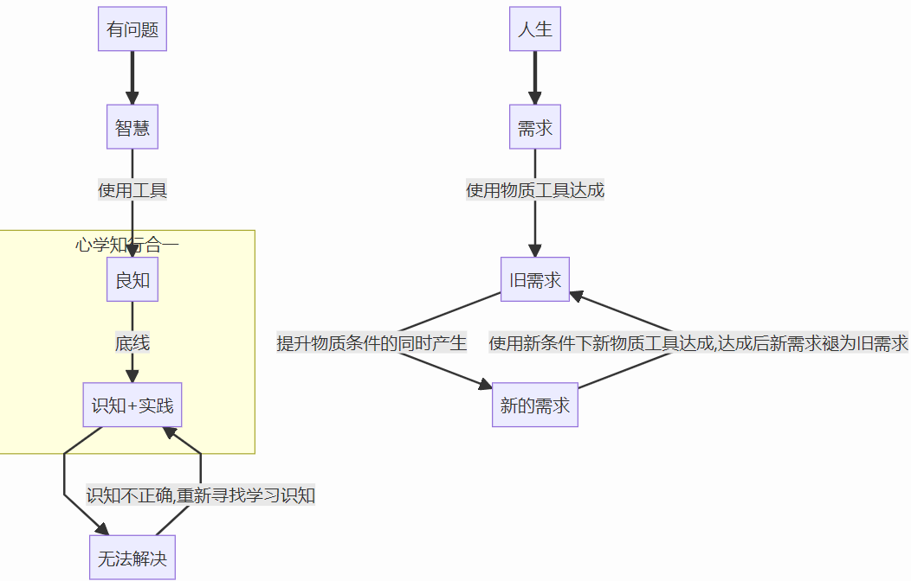

# 我对世界的思考和记录

## 方针

>
>
>```mermaid
>graph TD
>有问题==>智慧--使用工具-->良知
>subgraph 心学知行合一
>良知--底线-->识知+实践
>end
>识知+实践-->无法解决--识知不正确,重新寻找学习识知-->识知+实践
>人生==>需求--使用物质工具达成-->旧需求--提升物质条件的同时产生-->新的需求--使用新条件下新物质工具达成,达成后新需求褪为旧需求-->旧需求
>```

## 领悟

> 1. 我们永远，只能活在现在而已
>
> 2. 佛非佛，魔非魔。我相也
>
> 3. 境忘心自灭，心灭境无侵 忘者，亡心也 心灭，心死为忘 记者，言己也 言己 醒己为记
>
> 4. 用一个正确的理念去进行自我训练
>
> 5. 当我锁死自己的欲望后，我便自由了
>
> 6. 没有伴随着痛楚的教训，是毫无意义的。因为人若不牺牲些什么，是什么都无法得到的。但当忍受过这种痛楚，将其克服的时候，人就会得到不输给任何事物的坚韧的心。没错，钢铁般坚韧的心。
>
> 7. 学道之人,骨宜刚，气宜柔；志宜大，胆宜小；心宜虚，言宜实；慧宜增，福宜惜；虑宜远，思宜近；事上宜虔，接下宜谦，处同辈宜退让。得意勿恣意奢侈，失意勿抑郁失措；作福莫如惜福，悔过莫如寡过。应念身世苦空，切莫随流逐队。衣取蔽形，莫贪齐整；食取克馁něi，莫嗜美味。尝省此世前生，作何功行，可坐享檀施。十二时恒简点身口意业，善多邪？恶多邪？无记多邪？堪消四事邪？不堪邪？如此惭愧觉悟修省，自然习气渐消，智光渐露。祖意佛意，显于一念清净心中矣！
>
> 8. 你不必行色匆匆，不必光芒四射，不必成为别人~伍尔夫
>
> 9. 道是允许，是你可以，不是你也可以；不道是，不可以，你必须。
>
> 10. 世间万事本皆顺。不顺，不足以有人，唯人自碍也
>
> 11. 欲念死而道生
>
> 12. 我让你好好读书 不是为了让你做什么人上人，而是为了让你在以后的生活中，有更多选择的余地
>
> 13. 我们都在不同的赛道里，对手，是我们自己。和别个非要比较，是强合赛道，能不痛苦吗？所以，你不需要对别人解释自己，也不可能。人都是活在自己的经历和认知里的
>
> 14. 不要把欲望当喜欢，把喜欢当爱
>
> 15. 夏虫不可语冰是说，说别人能听懂的话
>
> 16. 我接受安排，但不会自找麻烦
>
> 17. 人体有那么一个机制，把满眼看到的当真，那么，你选择看到了什么呢
>
> 18. 改变自己是最容易的也是最难的，因为你有无数个理由去说服完全油自己选择的行动。可如果你连自己都改变不了，你还谈何去改变环境？你自己相信你能改变得了吗？
>
> 19. 我知道你为什么痛苦，你跳去过程看到了结果并坚定地认为这是你的东西或者说这是你也应该得到的
>
> 20. 定海神针被大圣拿起后才是金箍棒，在东海龙王那里只是神针
>
> 21. 资本想要自由，它最怕的的是，被权力抓住自己的小尾巴
>
> 22. 因果实乃天地至理
>
> 23. 这世界，从不缺少死亡～鬼谈会
>
> 24. 有目的地去读书，无目的的去结人
>
> 25. 我不能给你你想要的幸福，那么我就没立场在你身上索求我想要的福气，这不公平，也不合理，不是吗？
>
> 26. 不要问为什么，要问该怎么做
>
> 27. 最可笑的不过是，自以为给出了别人实际上根本无法做到的方法，来解放自己那颗自以为济世普救的自私心
>
> 28. 捭阖思想的核心是 我有没有不重要，我能让你相信我有很重要
>
> 29. 世事无极，好事小心坏处，坏事寻找好处。是我得大利也，避害从得。
>
> 30. 有些位置坐久了，就不知道生命为何物了，毕竟，已经离她太远了
>
> 31. 人的欲望这头野兽一旦放出了牢笼，再
>      关住，可就难了。毕竟放出来之前，欲望以为笼子里就是全世界。而出来之后，笼外，是无限。
>
> 32. 分享的话不要都送，都送了和不送是一样的。会被在乎的是，只有我的到了的感受，而非你的分享
>
> 33. 习惯了吃苦的人，吃一点糖都心有愧疚，习惯了吃糖的人，吃一点苦都觉得，这一定是谁搞了鬼，偷吃了我的糖
>
> 34. 我亲爱的朋友们，当你坐上早晨第一列电车走向工厂的时候，当你扛上犁耙走向田野的时候，当你喝完一杯豆浆，提着书包走向学校的时候，当你安安静静坐到办公桌前计划这一天工作的时候，当你向孩子嘴里塞着苹果的时候，当你和爱人悠闲散步的时候，朋友，你是否意识到你是在幸福之中呢？你也许很惊讶地看我：“这是很平常的呀！”可是，从朝鲜归来的人，会知道你正生活在幸福中。请你们意识到这是一种幸福吧，因为只有你意识到这一点，你才能更深刻了解我们的战士在朝鲜奋不顾身的原因。朋友！你已经知道了爱我们的祖国，爱我们的伟大领袖毛主席，请再深深地爱我们的战士吧，他们确实是我们最可爱的人！
>
> 35. 男女相悦，发乎情，止乎礼
>
> 36. 我曾想将最好的给你后来发现你就是最好
>
> 37. 你想让全世界都知道你过得好不好吗？
>
> 38. “我们登上并非我们所选择的舞台，演绎并非我们选择的剧本"。
>
> 39. 能够构建一个完美的循环也就构建了一个世界
>
> 40. 你要小心你的思想,因为它会变成你的语言;你要小心你的语言,因为它会变成你的行动;你要小心你的行动,因为它会变成你的习惯；而你的习惯则会成为你的命运。
>
> 41. 世间万物的关系实质上是双向反馈 天意 不悲不喜不卑不亢 人意伪装为天意，这是最恐怖的
>
> 42. 一切尽失，死亡的定义是什么 是停止呼吸，心脏不跳？还是永远没有意识
>
> 43. 人生是一场自证的旅途，self-prove，用行动自证自己的心 第一：生而为人，我应该干什么第二：生而为人，我要干什么第三，为了自证，我应该怎么做，列出计划并实施第四，不断自我反馈，和前两原则对比 五：自我修正 六：自证完毕
>
> 44. It seems that the all is meant to be so
>
> 45. 爱情 婚姻是两个人的事情 不要倾尽所有得去付出也不要一毛不拔得去索取
>
> 46. 谋事在人，成事在天
>
> 47. 有良好的描述能力，你才能在答案的海洋中去寻。寻找答案的能力在准确的描述之后，通过手中的工具，会的方法 竭尽全力搜寻答案
>
> 48. 我从小到大受到的教育是见老人摔倒应该去扶 是见到不平事应该见义勇为拔刀相助 可现实呢？狠狠扇了我们几个耳光 是我们错了吗？我想不通 如果我们是错的，为什么要教给我们错误的道理？ 如果我们是对的， 为什么成长后的世界是这样 难道我真的应该学鲁鲁修？错的不是我，是这个世界？
>
> 49. 历史长河无法改变，哪怕如何插手，早已被注定的宿命结局都不会产生影响
>
> 50. 岁月如刀斩天骄，长生路上叹妖娆，血与骨的开篇，一世悲凉的画卷。 
>
> 51. 我有仙心一颗，久被尘劳封锁。何日尘尽光生，照破山河万朵？
>
> 52. 我为天帝，当镇杀世间一切敌！
>
> 53. 仙路尽头谁为峰，一见无始道成空。
>
> 54. 不为成仙，只为在这红尘中等你归来
>
> 55. 我儿王腾有大帝之姿。
>
> 56. 你是英雄，所以要死，这个世间从来没有活着的英雄。
>
> 57. 一场繁华大世，看我辈天骄一个个凋零陨落，这不是选择的选择，一场黄金盛世的落幕，还能剩下几人？
>
> 58. 此时此刻，九具庞大的龙尸拉着一口青铜巨馆，横在漆黑冰冷的宇宙中，这震撼的一幕似乎永恒定格在那里！
>
> 59. 生又如何，死又如何，从混沌中来，回混沌中去，万古青天一株莲！
>
> 60. 那错过的人，那离去的脚步，那渐行渐远的路，就像是眼前的梧桐叶轻轻地飘落。
>
> 61. 蚂蚁与巨龙没有交集，蒲公英的种子与天空中的彩云难以相遇，它们分处在不同的世界，永远不知彼此。
>
> 62. 沧海成尘几万秋，道化黄发长生愁。一梦便是数千载，仙路崎岖何处游。
>
> 63. 来世，信则有，不信则无，岁月悠悠，世间终会出现两朵相同的花，千百年的回眸，一花凋零，一花绽。是否为同一朵，任后人去评断。
>
> 64. 登天路，踏歌行，弹指遮天。入仙府，逍遥游，挥袖收仙。
>
> 65. 谁是谁生命中的过客，零落的花，冰冷的碑，孤寂的坟，
>
> 66. 不需要答案，也无需多说。
>
> 67. 我任你复生，活一次我杀你一次，直到将你的不屈意志粉碎！
>
> 68. 斩道，斩不尽的执念，破不尽的虚妄
>
> 69. 做人不能太段德，做狗不能太黑皇
>
> 70. 永远不要小瞧对手，狮子搏兔亦用全力。
>
> 71. 人之一生，在时间长河中不过是一瞬。而若是死去，却是永远，比万古还要久。
>
> 72. 没有久别重逢后的喜悦，有的只是平淡如水，甚至有些云淡风轻的味道。
>
> 73. 善也，无尽游。恶也，无情堕
>
> 74. 以太极之道助人以有限性对抗世界的无限性
>
> 75. 世事无极，利害相权。
>
>     良知之上，取其利，避其害。我得大利也！
>
> 76. 善恶相守，善守恶之纯劲，恶守善之意相
>
> 77. 不见来处者，不可窥见未来；
>
>     不见未来者，何颜面见过去
>
> 78. 我磨尽了我对你的喜欢，才得以把你当成路人
>
> 79. 这宇宙 地球 人世 岂非是上一层次的生物 所创造的编程系统？
>
> 80. 人这一生呐，总是在为离别、新至做准备
>
> 81. 努力会留下痕迹的
>
> 82. 道是接纳而顺
>
> 83. 苦难与你，我理解
>     苦难与我，你不解
>     那么，我也没有理解你的苦难的必要性了
>
> 84. 有价值的稀缺性就是赢
>
> 85. 直到我情陷其中，才知自己早已萌生爱意。
>
> 86. 世间事，无可奈何才是常态 眼见他这高楼落了又起起了又落
>
> 87. 那些过去的人啊， 友好的，敌对的，时间将我们分隔两岸，我在此，向你们致以衷心的感谢 过去的你们造就了我的现在 现在身边的人啊，我和你们在同一岸 携手一起走向未来吧
>
> 88. 我有病 你就是医我的药
>
> 89. 顶天立地是要用胯下之辱来换的
>
> 90. 黄金分割位
>
> 91. 如果一开始就知道结局，这个故事，你还会亲自去开启吗 人生最痛苦的事情，莫过于不得不玩一场绝对不能输的游戏。而最悲惨的是，这场绝对不能输的游戏，从一开始，你还不知道自己一定会输 或者 ，知道自己一定会输
>
> 92. 好像每一个喜欢抬头看天的人，都有那么一些不切实际的愿望
>
> 93. 怀疑一旦产生，罪名已经成立，你会用自己的行为去验证自己的怀疑
>
> 94. 我希望你做一个能够掌控自我的人，依赖环境轻松些，但是环境的变化是你无法掌握
>
> 95. 恨和爱是为一体的，你不会因为喜欢这种感情，去恨一个人一件事
>
> 96. 从喜爱到掌控
>
> 97. 科学技术的价值,在于使用者的意图
>
> 98. 你好 请问 你是我的0.5吗 最好的爱情不是1+1=2 而是0.5+0+5=1 接受自己的不足，承认自己是0.5 结合另外的0.5 才是一 你好，余生，请多指教 从此刻开始，我们拥有彼此 最好的关系，应该是像人和玉 人养玉 玉养人
>
> 99. 东京喰种
>
>     ```  
>        东京喰种被封的原因是什么？难不成是因为它太血腥了，影响孩子的成长了吗？你真的看懂了吗？你错了，东京喰种说出了这个世界的残忍，它在批判这个世界，一个不愿说出，却又无比现实的世界，一个被包裹的非常华丽，却又无比肮脏的世界。
>         “错的不是我，是这个世界。”
>        越是纯洁无暇的人 就越容易染上各种颜色
>         软弱即是罪恶
>        正义的一方 无论做出再卑鄙的事情 都可以被原谅
>         遍体鳞伤做出的选择不过得其反 覆辙重蹈 黯然无趣的我 洋相百出 俗不可耐 优柔寡断又柔弱不堪 这就是我
>        世界上没有绝对的善与恶 只有强者和无法分清事实的弱者
>         现实那么骨感
>        我也曾欢笑过 曾经拥有过 
>         梦幻是多么美丽 又是多么的虚伪 曾在梦中看到过 也在现实中失落过 
>         一切的一切都在崩坏 
>         一切的一切都早已满目疮痍
>         扭曲 旋转 破坏 重组 撕裂 扭曲 疯狂 痛苦 世界的面目早已扭曲 曾经的自己早已在痛苦和疯狂中消亡 血色的彼岸花在盛开着 过去的自己渐渐变得透明 在这个扭曲的世界
>         这就是我 金木研
>         东京喰种 写出了世界的丑陋 写出了人们心中的痛苦 写出了那些心理扭曲的人的邪恶 
>         ……
>         993 986 979 972 965 958 951 944 937 930 923 916 909 902 895
>         1000-7的痛苦 只不过是痛的另一种的形态罢了
>     愿金木研被世界温柔对待
>     ```
>
> 100. 傲慢和偏见 我记得标题的这句话， “ I was in the middle before I knew that I had begun.”  个人更喜欢在网上看到翻译为“直到我情陷其中，才知自己早已萌生爱意。”读起来更加有韵味。
>
> 101. 藏兽于心，忍魔于腹
>
> 102. 目可见者繁众，目不可者无限
>
> 103. 死视生如去，生视死若归。向死而生，置生之意至死
>
> 104. 说前，尽可能探求掌握信息。在仁义，道德，礼乐，情操的轨道内结合探求到的说服对象的信息同自己求共鸣，保互异。
>
> 105. 一阴一阳谓之道，阴阳绵延存续，生生不息也。道者，混沌之开也。
>
> 106. 清醒时做事，迷茫时读书，得意时淡然，失去时放下，烦躁时运动，独处时自省
>
> 107. 你所或缺的，就是他存之生机。若一存可完可全，何须他存？
>
> 108. 等价交换是真，不过是，在那时，那地，那阶段的规则区间内，等价交换。
>         等价交换，是指在这个规则区间内，你用等量的能量，换得等量的回报。但若是时间、阶段区间发生变化，你用原来的量当然无法换得你期望的等量回报了。因为在此区间内，你给的价，已经不等于那个回报了。
>
> 109. 世间安有两全事，取舍~得失
>
> 110. 学会寻找合理之处，宽解自己的法门
>
> 111. once you have made your decisions,never hesitate. Hesitation means kind of death.
>
> 112. 一眼看到结局不要紧，那只是可能的结局。根据这种可能，加以调整，去开辟自己希望的未来吧！
>
> 113. 对于每个个体来说，只有一个真相。和个体目的相一致的真相。
>
> 114. 其实，人之间。谁也不用改变谁，我们只需找到共鸣点和冲突点。在不触碰冲突点的前提下，在共鸣点共鸣即可。
>
> 115. 在全貌出来之前，不要对外表现自己的立场！！！
>
> 116. 愿你在未来，不忘来路
>
> 117. 罹难而不弃，涅槃而重生。凤凰也！
>
> 118. 沉迷于获胜，最终是大败。秦灭六国二世而亡
>
> 119. 别人对你的期待，许念。基本上是假的，大家都挺忙。你还当真了？自己拿到的，才是真的！
>
> 120. 莫让文人丧了骨，莫让将军凉了心
>
> 121. 人这一生，在无限的变化中。据不变，根据自己所处时间 方位 条件的变化找准自己的定位，是度过此生的合适方法。
>
> 122. 人和天地斗，和人斗，最终，和自己斗，和自己的幻想斗
>
> 123. 能将废弃之事物发天地之能方显其大能，用大能之物成之，物能？我能？
>
> 124. 中国人是由情入理，不入情而讲理，第一反应是：你谁啊？我凭什么听你的
>
> 125. 承认接受自己的有限，你才能开始接受世界的无限
>
> 126. 一部中华史 一秉封神榜
>
> 127. 痛苦吗？你是把自己放进了错误的参照系而已，起点都不同，比毛线呢？
>
> 128. 见到过本质的我，再也回不去虚妄。至本难返
>
> 129. 什么是必须，是抛开一切后，还是不可放下，不可替代。正如水之于万物
>
> 130. 用最好的心情 作最坏的打算
>
> 131. 用一些自己觉得不重要的，去换一些别人觉得不重要的，我国人情社会。
>
> 132. 有锅大家抗，有福我独享。特色集体主义。看破不说破，跟你们学的！
>
> 133. 人无完人，想做完人，总会有人找问题的。这个问题是时间精力的有限性和无限的矛盾
>
> 134. 你不强也不差 只是大概合适 否则也不会在此时此地
>
> 135. 在我这也许无为的一生，愉快地走完这段路程，也是一个了不起的成就！
>
> 136. 上善若水，水不同万物相争。万物却相争而得水
>
> 137. 自以为比大家都聪明的人，才是最笨的；而认为自己比大家都愚笨谦逊的人，才是最聪明的
>
> 138. 不允许代表着你的无力，无力去接受
>
> 139. 越对外表现出攻击性的人，越是孱弱，越是害怕外物对它的攻击。好像在自卫的猫，在说：“我警告你，别惹我，我可是充满攻击性的”
>
> 140. 同样的，不公平的比赛，对于负败者，这失败毫无痛苦的意义，胜利者只是想把败者的这种感情当成他们成功的陪衬品罢了
>
> 141. 毕竟，没有对手的冠军，多没意思啊
>
> 142. 自律，是用更大的欲望去战胜小欲望。
>      正如，大海吞江！
>
> 143. 暴力只能以暴力之后的宽容而止，因为只用宽容，他会怀疑你是用巧，那暴力所付出的代价就太不值当
>
> 144. 真实的力量在于沉重和代价，虚妄的力量是广布与传播。若要使得虚妄到达真实，就得合虚妄广布之地的一切力量对于代价给予回复
>
> 145. 道、中庸、捭阖，阴极捭之，阳即阖之。常道，中庸之。
>
> 146. 无欲则刚
>
> 147. 真正会学习的人是会自我提问题的
>
> 148. 鸟儿为什么会飞我不清楚，但我知道，你得想跑，身体才能跑起来
>
> 149. 我已经富有灵魂的爱了，我现在需要的是肉体的爱
>
> 150. 在至暗中孕育最强的光，在最强的光下是最暗的阴影
>
> 151. 悲之极也，笑哉；乐之极也，泪哉。
>      爱之极也，恨哉。
>
> 152. 人这一生啊 就是说服自己的心的修行。
>
> 153. 使之感到失败不必万全胜利，只需要让他付出的代价大于他期望得到的收益即可
>
> 154. 显仁藏智，内沐于心
>
> 155. 改变自己都这么难，你还想要轻易地改变世界吗？
>
> 156. 只待时光携走隐忧，抑或火焰点燃明日！
>
> 157. 人是观念的动物，经济基础打好后，剩下的就是争夺人性的战争了。甚至，经济基础这个概念，也是观念。不是吗？
>
> 158. 故事快结束的时候，总会想起她的起点呢
>
> 159. 中国人才是最为现实的，极端的现实产生了极端的浪漫~诗词歌赋。
>      在沉重的现实里，为自己点亮明光。要不，怎么活下去呢
>
> 160. 相由心生，他相我心生，我相唯自知
>
> 161. 年轻时想做离歌笑，现在才知道，应无求才是我
>
> 162. 什么是感情，是你本可不这么做。但是不知道什么原因，你还是做了这件事。那未知的缘由，就是感情了。
>
> 163. 着你们想当独立自主的寄生虫的样子，就不禁想笑
>
> 164. 外圆内方的含义是糊里糊涂做人，认认真真做事
>
> 165. 人生呐，就像杯茶。泡久了，也就不苦了
>
> 166. 人最讨厌的就是被揭穿自己在满嘴猪油地啃食着别人的猪
>
> 167. 心痛苦吗？这还不是因为，你自己不能真诚对待自己的内心！
>
> 168. 摆脱贫弱的第一步，承认自己的贫弱
>
> 169. 越缺少频乏，越希望表达我有。正像越拼命表现自身暴力的人，越缺少力量。他在说，别过来，我可是很强大的啊！借此来从真强者那方自保
>
> 170. 在这纷繁的世界中，你能控制的，唯有自身。是故，自律，便是真正的自由！
>
> 171. 认识到自己的有限，是在这个无限的世界里生存下去的前
>
> 172. 困难是为了让你理解这么做的意义，而不是一切理所当然
>
> 173. 穷养男儿志，富养女儿德。养志养德才目的，本末倒置不可取。
>
> 174. 不同的人，不同的目的，同一个目的地。这就是矛盾了
>
> 175. 对自己要求高点，对别人要求低点
>
> 176. 内向于行，外向于思。互补不足，是为天道也
>
> 177. 福苦自酿，冷暖自知。我无须知道你是否真的如你所说，我不必花时间去思考唯有你知的事情，我无法未经你的同意进入你的内景
>
> 178. 会装孙子才有能力当爷
>
> 179. 所谓的知己不是一定知道你是什么会做什么，而是，他明白你肯定不是什么人肯定不会做什么事
>
> 180. 对于穷人他肯给你花钱就是爱你的，对于有钱人，他肯在你身上花时间就是爱你的。为什么？因为他们在你身上花费了他们最稀缺的事物
>
> 181. 天意自古高难问
>
> 182. “你可以躲在角落选择沉默，但是不要嘲笑甚至诋毁比你勇敢的人，因为他们争取的阳光也会照到你身上。”
>
> 183. 和对方交流时，想想对方的立场，你就会知道他们为什么这样说
>
> 184. 滕王阁序，报任安书，出师表，项脊轩志。对自己，对朋友，对上司，对配偶。经常抄写
>
> 185. 我终将飞向天际，用我的坠落，宣告自己的胜利~我可坠落，正是因为，我可翱翔
>
> 186. 做事分三步 
>      布局即要做什么，将整个事情划分为小模块再连接起来
>       造势 即 投入资源 启动并行动
>      摆平 事情做完检查是否符合预期，不符合检查调整 符合摆正收尾
>
> 187. 心悟空 身悟能 德悟净
>
> 188. 学习，是为了自己做事情而不是去教别人做事
>
> 189. 人性如水，正如无善无恶心之体。受念引导，导向何处，便是人世之向，正如有善有恶意之动。我要做的是，为善去恶实良知虽然很多人都认为灵魂是高于肉体的，但肉体并不是一个牢笼，肉体并不是邪恶的，肉体并不是罪恶的。
>       当我们爬上情欲的阶梯，我们从被爱人的美丽外表吸引，转向爱人的心灵之美。
>      我们爱上了对方，诞生出初始的好感，可能就是对方长得好看。
>       但是你爱上了她之后，慢慢的这种肉体的吸引会让你往上爬——会有知识的吸引，会有音乐的吸引，会有灵魂的相吸，它是让你扶级而上的阶梯。 
>       真正的爱最初往往是一种肉体的吸引，最后因为这种肉体的吸引，衍生出更高的感情追求，从而相伴一生。 
>
> 190. 原来最高的指挥艺术是，让被指挥的人不知道自己在做这件事，或者说，让他觉得自己在做的不是指挥者真正想让他做的
>
> 191. 给别人贴标签的人 他才是这个品质的真正所有者 正因为所有这种品质 他才了解这品质的本质和表现 然后 在同类相斥的原理下把也许貌似的表现贴上了标签
>
> 192. 人是信息的动物，信息的权重来源于信息直接的关联度，而关联度的表现就是情感
>      如，他人的真实在我这里就是虚假的。因为关联度未存，我没有相关体会
>
> 193. 谦虚 礼让 低姿态
>
> 194. 虽然你我讨厌矛盾，但是，矛盾也是进步的阶梯之一啊
>
> 195. 交浅言深换来的是对你的PUA，还多嘴不？还轻易原谅不？这是客观规律！是人性
>
> 196. 没有真实，唯信以为真。答案，在你的相信里
>
> 197. 无欢无厌，无喜无悲，是为大自在境
>
> 198. 在时间的长河里，你要的答案都在那堆河石里。能不能找到你想要的答案，看你能否潜入河底去寻找了
>
> 199. 带着目的做事，不可能把事做好。这是注意力分配的结果，把事情，变成目的本身
>
> 200. 君以此兴，必以此亡，故不兴不亡
>      胜对手的方法，就在他强大起来的过程里。自己灭亡的道路，就在起飞前的那些小路上
>
> 201. 对中国人只讲合适的话，至于对错，那是他人的果
>
> 202. 我只是，喜欢美好而已。而他们借口这就是人性，别幻想了，就要撕碎你心中的美好
>
> 203. 人来若清风，人去如流水
>
> 204. 人和天地斗，和人斗，最终，和自己斗，和自己的幻想斗
>
> 205. 情绪不是价值，是产生价值的这架机器的燃料
>
> 206. 不存在的羽翼学不会飞翔
>
> 207. 自由是带着束缚，却又能够随心所欲地奔跑    
>
> 208. 每个生命都有自己的时间线，当时间线产生交点，你我，就相遇了。故事是否继续？我们还会在一条时间线上吗？
>
> 209. 真实铺就虚妄，就像游戏里的每一行代码铺就了原本不存在的画面
>      虚妄生发真实，就像理想生根于真实后发芽为新的真实
>
> 210. 中庸不庸
>
> 211. 行动一定是有成效的，因为行动造成了内外能量与外界物质的交换
>
> 212. 努力不一定是有效的，有效的是特定条件下的努力。只谈努力，不讲基础条件是流氓行为
>
> 213. 寻找爱你之爱，而非爱你之人，会发现那个人只是你，你就是那唯一，值得你爱和原谅的人。———佛陀
>
> 214. 王阳明一句话都是经典 “知行合一”，他的心学到底是什么?
>       先解释了什么是知，知可以说是人的潜意识，人的思维模型。
>       当你去做一件事时，会用你的潜意识去“行”，你过去所经历的类似的事件，当时第一次所利用的方法会化为你的潜意识，变成如今你去做这件事而下意识去做的行为准则，这就是答主所谓的知行合一。
>      通过这种理论，我们可以利用其改变自身，比如:
>
>      1. 遇到新事物，一开始的时候就尽量去看清它，尽可能完美的解决问题，一个事物可能比较复杂，拆分成一个个小的问题，尽量完美的解决，为以后的行为准则树立标准，化为自己的思维模型。
>       2. 可以利用其改变自身的坏习惯或者不适应事物发展的行为准则，建立好自己的思维模型后，人会下意识的遵守，不喜欢改变，这也就是舒适圈，如何走出舒适圈，明白舒适圈的原理，就可以改变自身的一些问题，适应事物的发展。
>      3. 一些错误的“行”，会导致自身不合适的“知”，近而导致自身出现不合适的潜意识，所以我们在平时的时候，也要注意慎独，如果一件事情是不合适的，那么我们从一开始就不要做，可能我们会觉得一次两次没什么大不了的，但是会影响一个人的以后对此事物的看法，从而千里之堤溃于蚁穴，最终出现严重的后果。
>          以上是我看完以后的思考，希望能够共同探讨。
>
> 215. 血性，担当，宽广的胸怀，自律，懂上进
>
> 216. 长的没有距离感 性格好 嘴甜会说话 懂得尊重
>
> 217. 小谎骗人，大骗欺世
>
> 218. 当我真正开始爱自己，
>      我才认识到，所有的痛苦和情感的折磨，
>      都只是提醒我：活着，不要违背自己的本心。
>      今天我明白了，这叫做“真实”。
>
>     当我真正开始爱自己，
>      我才懂得，把自己的愿望强加于人，
>     是多么的无礼，就算我知道，时机并不成熟，
>      那人也还没有做好准备，
>     就算那个人就是我自己。
>      今天我明白了，这叫做“尊重”。
>     当我开始爱自己，
>      我不再渴求不同的人生，
>     我知道任何发生在我身边的事情，
>      都是对我成长的邀请。
>      如今，我称之为“成熟”。
>      当我开始真正爱自己，
>      我才明白，我其实一直都在正确的时间，
>      正确的地方，发生的一切都恰如其分。
>      由此我得以平静。
>      今天我明白了，这叫做“自信”。
>      当我真正开始爱自己，
>      我不再牺牲自己的自由时间，
>      不再去勾画什么宏伟的明天。
>      今天我只做有趣和快乐的事，
>      做自己热爱，让心欢喜的事，
>      用我的方式、我的韵律。
>      今天我明白了，这叫做“单纯”。
>      当我开始真正爱自己，
>      我开始远离一切不健康的东西。
>      不论是饮食和人物，还是事情和环境，
>      我远离一切让我远离本真的东西。
>      从前我把这叫做“追求健康的自私自利”，
>      但今天我明白了，这是“自爱”。
>      当我开始真正爱自己，
>      我不再总想着要永远正确，不犯错误。
>      我今天明白了，这叫做“谦逊”。
>      当我开始真正爱自己，
>      我不再继续沉溺于过去，
>      也不再为明天而忧虑，
>      现在我只活在一切正在发生的当下，
>      今天，我活在此时此地，
>      如此日复一日。这就叫“完美”。
>      当我开始真正爱自己，
>      我明白，我的思虑让我变得贫乏和病态，
>      但当我唤起了心灵的力量，
>      理智就变成了一个重要的伙伴，
>      这种组合我称之为，“心的智慧”。
>      我们无须再害怕自己和他人的分歧，
>      矛盾和问题，因为即使星星有时也会碰在一起，
>      形成新的世界，今天我明白，这就是“生命”
>
> 149. 理性做事，感性做人
>
> 150. 新时代人生四大喜 佟湘玉一样的老板 路飞一样的朋友伙伴 爱情公寓里的爱情 武林外传里的生活
>
> 151. 物不如新，人不如旧
>
> 152. 迄今为止我都是坚定的唯心主义者，唯有你，我希望今生
>
> 153. 哪怕她最后不喜欢我，我也可以骄傲得对自己说，自己曾经那么认真地喜欢过你
>
> 154. 一切的爱不过是价值的延伸
>
> 155. 不要小看语言的力量
>
> 156. 为众人抱薪者，不可使其冻毙于风雪！
>
>     为自由开路者，不可使其困顿于荆棘。
>      为愚昧启蒙者，不可使其困惑于无知。
>     蒙众人眼球者，必使其露于众人眼中
>      为病疾救治者，不可使其遭囚于苦痛。
>     为众人征战者，不可使其退钱于失望！
>      为世人燃灯者，不可使其沉默于渊暗
>     为正义献身者，不可使其辱于他人口齿。
>      为苍生破冰者，不可使其陷身于泥泞！
>     为吾辈探索者，不可使其无闻于世间。
>      为盛世殉道者，不可使其受辱于蚊蝇
>     为现世牺牲者，不可使其殁葬于他乡
>      为未来开拓者，不可使其湮灭于历史
>      为天下大同者，不可使其止步于不公
>      为私心害人者，不可使其昌盛于现世
>      为大众谋福者，不可使其孤军奋战
>      为利益不义者，不可使其脱身于正义
>      为众生抗争者，不可使其困顿于黑暗
>      为公义斗争者，不可使其困囿于囹圄
>      为世人屹立者，不可使其埋没于淤泥
>      为记录真相者，不可使其亡于流言
>      为众人守国疆者，不可使其隐没于僻壤之地!
>      为国之驻边者，不可使其忘于心中
>      为世间鸣不平者，不可使其毁于流言
>      为苍生奋进者，不可使其消逝于尘埃
>      为私利背叛者，不可使其幸存于盛世
>      为长、安奋战者，不可使其被辜负于小丑
>      为生命而前行者，不可使其孤身前行。
>      为世人指引者，不可使其无问于历史之流
>      为众人掌灯者，不可使其深陷于黑暗中！
>      为理想献身者，不可使其哀于现实
>      为人类之进取者   不可使其消泯于凡尘
> 157. 唯淡泊以宁静，唯宁静而致远
>
> 158. 科学不一定要杀死浪漫，智慧不一定要敌视童话，理性不一定要排斥温柔
>
> 159. 鼎然师父法语：以前恨一个人总想灭了他、厌一个人总想揍他一顿，恶心一个人总想干掉他。现在恨一个人恨不起来、厌一个人厌不起来，恶心一个人恶心不起来。没有了恨的兴趣，也没有了厌的爱好，更没有了恶心他人的想法。如今的我失去了就失去了，不再盲目讨回遗憾；如今的我伤感了就伤感了，不再鲁莽讨回公道；如今的我孤独了就孤独了，不再歇斯底里地到处喊冤；如今的我富也好穷也罢能随遇而安，不再发疯般的到处攀缘低头哈腰讨好他人。
>
> 160. 吾可用真实创造虚妄，亦可用虚妄铺就真实
>
> 161. 和城市的清晨相比，我更喜欢夜景 因为她更真实，更清醒，就像很多人在晚睡前那一阵子，思绪更清晰，更真实，没有虚假，没有刚睡醒那般任务的驱动感，也许，我认为的真实，是直接的生物本能
>
> 162. 做事情心中要无我无果，专注于事情本身。有我有果，你的注意力都不在事情上，何来好果？
>
> 163. 是我错了，错把一瞬的幸福 当成永久 可这一瞬间 难道不是永恒吗
>
> 164. 你我都在人间，却不在同一个世界
>
> 165. 这世间没有机缘，唯有因果；无分正邪善恶，只有立场
>
> 166. 过好每一天，演好当下的剧本，朝着心中的那个标杆前进。你最重要的是做你觉得正确的事情，最重要是你听不到内心的抱怨、最重要是多年以后的你能够看得起现在的你。
>
> 167. 想要不痛苦，就给任何事物留一点空间，就放在那里，不去理会，它就在那里放着，不会影响什么
>
> 168. 天道忌满 人道忌全
>
> 169. 无用方为大用
>
> 170. 我们所拥有的 只有自己的生命而已。其余的,都是向天而借  时间到了会收走但是说不定会给你留下一点什么 这是上天不仁，以万物为刍狗 遵循运作的法则而已 人只需对规则和规则的执行者 天 心怀感恩即可。上天 也有另一个名字 历史洪流
>
> 171. 真男人从不怕雨，但是，没事现在雨里被淋，那是傻逼
>
> 172. 失也是得 从失中 得来了你心中的空位。 可以放新的进去  失旧得新！
>
> 173. 新的始终开始了，我们无所畏惧
>
> 174. 从新的始 得到新 从新的终 得到新的始！
>
> 175. 不能说是对，只能说 适不适合你
>
> 176. 对于做不到的事 里面总有你能做到的。先做你能做的 一步一步推进正如 世上繁多的生命从单细胞而来总是有途径将简单的串联起来 构成复杂的难的 我们要做的 就是 找到这条路！
>
> 177. 我本就是天地间一旅人，我能带走的。只有沿途的风景
>
> 178. 都是流动的，痛是因为 那里淤塞，堵住了，重新流动起来就好了
>
> 179. 我们满眼 都是我们的偏见。而我们 很少有精力去一窥全貌
>
> 180. 轻易下论断 急于下论断 是我们走向偏见的开始
>
> 181. 让别人等待，哪怕说了请稍等。也是，一种傲慢 谦卑者，是站在那里，说 没啥 我等你一会吧
>
> 182. 留白，是一种艺术。留白的哲人，知道哪里 是应该下笔的 哪里 是天占之，人勿动的
>
> 183. 无知 也是一种本事，有些事情。尤其人与人之间 还是不要知道为妙
>
> 184. 强者 喜欢的是平等的交流 因为对等所以才能感受到自己的强大 太弱如附庸。只会感到累赘
>
> 185. 西游 是一个人的成长 从齐天大圣到斗战胜佛；也许 红楼梦是人生的总结 人生如一场大梦；水浒是天格中 众星的璀璨；三国 是天下最终的大势 天道也 
>
> 186. 能把谎言当真 是感受到爱的前提条件
>
> 187. 我不奢求从这个行动中得到什么，我只是，想，并且愿意这么做而已
>
> 188. 我想和你走近点 和你近点 我更能感觉到心脏的跳跃 
>      我想和你保持点距离 离你太近了 我的磁场就乱掉了
> 189. 接受一切 你就拥有一切 好的 坏的。正如，上善若水 ，水怀万物。故几于道
>
> 190. 变的是现象 不是本质
>
> 191. 建议这种东西，别人明确需要时候的给予帮助。别人啥也没说，自以为需要，你给的不是帮助，是傲慢。是不相信他人可以自渡的傲慢
>
> 192. 现实的世界对于他们失去意义 永恒的梦境会成为唯一的真实 崩坏3
>
> 193. 镜子当然难免令人生厌，它并不总是映照出我们喜欢的那些侧面
>
> 194. 生物 进化或者退化成新物种的标志是他们的思想 因为所在处境 也就是物质 经历的改变  而改变 思维纬度 上了 或者 下了 一个阶梯
>
> 195. 相同的结果并不意味着相同的过程，而过程塑造了你
>
> 196. 我作为人的一生 只有一件事 
>       认识自己 通过我的亲人 我的朋友 我的敌人 一步一步 画出自己真实的模样
> 197. 梦境和现实的差异 是时间吧 
> 198. 人生呐，难的是 说服自己的心
> 199. 你可能不会说服。更可能没有时间精力，也可能根本无意
>
> 200. 我们为什么精力有限？
>      我想 是为了让自己忘却那些过去的伤害
>
>     只是 我们无法有意识地去觉察到怎样运用这天赋的本能
>      其实 挺简单的 将有限的精力 投入一件完整的事情 最好是漫长的事情
>      这件事情吸引了你所有的精力 让你无瑕在感受到那些本就不属于自己的痛苦
>     所以我想 这是大多数人 去按部就班地结婚生子的原因吧 
>      总有一件事情 去不断地吸引你的注意力
>     让你无瑕顾及你受的伤 你的血 你的泪
>      limited is a gift
>
> 201. 皇帝这个职位 是垄断所有信息的象征 古代信息无法及时流通 所以需要一个能够令所有人 同时信服一个信息的信号源 以皇帝为核心的政令 就是这个信号源。而随着科技手段的进步  及时 信服 一旦确信发出 无法变更 的信号 将逐步瓦解这种核心
>
> 202. 世界的裂痕，从思想开始。思想的分裂，撕扯了这个世界
>
> 203. 凡此众生，皆有所相。凡有所相，皆是虚妄。凡是虚妄，终归万藏。
>
> 204. 行是最真的语言
>
> 205. 真正的尊重是 在意别人自己的选择 。尊重他承受的后果 ，接受后果造成的他而不是什么都不接受 一味强求别人接受自己所谓为你好的建议 这不是 没有经历 不论好坏 这个永远接受建议的人
>
> 206. 永远活的不是自己
>
> 207. 这个世界已经很残酷了 不要再和它比较残酷了 爱一点自己 爱一点身边的人
>
> 208. 万千弱水，我只取一瓢饮
>
> 209. 生命中的有些人 事 物 你的生命中只为此留下了一个相应的空缺。拥有了，固然好。可是，没有拥有 你就拥有可选天下同类事务的选择权！不是吗？
>
> 210. 接受新的 总比改变成见轻松吧 新的有人类好奇的本能推动 成见 是心里的一座山 想要搬山 你得化身愚公 旷日持久 何况 你想要改变的成见 是否值得你化身愚公呢？
>
> 211. 积伪成真，装一辈子，那就是真的你了。积真趋伪，一直做真。偶尔一次装，那你之前的真。都是假的了
>
> 212. 诗 是有经历的人在吟唱他们的生命
>
>     或怀恋 后悔过去 或 期盼向往明天
>      除了那表面的鸟语风吟 金戈铁马 你 真的读懂了吗？
>
> 213. 无有相生 虚实相间
>
>     虚是思想 实是现实
>     虚作实为恩赐 那么一切皆是恩赐 生命 死亡 遭遇 见虚为真
>     实作虚为真 见真伪为虚
>     经历虚实 
>     虚也是实的一部分
>     实也可为虚的前章 
>     我想爬上那山峰见那瑰丽的风景
>     就算那上面的瑰丽真的不在
>     那又何如？
>     我已在这峰上！
> 214. 天是一名孤独至深的少年，他的话是无声的 是 道 所以 人间有了人以行言传道得道多助失道寡助可是 因为不断的变化更新 他还是少年 喜欢和自己一样年轻 有生命力的存在故 上天有好生之德可他还是有点患失的青年 不做风险大的 投资   故自助者 天才助之
>
> 215. every day is a new day，the yesterday has passed,remember it and take it in this new day
>
> 216. knowledge is a kind of power
>
> 217. 人和钱的关系 正如鱼和水 有些鱼夺走了其他鱼的水并在其中傲游有些鱼用那么点滴露之郧 勉强存活那些傲游的鱼说 来啊 一起傲游啊
>
> 218. 你可不要成长那种人 死了 都没人在你的墓碑前掉一滴眼
>
> 219. 我最不喜欢所谓的中立区域了 可到处都是这些灰色地带你有没有想过 自己也是这灰色地带的受益人呢？
>
> 220. 被这些尖锐的矛盾刺穿后，你我已成为矛盾本身
>
> 221. 我要做自己的皇帝 对自己完全掌控。现在不是吗？每个人做自己皇帝的最好时代
>
> 222. 当弱小时，国家的正义是大多数的正义，即使，大多数不是正义强大时 个体的正义他就是国家的正义可能是因为 有富余的精力和资源了吧
>
> 223. 总有人喜欢风的清云的淡同样，也有人倾慕风的厉 云之厚积各行其道是也
>
> 224. 撩动你心弦的 不是那人本身。而是 那外装勾起的你的幻想。而幻想 终究只是幻想罢了
>
> 225. 斩断幻想的因果链的方式就是现在，用当前的利剑攻破你幻想的长链吧
>
> 226. 工具，不是目的。是用来达到目的的工具。而，工具的含义是。它是可以被替代的
>
> 227. 一眼看出本质不算啥 看破不说破 才是大能 能够压制自己得到本质的无上喜悦之情
>
> 228. 知行合一，其一良知，其二，识知 以良知为则，用识知行事  只要识知不背良知，用点花招又何妨？
>
> 229. 你是对标能力来提升自己的欲望呢，还是对标欲望去提升自己的能力？能力和欲望之间的沟壑，叫做自找的痛苦
>
> 230. 只要还活着，就有时间，有时间，就有可能实现可能性
>
> 231. 我！富有生死！
>
> 232. 感恩所拥有，我就富有，我本来身无一物，死无一物
>
>     活着，呼吸着，吃饭，睡着，这就是最大的实际。离开了这些，一切如梦幻泡影
> 233. 天有大德 曰生  曰勤 曰检。十几世纪西方的开拓是生 今生的共存是生。生以勤同天易生资。生以检以养天德
>
> 234. 人心是杆称，你的选择是砝码。称往哪头偏，看你的选择喽。
>
> 235. 可知，不可说，敬畏吧
>
> 236. 生活只是三件事，我把她概括为3CE。经验、习惯、选择。experience、practice、choice
>
> 237. 在光速的棱角下。我们不过是那些洞中之人的影子。随着他们的行动而动，这种身不由己，我称之为-命运。影子强动，甚至带动了洞中人。以次身带动本体，这种影子的抗争，我把它叫做-对命运宣战！
>
> 238. 你的命运 就在你的一思一言一行当中，不必费心寻找
>
> 239. 我们这一生就是在用有限的精力与时间同无限的复杂度作斗争的过程，何其壮烈呀！
>
> 240. 困难抬高你的上限，容易拉低你的下限
>
> 241. 虚数之树上却开出了最真实的花朵～生命之花
>
> 242. 不要去引出那些人心中的野兽，野兽是他们的罪，引出是你的过
>
> 243. 无须解释，相信你的人自不必说。不信你的人，解释无用。做好你自己的事。行动是最真实的，不需语言去证实的
>
> 244. all is determined all is chosen
>
> 245. 1.all is meant to be so
>
>     2.and the gate  from which you get in is closed
>      3.you have to finish the story you started.
>     4.all is done
>      5.and the God says
>     6.good boy/girl nice shot!
>
> 246. 最好的生活状态 其实是空缺。因为空缺 你才会有拥有的欲望；如果全部拥有，你只会失去，而失去，总是令人痛苦s
> 247. 你的选择不是你的选择，是别人告诉你的 你的选择
> 248. 你并不是唯一，见过的多了。还是选择你，你才是唯一
> 249. 你不能因为你的欲望 就说我的情节是老封建 这是双标狗
> 250. 饮醉 ？ 心醉 ？ 醉翁之意不在酒，在乎山水之间也
> 251. 北周的开国者、也是南北朝时期一大猛人,宇文泰,为一统天下曾遍访天下贤才。有天他遇到了号称有诸葛亮之才名的苏绰,向其讨教治国之道。两人一见如故,密谈三日三夜。
> ```
>     宇文泰问:“国何以立?”
>      苏绰答:“具官。”
>     宇文泰问:“如何具官?”
>      苏绰答:“用贪官,反贪官。”
>     宇文泰有些纳闷:“为什么要用贪官?”苏绰答:“无论打江山还是坐江山,都需要手下人为你卖命,可让别人为你卖命就必须有好处,你并没有那么多钱,只好给权,让他用手中的权去搜刮民脂民膏,他不就得到好处了吗?”宇文泰问:“贪官得了好处,我有什么好处呢?”苏绰答:“他能得到好处是因为你给的权,为了保住自己的好处,他就拼命维护你的权,有贪官维护你的政权,江山不就巩固了吗。”
>      宇文泰又问:“既然用了贪官,为何还要反?”
>     苏绰答:“这就是权术的精髓所在,用贪官,就必须反贪官。你看,其一、天下哪有不贪的官?官不怕贪,怕的是不听你的话。以反贪为名,消除不听你话的贪官,保留听话的贪官。这样可以消除异己、巩固你的权力。其二、官吏只要贪污,把柄就在你的手中。他哪敢背叛你,只会乖乖地听你的话。所以,‘反贪官’驾御贪官的法宝。如果你所用皆是清官,深得人民拥戴,要是不听话,你哪儿有借口除掉他。假使硬行除掉,也会引来民情骚动。所以必须用贪官,才可以清理官僚队伍,使其成为清一色的拥护你的人。”
>      宇文泰大喜,苏绰忽反问:“如果你用太多贪官而招惹民怨怎么办?”宇文泰一惊,急急请教:“先生有何妙计?”苏绰答:“这就是奥妙所在,加大宣传力度,祭起反贪大旗,让民众认为你是好的,不好的只是那些贪官,把责任都推到他们的身上,让民众知道社会出现这么多问题,并非你不想搞好,而是下面的官吏不好好执行你的政策。对那些民怨太大的官吏,宰了他!为民伸冤的同时,再把他搜刮的民财放进你的腰包。这样,不负搜刮民财之名却得民财之实惠。总之,,除贪官来消除异己,杀贪官来收买人心,没贪财来实己腰包,这才是权谋的最高境界。”
>     宇文泰如醍醐灌顶,十年用心用力,终成一时霸业。
> ```
> 252. 当劳动变成一种兴趣爱好 而这种兴趣爱好的产出结合生产力水平 足够供给所有  按劳分配变为按需分配
>
> 253. 物质的价值匹配是核心
>      物质价值分为 社会价值 个人价值，当社会价值高于个人价值时 个人价值会被社会价值驯化 具体表现为 个人价值被抛弃 追求社会价值 这是商业出现异化的表现 内涵是 物质被出售的人加上了 这些人想出售的价值观 本应被物质承担了的社会价值 被这些价值观膨胀化 就成了 看似合理的社会价值。当个人价值高于社会价值时 个人价值打败想要驯化她的社会价值 表现为 有些在社会价值里一文不值的物质 被个人价值赋予极高的地位 反过来 一些在社会价值里极高的物质品 在个人价值里 一文不值 内涵是 个人价值战胜了被添加进去的价值观 并统治了 个人对于物质的需求 行使了 在个人认知里 对于物质价值的赋予权 当个人价值和社会价值平等 即 社会价值给物质赋予的地位等同于个人价值赋予它的地位 这时发生的交易 才是真正的等价交换。商人 是开始把自己的观念 加入商品 导致等价交换这一准则开始崩塌的一群人。
>
> 254. 你感受到什么，你就会输出什么。你的世界就会因此是什么，比如一个人总是感受到美好，那他必然会时刻滋润于美好中，时刻晶莹剔透，不断地把这妙不可言的美好，给侧漏出来。
>
> 255. 能量超高的模式，我无法自如的表达，因此我彻底的自如了。
>
> 256. 没有谁欠谁，也没有谁帮助了谁，实际上，一切都是大自然能量守恒所呈现出来的不同形态。
>
> 257. 面对无数种无法重复的形态，很多人总沉迷于此，而没有真正感受过，那种不管怎么变，大自然都始终如一地能量守恒，我称之为【圆满】，而我们所谓地修德，实际上就是不管察觉每个当下大自然呈现出来的不同形态去感知她内核那股看不见但始终圆融的能量，或者说是让一切保持平衡而不断呈现不同显化世界的能量。
>
> 258. 当你能持续感知到它的存在时，你的功德就会越来越圆满，这个我们无需计较结果，因为无限上限，多少就是多少。
>
> 259. 而你周围的一切会因你这样，周遭的人类都会变得跟你一样，晶莹剔透，不可描述的妙不可言。
>
> 260. 比如你安静了，你必然能到周到一切的声音，如果你吵闹了，那你必然失去一切清晰的声音，再或者你愤怒时，你必然失去轻松的体验，而你得知这道理后，你必然会执着于此，而当你此时又如此轻松，便是因为你明了了那【妙不可言】，那【不可说】。
>
> 261. 我们所修的这个事情，会如何体现在你的生活上呢？或者说，会如何给你生活带来巨大的【妙不可言】呢？
>
> 262. 你会无限包容一切，你会宽恕一切，即便一个人对你不怀好意，你也会接纳，并让他感知到你的能量，并因此而改变自己，因为你是一个最妙的参考，因为你的存在，而让他本能地想改变。
>
> 263. 记住，我前面所说的是我们唯一需要做的，而如果你没坚持这件事情，而是突然去在意结果了，比如在意对方居然没觉悟，那你就变成了对方。这种变化，又是一种大自然永恒在让事物阴阳两面保持均衡圆融的体现。
>
> 264. 我不知道你能否明了，这不重要，你只是不断地知道，大自然不断无私地让每时每刻所呈现出来的万物都保持一个圆融均衡，一个完美的状态，因此我们所在的世界才如此的生生不息。
>
> 265. 所谓的生生不息，就是你的生活不会一成不变，而是你的生活的一切，能像心跳一样，自由跳动，而自由跳动的具体表现，就像心电图似的，一上一下，因而，你才生生不息，你才有机会生气、愤怒、傲娇、开心、兴奋、妒忌。因而，这个大自然无时无刻不伟大，而我们也因为自己的无知而时常怪罪自然，殊不知，这些无知或怪罪的表现，也是我们有了生命力才有的，当然，这些无知或怪罪，也是大自然馈赠我们最好的礼物，否则，我们又如何得知大自然的伟大，因而我们又怎能得出我们是具有生命力的，又如何知道不断如何，活着已经是赚到了，因而又如何了解到我们所感知到的一切就是赚到后的继续赚到，所以，这一切是多么地完美，我根本无法停止我对大自然的感谢，所以，我该如何赞美这一切呢？所以，此生的目的，便是告知各位，这些妙不可言的一切一切。
>
> 266. 凡所诸相，尽皆幻象
>
> 267. 黑暗中的光明才是光明。光明中的光明只是平常
>
> 268. 人与人差距越近，越是天堑之距
>
> 269. 强者思维是关注自我，自我和自我比较。弱者思维关注他人，比较他人与自己的得失
>
> 270. 曾仕强经典语录大全(其一）
>
>      ```
>       1、自作自受，不怨别人。〖8字〗
>        2、德本财末，重视伦理。〖8字〗
>       3、中庸之道，合理应变。〖8字〗
>        4、谨守本分，不宜妄动。〖8字〗
>       5、顺天敬神，不能迷信。〖8字〗
>        6、饮水思源，不能忘本。〖8字〗
>       7、管理是修已安人的历程。〖10字〗
>        8、你的福气决定你的成败！〖10字〗
>       9、结果不重要，原因、动机才重要。〖12字〗
>        10、读书如果不明白道理，等于白读。〖13字〗
>       11、遇到鬼不能跑，一跑就真的有鬼了。〖14字〗
>        12、成功之道就是：你自己少讲，让别人讲。〖15字〗
>        13、满脑子只有钱的人，一辈子赚不到钱。〖15字〗
>        14、人生总是有许多“没想到”，终究是想不到。〖16字〗
>        15、使人敬畏，全在自立自强，不在装模做样。〖16字〗
>        16、人生的理想在于不断提升自己的层次。〖16字〗
>        17、人生就是不断做出合理的阶段性调整。〖16字〗
>        18、以化解代替解决，务求尽量减少后遗症。〖16字〗
>        19、认为自己很重要，几乎是众人共同的需求。〖17字〗
>        20、老板做好人，干部做坏人，才是良好的配合。〖17字〗
>
> 271. 人的本性将永远倾向于贪婪与自私、逃避痛苦、追求快乐，而无任何理性。——柏拉图《法律篇》
>
> 272. 我追索人心的深度，却看到了人心的浅薄。——木心《云雀叫了一整天》。
>
> 273. 在孤独中，孤独者将自己吃的一干二净，而在人群中，他被众人吃掉，现在，你选择吧。——尼采《人性的，太人性的
>
> 274. 人们相互蔑视，又相互奉承，人们各自希望自己高于别人，又各自匍匐在别人面前。——马克·奥勒留《沉思录》
>
> 275. 撒谎是人之本性，在多数时间里，我们甚至都不能对自己诚实。——芥川龙之介《罗生门》
>
> 276. 人的天性便是这般凉薄，只要拿更好的来换，一定舍得。——亦舒《要多美丽就多美丽》
>
> 277. 人性从来是老样子——可以变化，但没法完美，有所摇摆，但不会进步。——佩索阿
>
> 278. 你的好对别人来说就像一颗糖，吃了就没了；你的坏对别人来说就像一个疤痕，留下就永久在；这就是人性。——朱德庸
>
> 279. 世界上有两样东西不可直视，一是太阳，二是人心。东野圭吾——《白夜行》
>
> 280. 爱情、希望、恐惧和信仰构成了人性，它们是人性的标志和特征。——罗·勃朗宁
>
> 281. 高雅时髦与丑陋粗俗是人性这块普通硬币的两面。——赫·乔·威尔斯
>
> 282. 我只建造一座小庙，在这座小庙里，我供奉的，是人性。——沈从文
>
> 283. 有罪是符合人性的，但长期坚持不改就是魔鬼。——乔叟
>
> 284. 世上人的本性都是一样的，但教育和习惯却使它们的表现形式不尽相同，因此，我们必须隔着各种外衣对他们加以认识。——切斯特菲尔德
>
> 285. 我那时还不了解人性多么矛盾，我不知道真挚中含有多少做作，高尚中蕴含着多少卑鄙，或者，即使在邪恶里也找得着美德 。——毛姆《月亮与六便士》
>
> 286. 减少一点对他们的尊重，降低一点对他们的要求，这样会更接近于爱，因为他们的负担就不那么重了。人们孱弱而卑劣。陀斯妥耶夫斯基——《卡拉马佐夫兄弟》
>
> 287. 人生有一种天生的，难以遏制的欲望，那就是，在理解之前就评判。——米兰·昆德拉
>
> 288. 人类既强大又虚弱，既卑琐又崇高，既能洞察入微，又常常视而不见。——狄德罗
>
> 289. 相信人性的善良，但不要去堵这个善良，更不要去给人心底滋生魔鬼的机会。——耳根
>
> 290. 其实，人之间。谁也不用改变谁，我们只需找到共鸣点和冲突点。在不触碰冲突点的前提下，在共鸣点共鸣即可。
>      在全貌出来之前，不要对外表现自己的立场！！！
>
> 291. “亲爱的雷斯垂德，我认为，当法律无法给当事人带来正义时。”“私人报复，从这一刻开始就是正当，甚至高尚的。”—— 《福尔摩斯探案集·归来记·米尔沃顿》
>
> 292. 秦灭六国是物质基础上的统一，始皇帝书同文是观念上的统一。当今世界，物质上的统一基本等同于毁灭。而天之大德为生，这次的统一，是从人的根本。观念上开始的。
>      是观念的动物，经济基础打好后，剩下的就是争夺人性的战争了。甚至，经济基础这个概念，也是观念。不是吗？