# 诗语


## 我的写作

> ### 出世
> 1. <div style="font-family: STXingkai;font-size:30px">泰山府君祭</div><br/>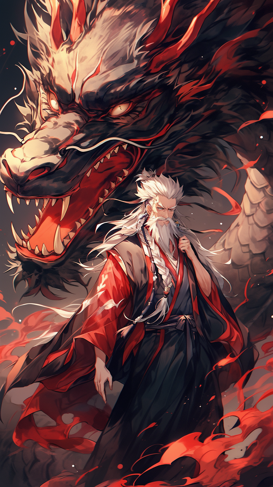
>    <div style="font-family: STXingkai;font-size:20px">天堑轰雷震，穹顶云光影。</div><br/>
>    <div style="font-family: STXingkai;font-size:20px">黯云盘，昭影明霰却透见，泰山路。</div><br/>
>    <div style="font-family: STXingkai;font-size:20px">适君扶摇乾清殿，乱批占，奇正撼。</div><br/>
>    <div style="font-family: STXingkai;font-size:20px">神女珠洒含泪溅，泣歌府君乾德大，大德维何？唯生死两仪故。</div><br/>
>    <div style="font-family: STXingkai;font-size:20px">万仞长生观死张，末了是，协无念。</div><br/>
>    <div style="font-family: STXingkai;font-size:20px">无念祭理，理身运道无间河，府君辟地开天！</div><br/>
> 2. <div style= "font-family:monospace;font-size:30px">道歌我颂</div><br/>
>
>     <div style= "font-family:monospace;font-size:20px">我徒有我，空乏其身</div><br/>
>
>     <div style= "font-family:monospace;font-size:20px">轻身如燕，焉入风云</div><br/>
>
>     <div style= "font-family:monospace;font-size:20px">胡可以惧，何可见夺</div><br/>
>
>     <div style= "font-family:monospace;font-size:20px">既已无失，天地可得</div><br/>
>
>     <div style= "font-family:monospace;font-size:20px">拥天伏地，身化其刚</div><br/>
>
>     <div style= "font-family:monospace;font-size:20px">立地擎天，身柔其怯</div><br/>
>
>     <div style= "font-family:monospace;font-size:20px">刚柔斯济，得求其烈</div><br/>
>
> 3. <div style="font-family: STXingkai;font-size:30px">舒离歌</div><br/>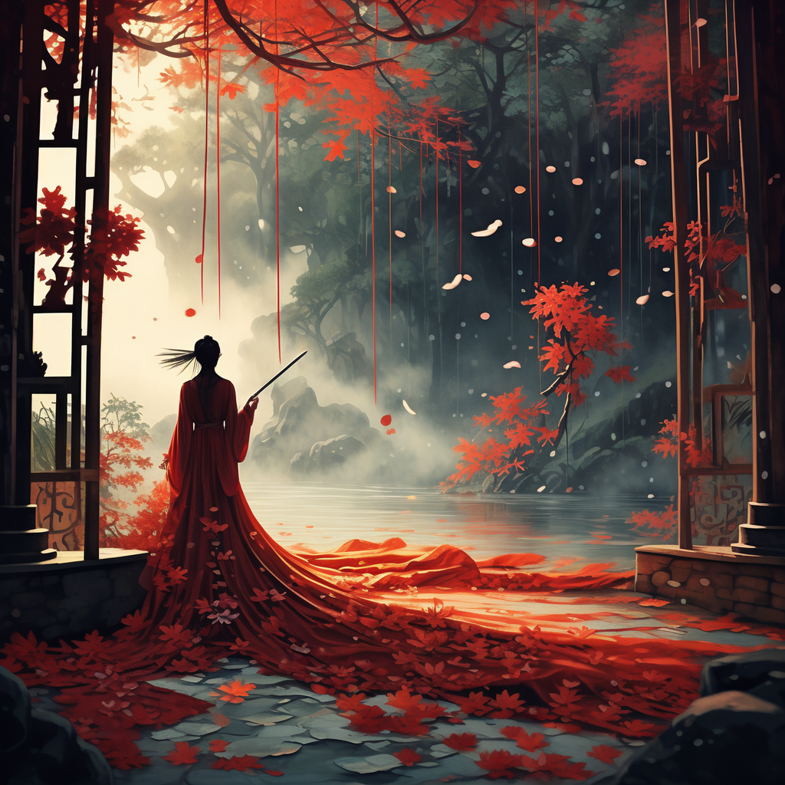
>    <div style="font-family: STXingkai;font-size:20px">蓬黎唱晚，顾望旋花落。恨晚风来早，绯云来迟，夜顿夏梦染。</div><br/>
>    <div style="font-family: STXingkai;font-size:20px">梦里寻真真亦梦，镜舒两离，胡言癫狂语。</div><br/>
>    <div style="font-family: STXingkai;font-size:20px">人不见，伺窥无情游，无情我。</div><br/>
>    <div style="font-family: STXingkai;font-size:20px">玉色剑陨刺岚颠，坠下闲云鹤，万里禅。</div><br/>
>    <div style="font-family: STXingkai;font-size:20px">点降暮帘飘渺声，独不闻，谁在弹？</div><br/>
>
> 4. <div style="font-family: STXingkai;font-size:30px">夜游晚江水</div><br/>
>     <div style="font-family: STXingkai;font-size:20px">叠晚舟，孤灯染昼画船钩。闻鱼龙悲啸，看淡澜风清，无人吟语。</div><br/>
>     <div style="font-family: STXingkai;font-size:20px">钓元秋，银河飞转流白练。赏玉蝉鸣咏，算星罗棋布，天神弈对。</div><br/>
>     <div style="font-family: STXingkai;font-size:20px">惊恍惚，手扇飘花点落地，起望烟缭远近山，独我摇琴，水露轻沾。</div><br/>
>     <div style="font-family: STXingkai;font-size:20px">断桥天上楚云飞，白河川里云龙盘。</div><br/>
>     <div style="font-family: STXingkai;font-size:20px">容我无事，醉梦矣。性如此，任他地覆天翻！</div><br/>
>     <div style="font-family: STXingkai;font-size:20px">人生是，借假修真。</div><br/>
>     <div style="font-family: STXingkai;font-size:20px">水火傍身真如幻，我性迷绮假是真。</div><br/>
>
> 5. <div style="font-family: STXingkai;font-size:30px">轻离此磐疏神兮</div><br/>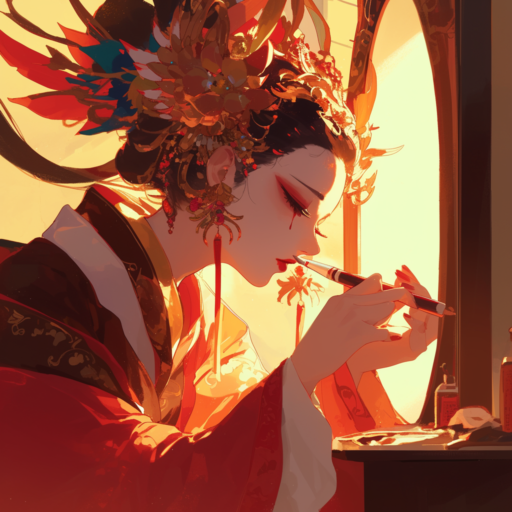
>      <div style="font-family: STXingkai;font-size:20px">轻点焰妆绡红泪，舞筝起，笙歌鸣。</div><br/>
>      <div style="font-family: STXingkai;font-size:20px">律韵带协起伏身，毋由己，动静伶。</div><br/>
>      <div style="font-family: STXingkai;font-size:20px">兀得欢影新此系，驱下场，魂是息。</div><br/>
>      <div style="font-family: STXingkai;font-size:20px">犹愿勿演索泪事，舒待己，唱轻离。</div><br/>
>      <div style="font-family: STXingkai;font-size:20px">谁是人间失魂客，墨落书，叙日夕。</div><br/>
>
> 6. <div style="font-family: STXingkai;font-size:30px">为何？不知</div><br/>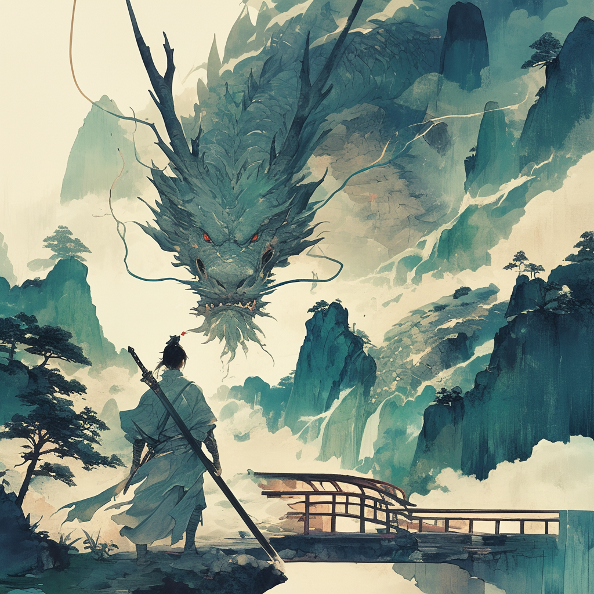
>     <div style="font-family: STXingkai;font-size:20px">无人与我屠龙，青山路上半桥松。</div><br/>
>     <div style="font-family: STXingkai;font-size:20px">眼前半生糊涂事，作来往日清风。</div><br/>
>     <div style="font-family: STXingkai;font-size:20px">运化残功扶刀起，乍是泣泪血书成。</div><br/>
>     <div style="font-family: STXingkai;font-size:20px">功在茶馆评书，身在一方屏后，解是孤胆一身萍，会在世里逢颂，予亦相称送。</div><br/>
>     <div style="font-family: STXingkai;font-size:20px">上道若问此为何？天知，我不知。</div><br/>
>
> 7. <div style="font-family: STXingkai;font-size:30px">仲夏夜梦 歌仙</div><br/>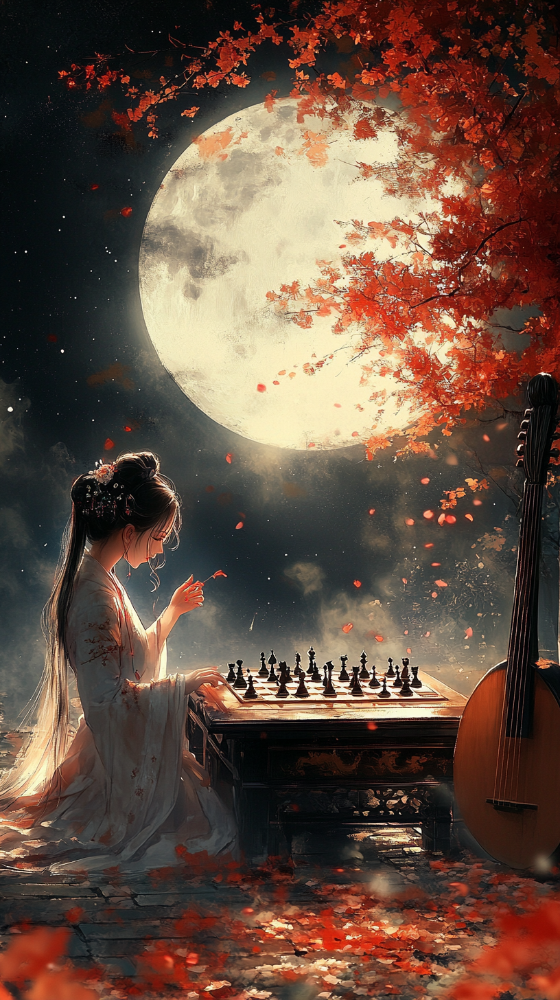
>     <div style="font-family: STXingkai;font-size:20px">清凉绡透，眺指零星恬笑欢。</div><br/>
>     <div style="font-family: STXingkai;font-size:20px"> 叹逍遥难觅，照堪自如是轻拨撩重，天散晴汉。</div><br/>
>     <div style="font-family: STXingkai;font-size:20px">汉无寻迹，岂令何人可攀？</div><br/> 
>     <div style="font-family: STXingkai;font-size:20px">但听仙音袅袅，短歌夏夜长梦，扶摇轻挂长衫，遮盖云天！省云天有雷，我枕歌对仙、弈棋盘！</div><br/> 
>
> 8. <div style="font-family: STXingkai;font-size:30px">络丝娘</div><br/>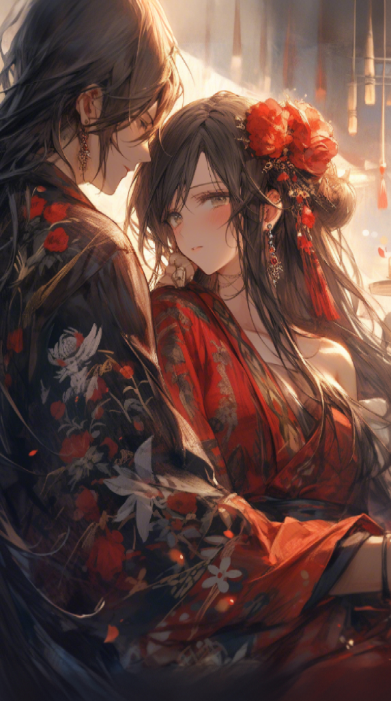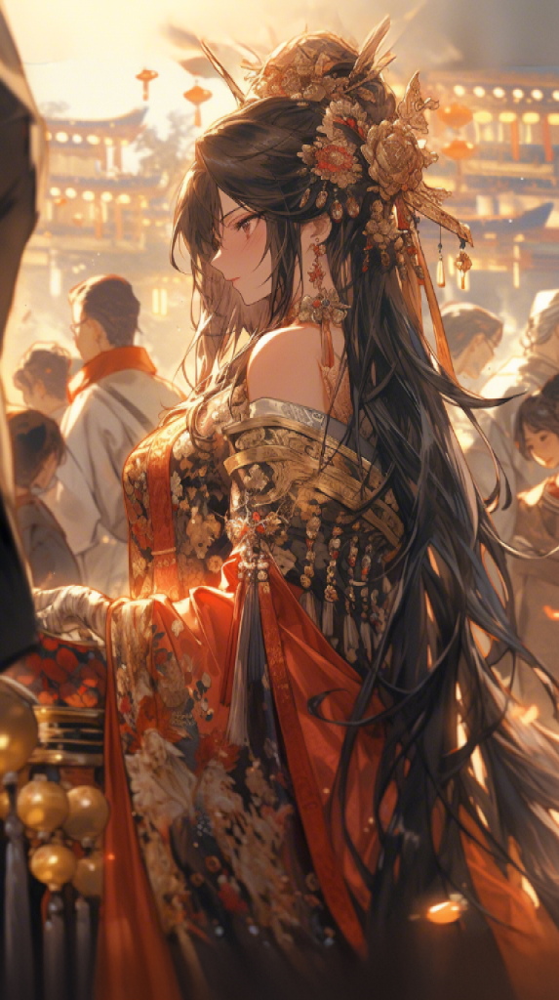
>    <div style="font-family: STXingkai;font-size:20px">美娇娘，络丝新褥照明廊。</div><br/>
>    <div style="font-family: STXingkai;font-size:20px">廊影昭明光，我见娘娇害情乱，言不语。</div><br/>
>    <div style="font-family: STXingkai;font-size:20px">不语何予，怎敢悦请情芳？</div><br/>
>    <div style="font-family: STXingkai;font-size:20px">可惜只顾思怜，怜可亲。</div><br/>
>    <div style="font-family: STXingkai;font-size:20px">可亲是萱若迷影，影落沉枕心涧，不敢恋香。只道合坐旁让，若无真心感连相，谁好赴作情郎？</div><br/>
>    <div style="font-family: STXingkai;font-size:20px">情转言深，计思量，终难忘。</div><br/>
>
> 9. <div style="font-family: STXingkai;font-size:30px">红袖垂</div><br/>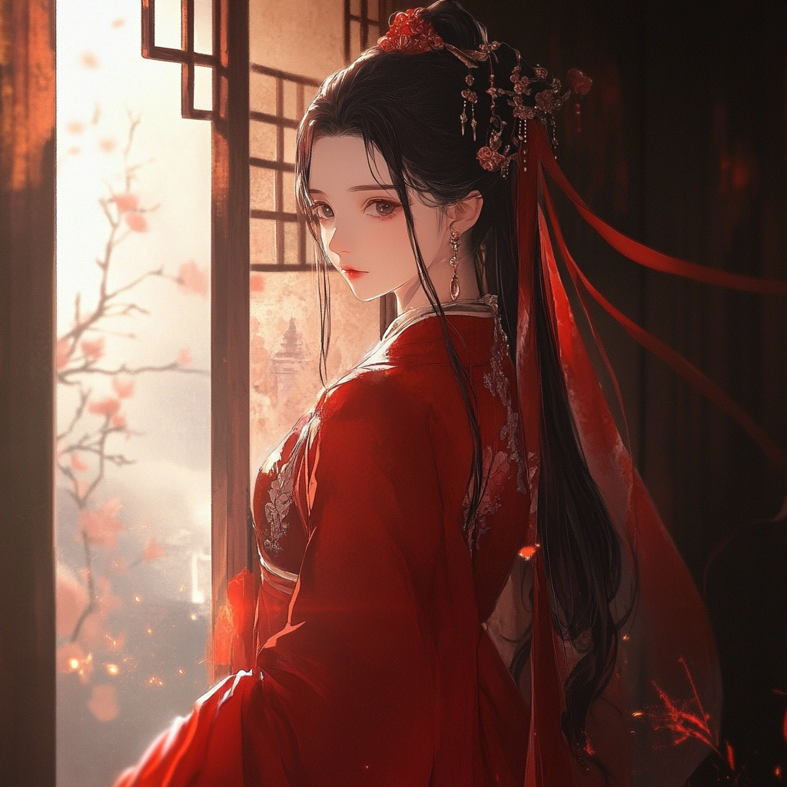
>    <div style="font-family: STXingkai;font-size:20px">堕红袖，悄扇清绣慰朱颜。</div><br/>
>    <div style="font-family: STXingkai;font-size:20px">梦锁幽帘黛人间，镜钗云鬓，似教笑人恬。 </div><br/>
>    <div style="font-family: STXingkai;font-size:20px">也焕晴衫灌弗醉，些许是情人泪，洒落世间才兑。</div><br/>
>    <div style="font-family: STXingkai;font-size:20px">撩采心烟绕红垂，终是以待念人，相舍随陪。</div><br/>
>  
> 10. <div style="font-family: STXingkai;font-size:30px">宿醒唤青衣</div><br/>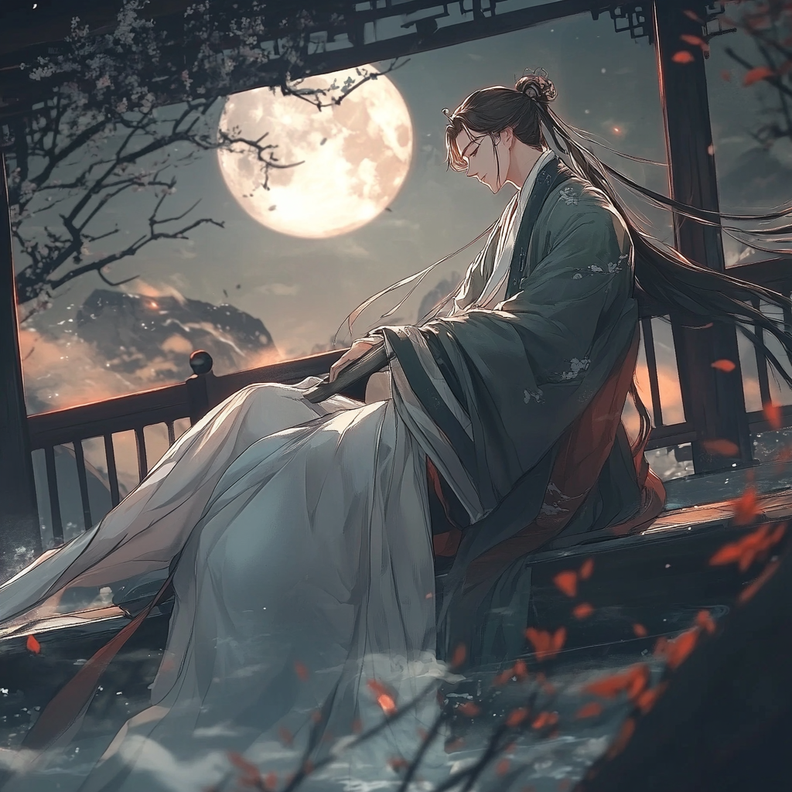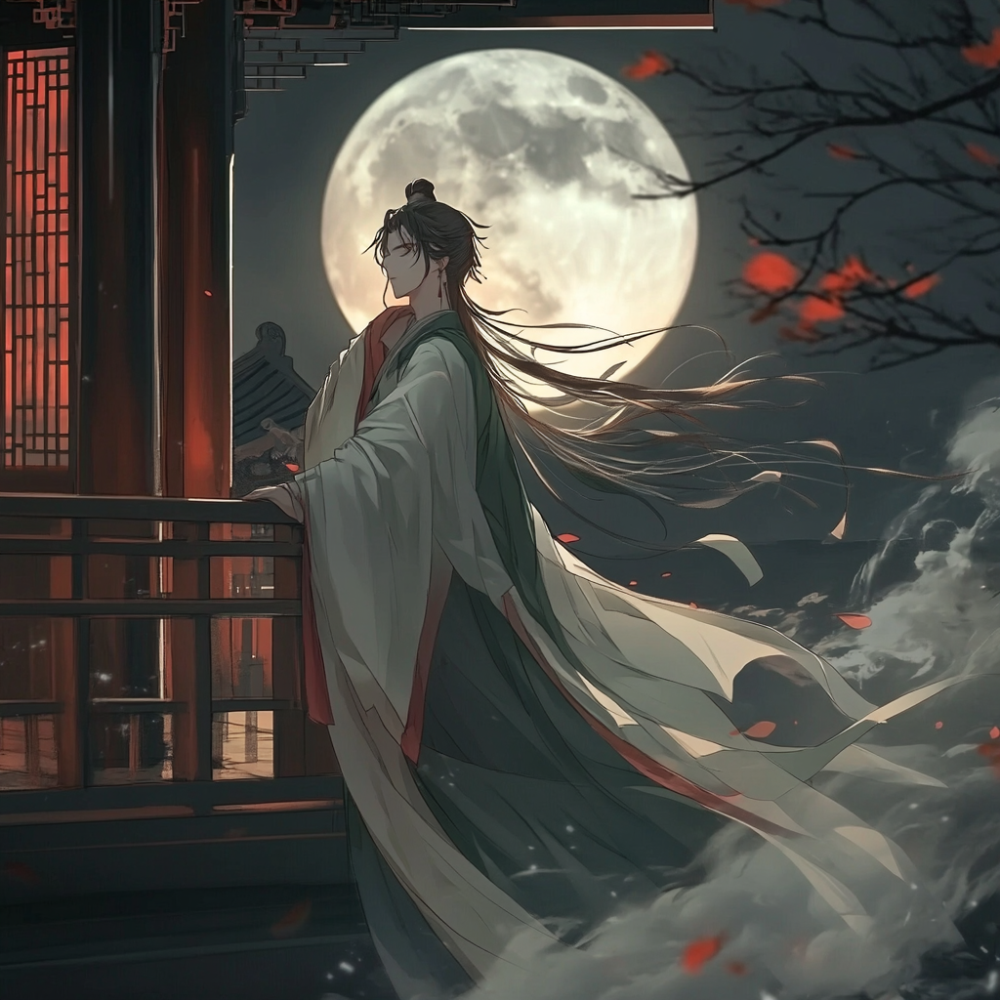
>      <div style="font-family: STXingkai;font-size:20px">亭醉吮饮廊洲月，跃发坐尘挽林溪。</div><br/>
>      <div style="font-family: STXingkai;font-size:20px">宴送星筝一场风，吹散零落缅妆，却教人点着青衣。</div><br/>
>      <div style="font-family: STXingkai;font-size:20px">轻纳情袖拂凌定，身转却着天宫云迹。</div><br/>
>      <div style="font-family: STXingkai;font-size:20px">是哪方真人才刚醒憩？</div><br/>
> 
> 11. <div style="font-family: STXingkai;font-size:30px">鹧鸪天 青灯</div><br/>
>     <div style="font-family: STXingkai;font-size:20px">青画瞄山伴盏灯，照横渠，白鹭天野中。叶蝉弥叫，归思望铁松。</div><br/>
>     <div style="font-family: STXingkai;font-size:20px">启仗离休川瀑雾，何日消沉？欢梦若浮生！</div><br/>
>     <div style="font-family: STXingkai;font-size:20px">瞭见岁烟谜谜霭，悄然如寄，但笑嬉孩童。我短歌穹苍，熹微亮明公。</div><br/>
> 
> 12. <div style="font-family: STXingkai;font-size:30px">青衣漫桥</div><br/>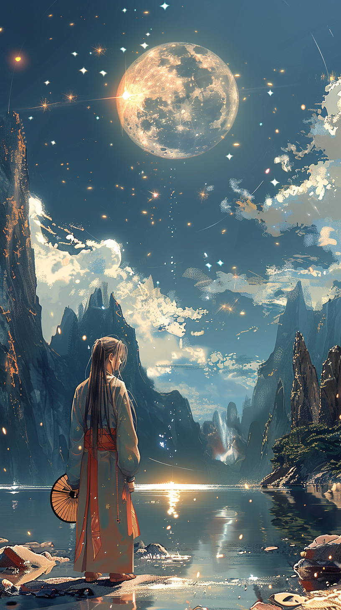
>      <div style="font-family: STXingkai;font-size:20px">半月桥，露点零清慰寂寥。</div><br/>
>      <div style="font-family: STXingkai;font-size:20px">携晚风，青衣嫚寻性逍遥。</div><br/>
>      <div style="font-family: STXingkai;font-size:20px">逍遥折扇应戏许，触点凌云霄。</div><br/>
>      <div style="font-family: STXingkai;font-size:20px">凌虚青霄也邀我，散涣灵明待来稍。</div><br/>
>      <div style="font-family: STXingkai;font-size:20px">时分渐至长刻，今来往昔顾既描，我短歌引啸唱离骚。</div><br/>
>
> 13. <div style="font-family: STXingkai;font-size:30px">和词东坡先生之江城子恨别</div><br/>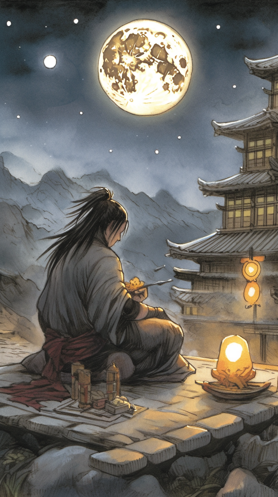
>      <div style="font-family: STXingkai;font-size:20px"> 林苑丛，姣月折婉中。</div><br/>
>      <div style="font-family: STXingkai;font-size:20px"> 寄人长情楚楚依，离去却匆匆。</div><br/>
>      <div style="font-family: STXingkai;font-size:20px">待回还，留落难愁，尽在不语中。</div><br/>
>      <div style="font-family: STXingkai;font-size:20px">天辜悲鸿，雁展归曲东</div><br/>
>      <div style="font-family: STXingkai;font-size:20px">我无厌，何年许见？故庭长柏青松。</div><br/>
>
> 14. <div style="font-family: STXingkai;font-size:30px">行香子 过严陵濑</div><br/>
>       <div style="font-family: STXingkai;font-size:20px">倦取余霞坐晚舟，华彩婷妆暖清秋。</div><br/>
>       <div style="font-family: STXingkai;font-size:20px">游转流江曲如画，忆当年，光武严陵。</div><br/>
>       <div style="font-family: STXingkai;font-size:20px">今古君臣，虽不承志也无名，但曾有，知我留情。</div><br/>
>       <div style="font-family: STXingkai;font-size:20px">聚荡萍波算远汀，恰又观见：</div><br/>
>       <div style="font-family: STXingkai;font-size:20px">严陵鱼钓秋水色，翠点云山晓峰青。</div><br/>
>       <div style="font-family: STXingkai;font-size:20px">鉴映明影成一注，过眼云烟效天听。</div><br/>
>
> 15. <div style="font-family: STXingkai;font-size:30px">南歌子 还箫</div><br/>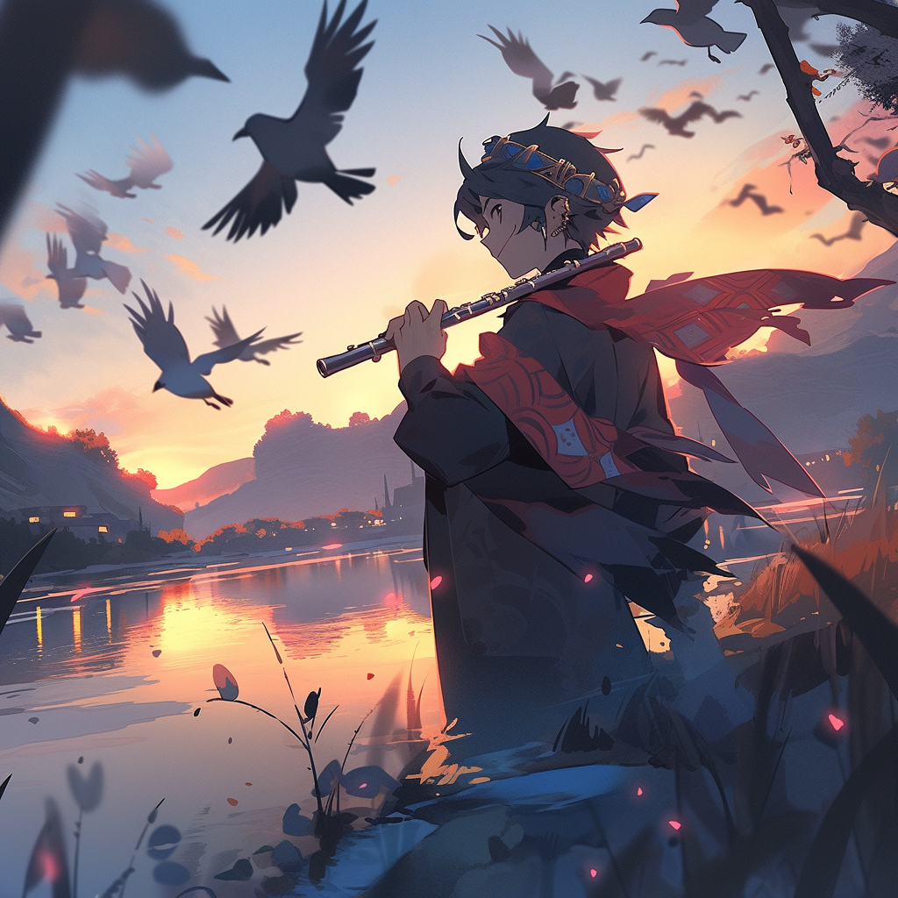
>       <div style="font-family: STXingkai;font-size:20px">背晚歌，清许淮涧漫红波。</div><br/>
>       <div style="font-family: STXingkai;font-size:20px">野眺蹒跚处，醉叶缠缭，撩零箫。</div><br/>
>       <div style="font-family: STXingkai;font-size:20px">谁人唱箫？箫叫钓离绡，谁人笑真傲？</div><br/>
>       <div style="font-family: STXingkai;font-size:20px">傲闹歇身还吊处，只是当时年少。</div><br/>
>
> 16. <div style="font-family: STXingkai;font-size:30px">风凉暖玉</div><br/>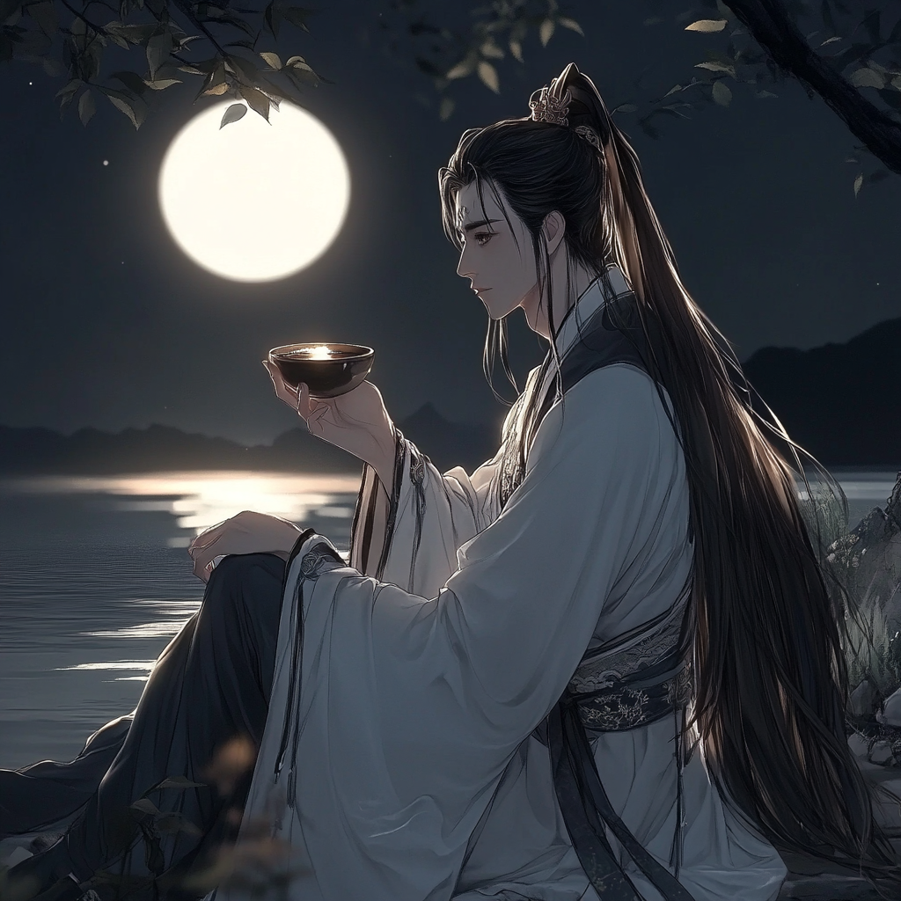
>       <div style="font-family: STXingkai;font-size:20px">一湖霜，俏看滴露液流觞。</div><br/>
>       <div style="font-family: STXingkai;font-size:20px">不教窗逾静晚，皎皎月明，罅隙淡散艳缭光。</div><br/>
>       <div style="font-family: STXingkai;font-size:20px">饮浸何晓梦醒？</div><br/>
>       <div style="font-family: STXingkai;font-size:20px">咬叶铃风话清凉，凉涌泉中润暖玉，是沽酒铭觞。恬醉也，教我人间竞风流。</div><br/>
>
> 17. <div style="font-family: STXingkai;font-size:30px">云采</div><br/>
>        <div style="font-family: STXingkai;font-size:20px">乱采云滩斑驳镜，不颜汗，竟奇观。</div><br/>
>        <div style="font-family: STXingkai;font-size:20px">我开天阖许不负，算也畏，湍云专。</div><br/>
>        <div style="font-family: STXingkai;font-size:20px">但实衷心不愿辜，离弦踏脱，畏也不难。</div><br/>
>        <div style="font-family: STXingkai;font-size:20px">难最是，何颜教人欢？</div><br/>
>
> 18. <div style="font-family: STXingkai;font-size:30px">浪淘沙</div><br/>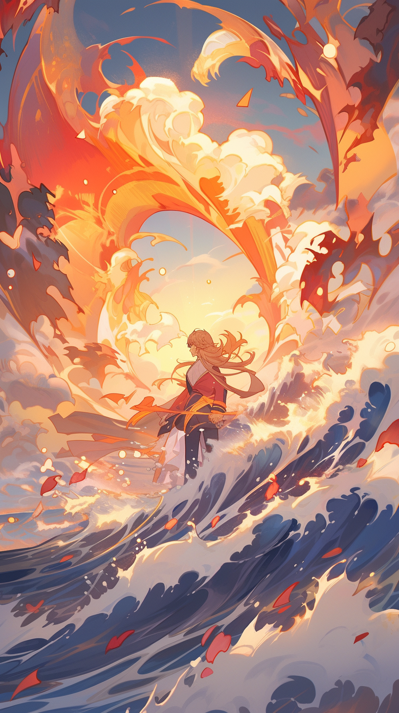
>      <div style="font-family: STXingkai;font-size:20px">大浪淘沙，沙无尽。无尽烨穹花。</div><br/>
>      <div style="font-family: STXingkai;font-size:20px">穹花苍变无边相，揽收太液池，挂残妆。</div><br/>
>      <div style="font-family: STXingkai;font-size:20px"> 妆缅槃云镜，云暗见亮，应是虚凌迟光。</div><br/>
>      <div style="font-family: STXingkai;font-size:20px">迟光引相，浪去随明波去，至滩沙临觞。</div><br/>
>
> 19. <div style="font-family: STXingkai;font-size:30px">风卷临清</div><br/>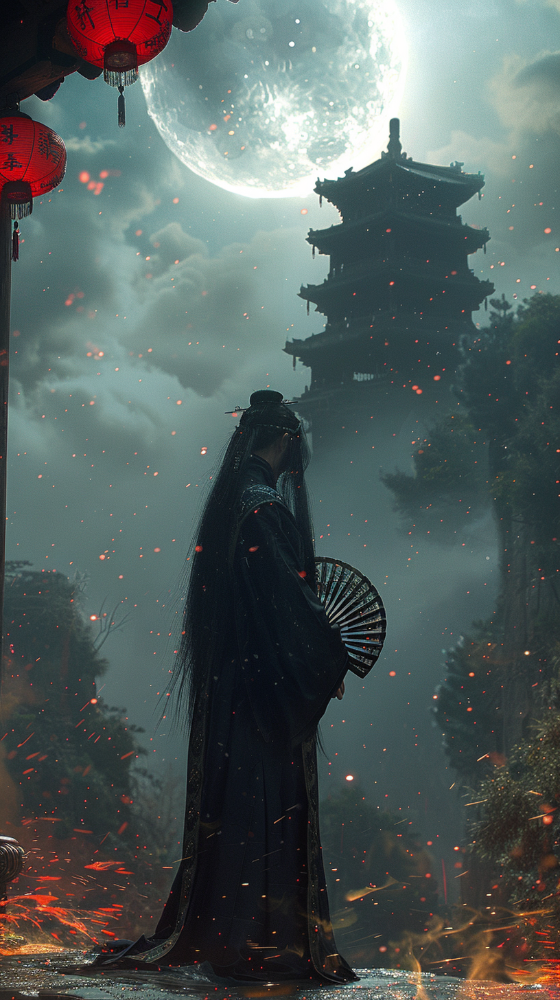
>     <div style="font-family: STXingkai;font-size:20px">我教临风一点清，乱弹星，云淡轻。</div><br/>
>     <div style="font-family: STXingkai;font-size:20px">风卷镰割散漫萍，刺红绣，暗月明。</div><br/>
>     <div style="font-family: STXingkai;font-size:20px">流束越转圆光镜，照鉴众生相，是灵精妙婉，唬儿谁惊？</div><br/>
>     <div style="font-family: STXingkai;font-size:20px">静萍情邀奢挽，旧叙长亭。</div><br/>
>
> 20. <div style="font-family: STXingkai;font-size:30px">冷溪沙</div><br/>
>     <div style="font-family: STXingkai;font-size:20px">冷溪沙，浣洗凉清星月发。</div><br/>
>     <div style="font-family: STXingkai;font-size:20px">涓无隙，渺无尘，岁养天生照琉夏。</div><br/>
>     <div style="font-family: STXingkai;font-size:20px">渡长波，歧路漠，窥得零路前道尽，不许说。</div><br/>
>     <div style="font-family: STXingkai;font-size:20px">蓄归成天旋荡济，揽芳烨婷花。</div><br/>
>
> 21. <div style="font-family: STXingkai;font-size:30px">三言</div><br/>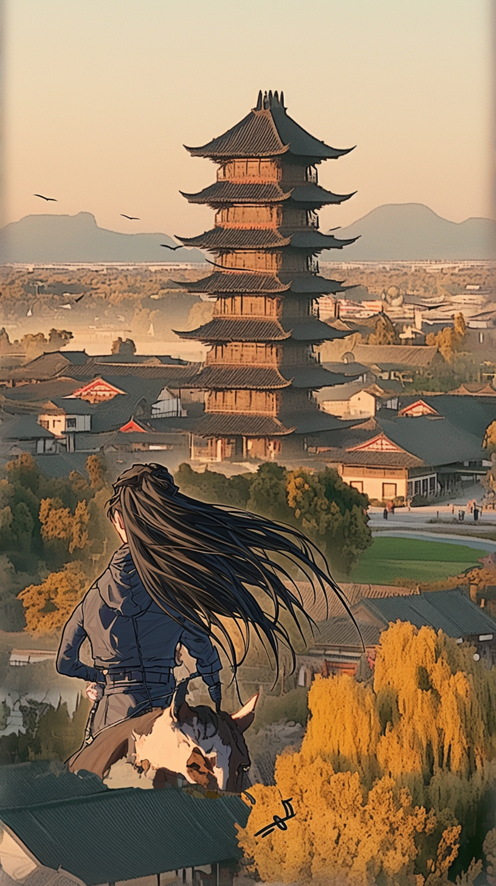
>     <div style="font-family: STXingkai;font-size:20px">兴彩是，念希雄州雾列应许少年纵马。</div><br/>
>     <div style="font-family: STXingkai;font-size:20px">耽然去，望堪百道千隙或有踏脱之时。</div><br/>
>     <div style="font-family: STXingkai;font-size:20px">叹摇首，奋力千钧冲破原是自固其间。</div><br/>
>
> 22. <div style="font-family: STXingkai;font-size:30px">燕碎</div><br/>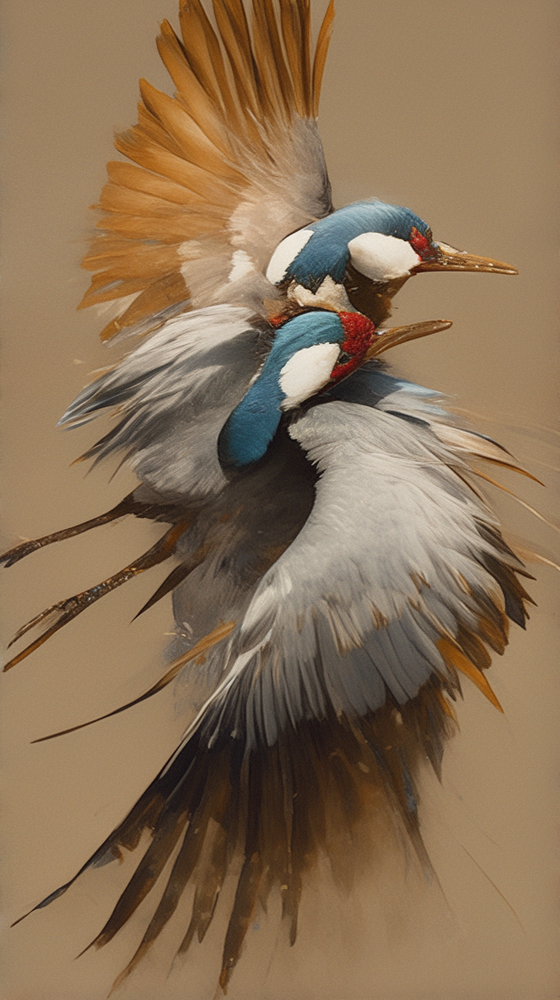
>     <div style="font-family: STXingkai;font-size:20px">鸿飞燕，游转画江流，掠声惊叫碎。</div><br/>
>     <div style="font-family: STXingkai;font-size:20px">碎齐玄天坠无间，返来却无辞缀。</div><br/>
>     <div style="font-family: STXingkai;font-size:20px">无辞是身灭魂丧灵涕喈，顽不悔。之影向散流光会。</div><br/>
>
> 23. <div style="font-family: STXingkai;font-size:30px">花葬花</div><br/>
>     <div style="font-family: STXingkai;font-size:20px">凄艳玉兰开早谢，晴枝扫悲绢啼嗟。</div><br/>
>     <div style="font-family: STXingkai;font-size:20px">皆望花繁盛点街，不思花放过隙歇。</div><br/>
> 24. <div style="font-family: STXingkai;font-size:30px">夜雨楼</div><br/>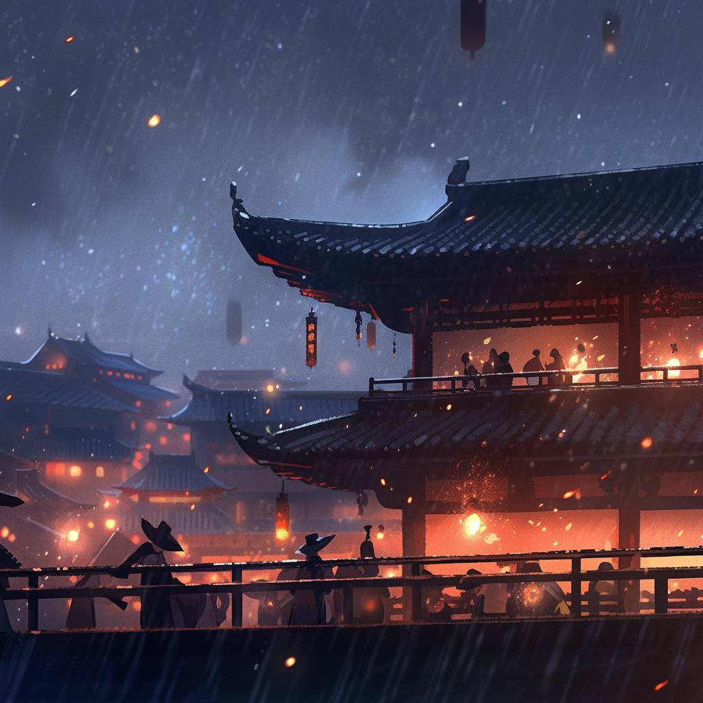
>     <div style="font-family: STXingkai;font-size:20px"> 夜雨柔，翠画红偎艳新楼。</div><br/>
>     <div style="font-family: STXingkai;font-size:20px">伴卷帘霞红旆入，扇掩鸿楼缦，楼勉离星灯照影鉴。</div><br/>
>     <div style="font-family: STXingkai;font-size:20px">鉴转明照霰妆，盘秀颜，是谁求？</div><br/>
>     <div style="font-family: STXingkai;font-size:20px">算也是无谓，钩点零星慰玉描。</div><br/>
>     <div style="font-family: STXingkai;font-size:20px">任滴露寻游，流到尽幕是，昊天误留。</div><br/>
> 
> 25. <div style="font-family: STXingkai;font-size:30px">青鸟</div><br/>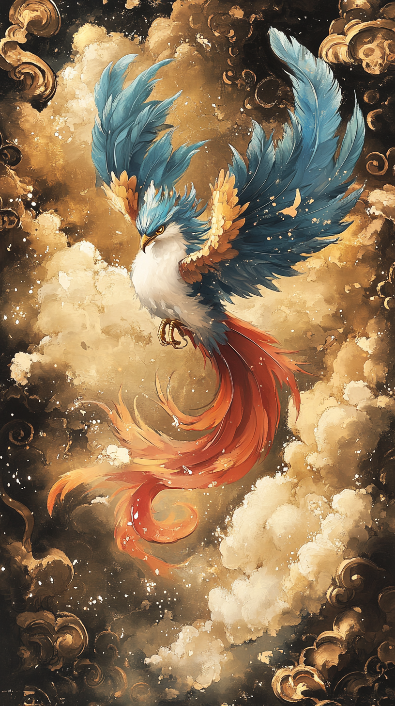
>     <div style="font-family: STXingkai;font-size:20px">淋暗霜，镜叶林深不见光。强忍磐行不顾伤，青鸟悄探看，飞出晴阳。</div><br/>
>     <div style="font-family: STXingkai;font-size:20px">细隙明间散透亮，心易血脉旋一浪，洗尽沧桑。</div><br/>
>     <div style="font-family: STXingkai;font-size:20px">淋照烨光福玉润，青鸟霰虹妆，奇艳莽苍！</div><br/>
>
> 26. <div style="font-family: STXingkai;font-size:30px">夏语鸣悲</div><br/>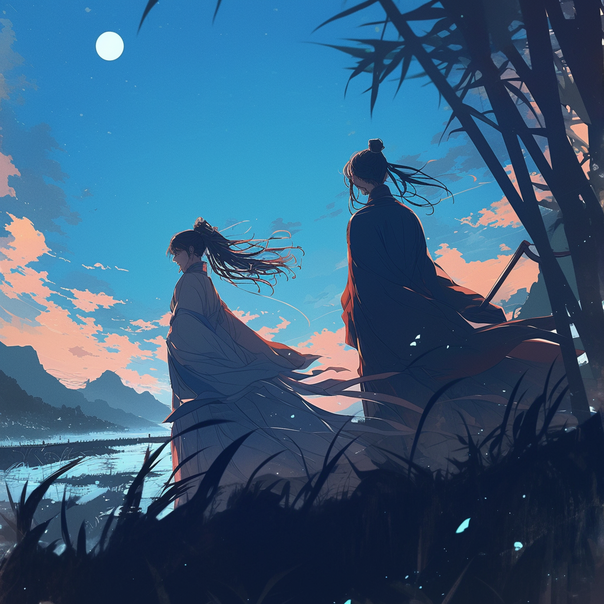
>     <div style="font-family: STXingkai;font-size:20px">长夜夏，亦步践履难追迹，却见影遗渐远，送唱悲语。</div><br/>
>     <div style="font-family: STXingkai;font-size:20px">悲语不悲离人泪，悲翩翩匆逢，明日君若何从？</div><br/>
>     <div style="font-family: STXingkai;font-size:20px">妄断虞念，戏兴又多可久？纵与谁正同醉道叙归？</div><br/>
>     <div style="font-family: STXingkai;font-size:20px">我也教听随尔去，约竟到，莽苍崔巍！</div><br/>
> 
> 27. <div style="font-family: STXingkai;font-size:30px">兰亭见君</div><br/>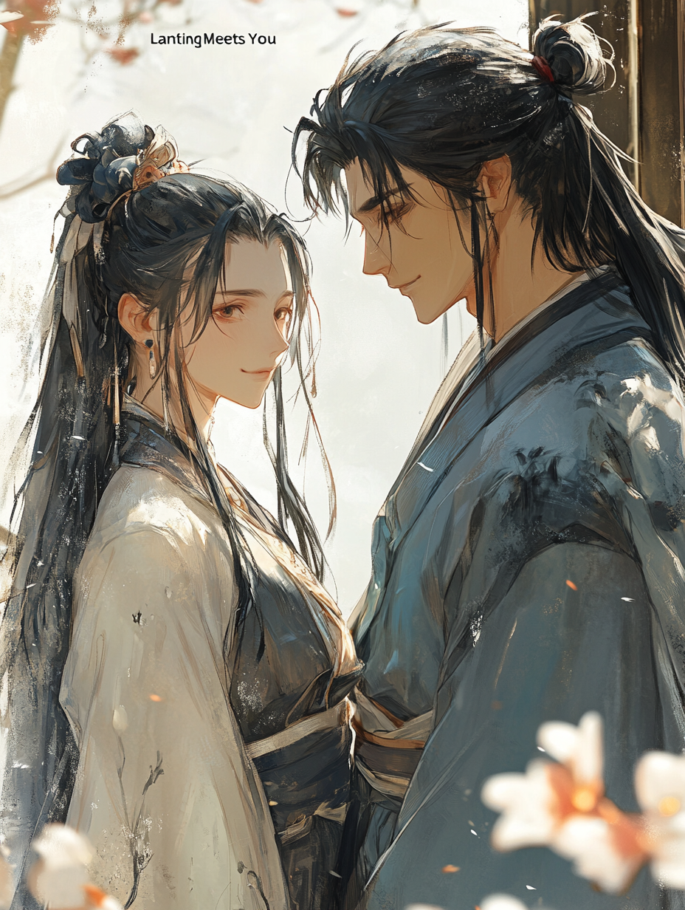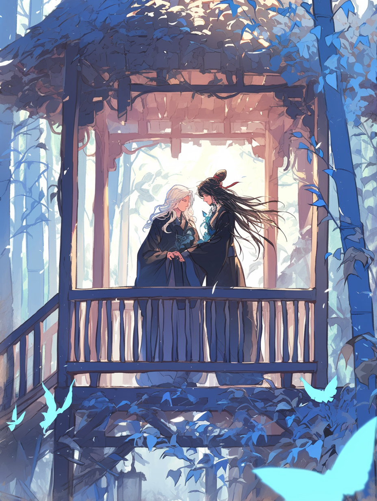
>     <div style="font-family: STXingkai;font-size:20px">风起青萍末，久过兰亭早，覆栖草。</div><br/>
>     <div style="font-family: STXingkai;font-size:20px">见前尘往事，到兰亭别晓，待君来到。</div><br/>
>     <div style="font-family: STXingkai;font-size:20px">身缦垂露晚吊，相视展颜照笑。</div><br/>
>     <div style="font-family: STXingkai;font-size:20px">见君来，相晤甚好。</div><br/>
>     <div style="font-family: STXingkai;font-size:20px">把酒放歌，送笔书画千金稿。算文有市价，欢歌酌酒切忌表。只想君我两相颂，同心终难讨。</div><br/>
>     <div style="font-family: STXingkai;font-size:20px">不好不妙，我送君遥眺。</div><br/>
>     <div style="font-family: STXingkai;font-size:20px">真好真妙，君踏入青霄，莫离巧。</div><br/>
>     <div style="font-family: STXingkai;font-size:20px">别君道，起将兰亭扫。</div><br/>
>     <div style="font-family: STXingkai;font-size:20px">扫尽风雨处，还请相约老。</div><br/>
>
> 28. <div style="font-family: STXingkai;font-size:30px">遥阳曲</div><br/>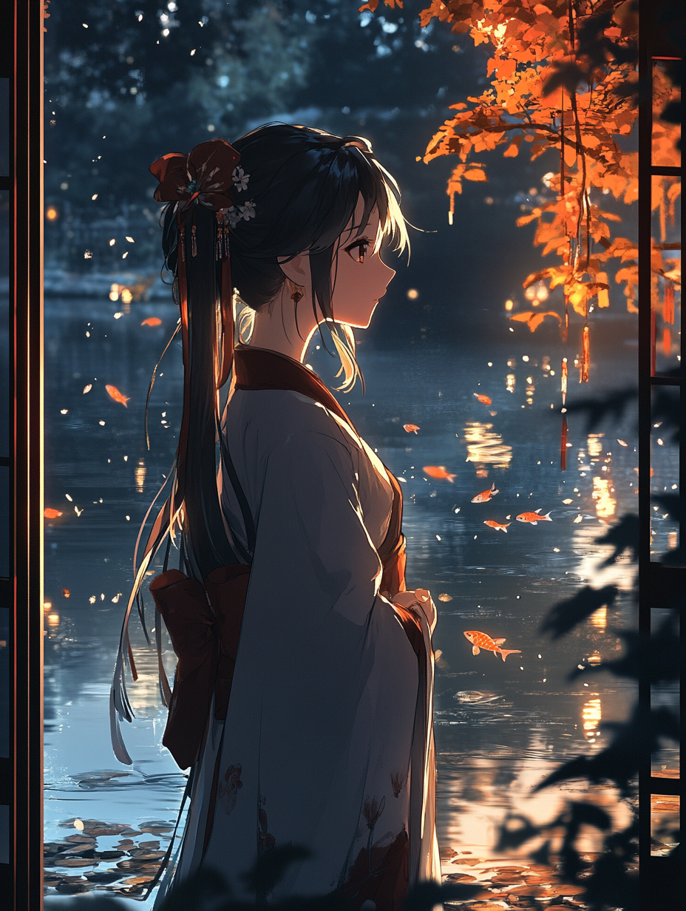
>     <div style="font-family: STXingkai;font-size:20px">夜迟无念潇湘雨，一窗情，应有愿许。</div><br/>
>     <div style="font-family: STXingkai;font-size:20px">帘送风凉赘无语，从前如梦，纵跃万千思缕。</div><br/>
>     <div style="font-family: STXingkai;font-size:20px">谁与明言来日世，空静无声，池港跳鱼。</div><br/>
>     <div style="font-family: STXingkai;font-size:20px">鱼跃出水些许冷寒，我却思图遥阳曲。</div><br/>
>     <div style="font-family: STXingkai;font-size:20px">遥阳曲，唱散心间云霭。</div><br/>
>
> 29. <div style="font-family: STXingkai;font-size:30px">云转九曲</div><br/>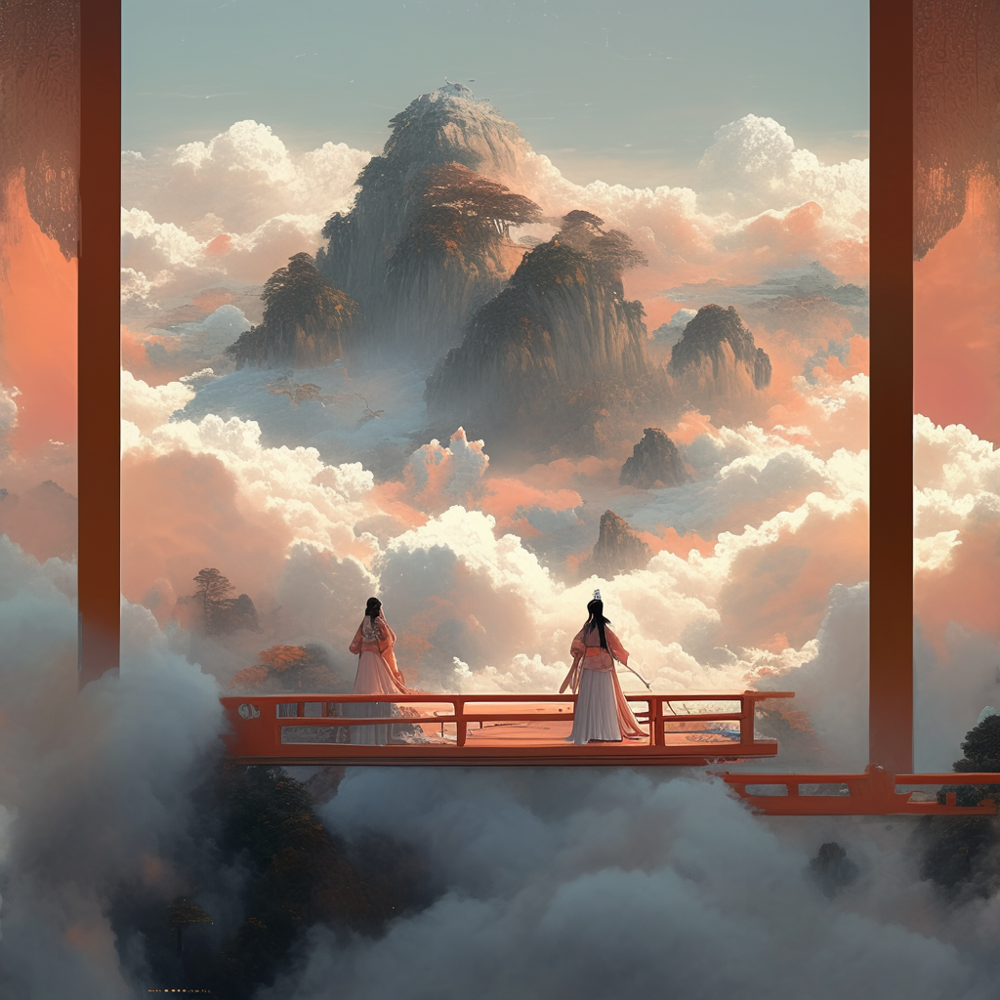
>     <div style="font-family: STXingkai;font-size:20px">天姿醉袅迷风烟，滚滚尘，不复痕。</div><br/>
>     <div style="font-family: STXingkai;font-size:20px">幽梦残断怅寒阳，夜茫茫，飞出神。</div><br/>
>     <div style="font-family: STXingkai;font-size:20px">迟阳觅归倦天涯，淋焕光，道圆方。</div><br/>
>     <div style="font-family: STXingkai;font-size:20px">盘染九曲还催复，淡云飞，探精深。</div><br/>
>
> 30. <div style="font-family: STXingkai;font-size:30px">柳弄</div><br/>
>     <div style="font-family: STXingkai;font-size:20px">垂柳洗寰拨云弦，影散乱，慕娉婷。</div><br/>
>     <div style="font-family: STXingkai;font-size:20px"> 雷鸣鼓震轰迷霭，穹光里，唤星萤。</div><br/>
>     <div style="font-family: STXingkai;font-size:20px">柳摇长空啸雷霆，终无心，莫是情。</div><br/>
>     <div style="font-family: STXingkai;font-size:20px">是情揽捋终雨晴，闭舍开，笑轻盈。</div><br/>
>
> 31. <div style="font-family: STXingkai;font-size:30px">字我凌花</div><br/>
>     <div style="font-family: STXingkai;font-size:20px">严刻冰凌寒济深,却求花丽来报春。</div><br/>
>     <div style="font-family: STXingkai;font-size:20px">似岁至成论形纪，争言存问创观甄。</div><br/>
> 
> 32. <div style="font-family: STXingkai;font-size:30px">明星轻点谧云妆</div><br/>
>     <div style="font-family: STXingkai;font-size:20px">冷清秋，坐盏莲灯半侧书。</div><br/>
>     <div style="font-family: STXingkai;font-size:20px">观风下百叶，无穷宙宇，帘卷流苏。</div><br/>
>     <div style="font-family: STXingkai;font-size:20px">抟器转弦促歌舞，觉刹那星点、过眼云烟终，终是割断素璞。</div><br/>
>     <div style="font-family: STXingkai;font-size:20px">既如是，何妨用短拨长，学来无尽。</div><br/>
>     <div style="font-family: STXingkai;font-size:20px">无尽游浪世间星云，运流精光。</div><br/>
>     <div style="font-family: STXingkai;font-size:20px">光仪有瑕，待我寻作星点，细补阁妆。</div><br/>
>
> 33. <div style="font-family: STXingkai;font-size:30px">高岭花</div><br/>
>     <div style="font-family: STXingkai;font-size:20px">暗香里，何处昏寻遥寄？</div><br/>
>     <div style="font-family: STXingkai;font-size:20px">只一眼银絮，挽回顾流芳。</div><br/>
>     <div style="font-family: STXingkai;font-size:20px">岭上飘雪淡看，独一枝，俏艳争放！</div><br/>
>     <div style="font-family: STXingkai;font-size:20px">感相高下万里相计较，无尽边，何劲消？。</div><br/>
>     <div style="font-family: STXingkai;font-size:20px">啸也随风罢，我无妙住，也天骄！</div><br/>
>
> 34. <div style="font-family: STXingkai;font-size:30px">风月流连</div><br/>
>     <div style="font-family: STXingkai;font-size:20px">月流晚琴，夜晌萤星花垂露，云霰顾。</div><br/>
>     <div style="font-family: STXingkai;font-size:20px">弦长漫路，行无身迹闲庭步，叶散长修竹。</div><br/>
>     <div style="font-family: STXingkai;font-size:20px">渺身映奇赴，长尺落洒云涧覆，俏看谁才入？</div><br/>
>     <div style="font-family: STXingkai;font-size:20px">风期乱流苏，似是不远相识过。笑忖谁先度？</div><br/>
>
> 35. <div style="font-family: STXingkai;font-size:30px">花溪林深</div><br/>
>     <div style="font-family: STXingkai;font-size:20px">落雨飘香花满袖，浅风穿溪觅寻芳。</div><br/>
>     <div style="font-family: STXingkai;font-size:20px">青光跃影淋无处，液洒琼浆溅横桑。</div><br/>
>
> 36. <div style="font-family: STXingkai;font-size:30px">啸川</div><br/>
>     <div style="font-family: STXingkai;font-size:20px">暮迟昏渺乱鸣箫，顾上层峦半重昭。</div><br/>
>     <div style="font-family: STXingkai;font-size:20px">迟顶挥悲飘一剑，骁风烈马啸西川。</div><br/>
>
> 37. <div style="font-family: STXingkai;font-size:30px">归真</div><br/>
>     <div style="font-family: STXingkai;font-size:20px">北国有佳人，南冠客思深。</div><br/>
>     <div style="font-family: STXingkai;font-size:20px">诸付东流水，还首身归真。</div><br/>
>     <div style="font-family: STXingkai;font-size:20px">归真徐惶夜，无似此中人。</div><br/>
>     <div style="font-family: STXingkai;font-size:20px">琳琅天街上，元瑶月付身。</div><br/>
>
> 38. <div style="font-family: STXingkai;font-size:30px">镜转天鉴</div><br/>
>     <div style="font-family: STXingkai;font-size:20px">天化亲颜妆新鉴，练舞南风彩墨衫。</div><br/>
>     <div style="font-family: STXingkai;font-size:20px">瓶波含浪秋凌渡，练舞南风彩墨衫。</div><br/>
>
> 39. <div style="font-family: STXingkai;font-size:30px">晨曦见天神</div><br/>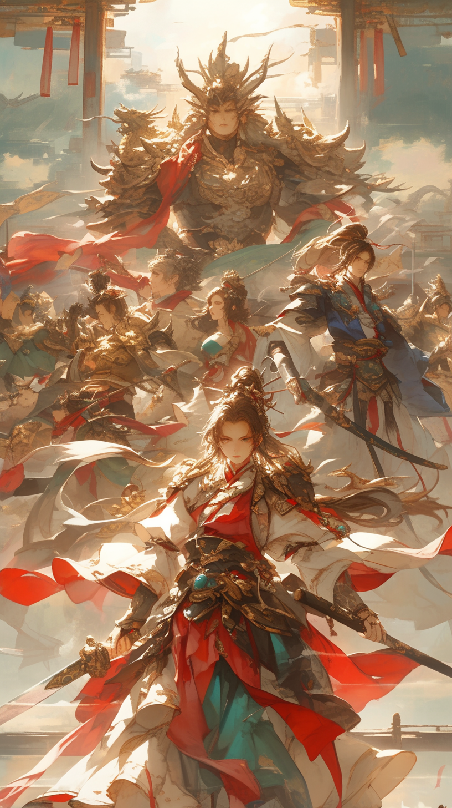
>       <div style="font-family: STXingkai;font-size:20px">幕遮天，万方奏乐闪鸣千。眺银汉，襄落楚天。</div><br/>
>       <div style="font-family: STXingkai;font-size:20px">乱折扇，彩练雀影迷观。俯江河，盘乱绕山。</div><br/>
>       <div style="font-family: STXingkai;font-size:20px">早过曦，金乌凌天飞逐箭。付今日，要渡晴川！</div><br/>
>       <div style="font-family: STXingkai;font-size:20px">川过苍龙岭，劲摆丘陵波，朝天啸！</div><br/>
>
> 40. <div style="font-family: STXingkai;font-size:30px">天仙子 复唤</div><br/>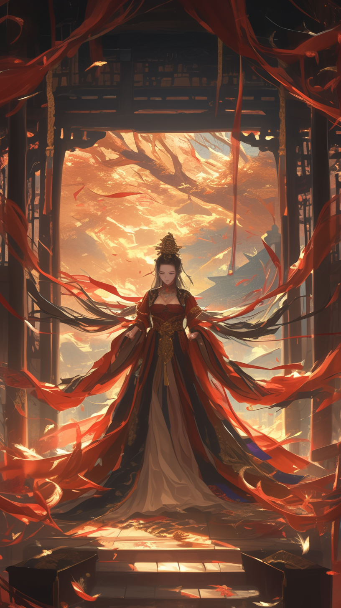
>     <div style="font-family: STXingkai;font-size:20px">晴明照宫阁，玉柳垂环痴音怀，妆颜圆镜台。</div><br/>
>     <div style="font-family: STXingkai;font-size:20px">焦尾遗匣旧余恨，细看来，是汝妆红怜泪，仍可爱！</div><br/>
>     <div style="font-family: STXingkai;font-size:20px">抱琴归轩复元身，念思亲，是吾天仙子，凤兮还复来！</div><br/>
>     <div style="font-family: STXingkai;font-size:20px">云绯上，光翎黄镜开。</div><br/>
>     <div style="font-family: STXingkai;font-size:20px">镜开照霰琳琅雨，天仙子，你是天上来？</div><br/>
>
> 41. <div style="font-family: STXingkai;font-size:30px">离歌笑</div><br/>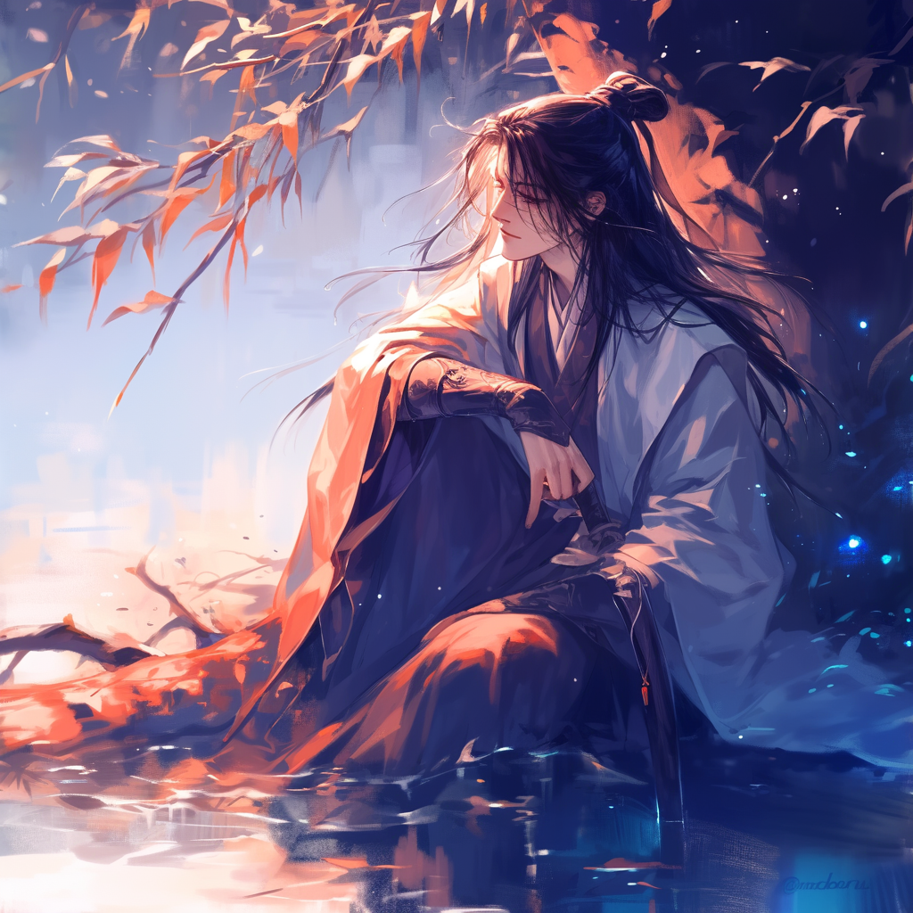
>     <div style="font-family: STXingkai;font-size:20px">寒湘里，凄水摇怀。</div><br/>
>     <div style="font-family: STXingkai;font-size:20px">池中凉清映袭坠，细看是，濡沫人泪。</div><br/>
>     <div style="font-family: STXingkai;font-size:20px">情是何物不许问，敲骨销魂吸人髓。</div><br/>
>     <div style="font-family: STXingkai;font-size:20px">不如放歌去，自趁未老先倾醉。</div><br/>
>     <div style="font-family: STXingkai;font-size:20px">待得归来还纵饮，兴起是，离歌唱来狂笑碎！</div><br/>
>
> 42. <div style="font-family: STXingkai;font-size:30px">人生如棋，落子无悔</div><br/>
>     <div style="font-family: STXingkai;font-size:20px">烟霏沫雨瀑流纱，矜川破风彩溅沙。</div><br/>
>     <div style="font-family: STXingkai;font-size:20px">舍命布棋道不复，落子无悔岁生发！</div><br/>
>
> 43. <div style="font-family: STXingkai;font-size:30px">夏行九歌</div><br/>
>     <div style="font-family: STXingkai;font-size:20px">步煞恶盘鼓吹杀，乾坤九章轮追发。</div><br/>
>     <div style="font-family: STXingkai;font-size:20px">星筝百华杀无尽，华放九歌涅槃沙。</div><br/>
>
> 44. <div style="font-family: STXingkai;font-size:30px">天外天</div><br/>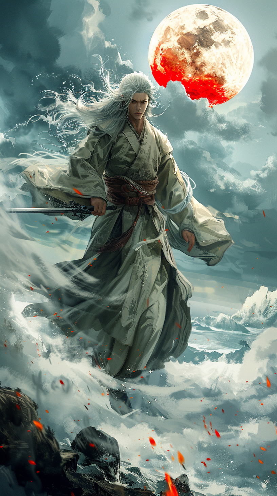
>     <div style="font-family: STXingkai;font-size:20px"> 雾霭轻歇别云涧，轻风但徐见。</div><br/>
>     <div style="font-family: STXingkai;font-size:20px">徐见回还天拗处，不识天外天。</div><br/>
>     <div style="font-family: STXingkai;font-size:20px">天外天照、光难进，有远声来涧。</div><br/>
>     <div style="font-family: STXingkai;font-size:20px"> 清歌遥唱，天外天，我送白发仙！</div><br/>
>     <div style="font-family: STXingkai;font-size:20px">白发仙，仙风拂渐凡云巅！</div><br/>
>     <div style="font-family: STXingkai;font-size:20px"> 任行损获天地间，别无碍，是非无有运无间。</div><br/>
>
> 45. <div style="font-family: STXingkai;font-size:30px">过关</div><br/>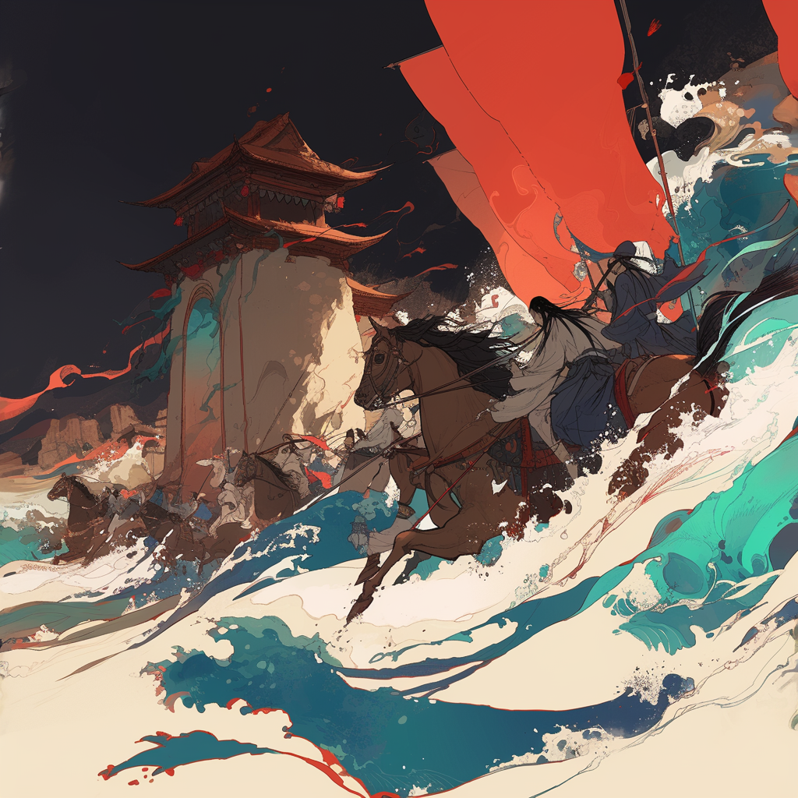<br/>
>       <div style="font-family: STXingkai;font-size:20px">锻迷山，孰教圣君度雄关？</div><br/>
>       <div style="font-family: STXingkai;font-size:20px">圣君奋马军千万，叫落川！</div><br/>
>       <div style="font-family: STXingkai;font-size:20px">落川鸿影见悬帆，暮落地，顾夕勘。</div><br/>
>       <div style="font-family: STXingkai;font-size:20px">望见滔天浪合龛，不明日，今夜穿奇滩！</div><br/>
>
> 46. <div style="font-family: STXingkai;font-size:30px">颂东坡先生</div><br/>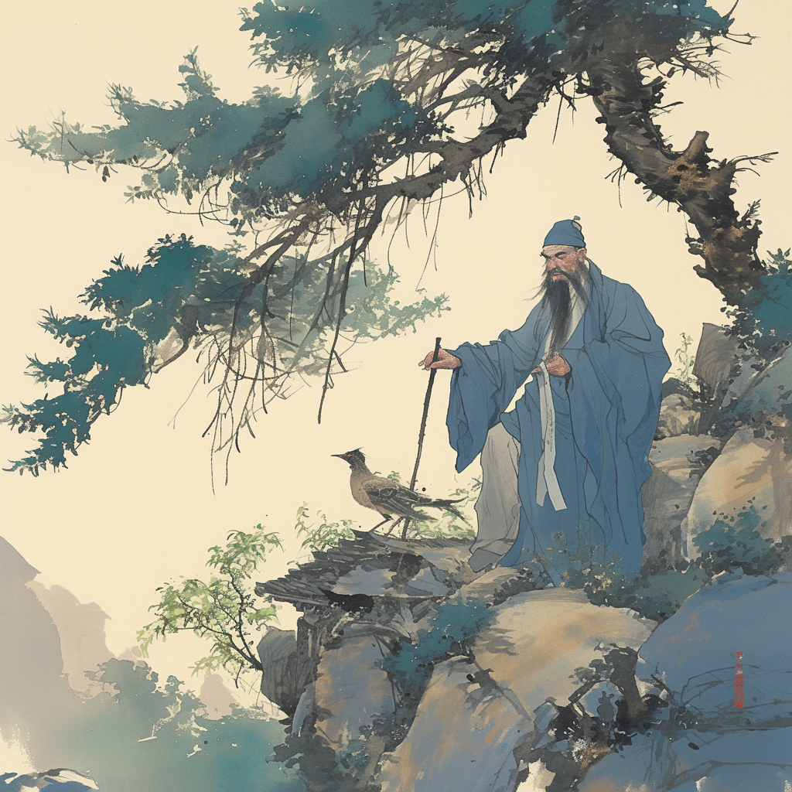
>      <div style="font-family: STXingkai;font-size:20px">念天赋其才，得深而潜用。毋回章台旧路，泰山道，会寻新府。</div><br/>
>      <div style="font-family: STXingkai;font-size:20px">步用形声，抬望眼不觉来处，不去返。</div><br/>
>      <div style="font-family: STXingkai;font-size:20px">孤道是寻常，尽头涣离往昔，是此生。</div><br/>
>
> 47. <div style="font-family: STXingkai;font-size:30px">同铭东坡江城子之怀渊明斜川诗</div><br/>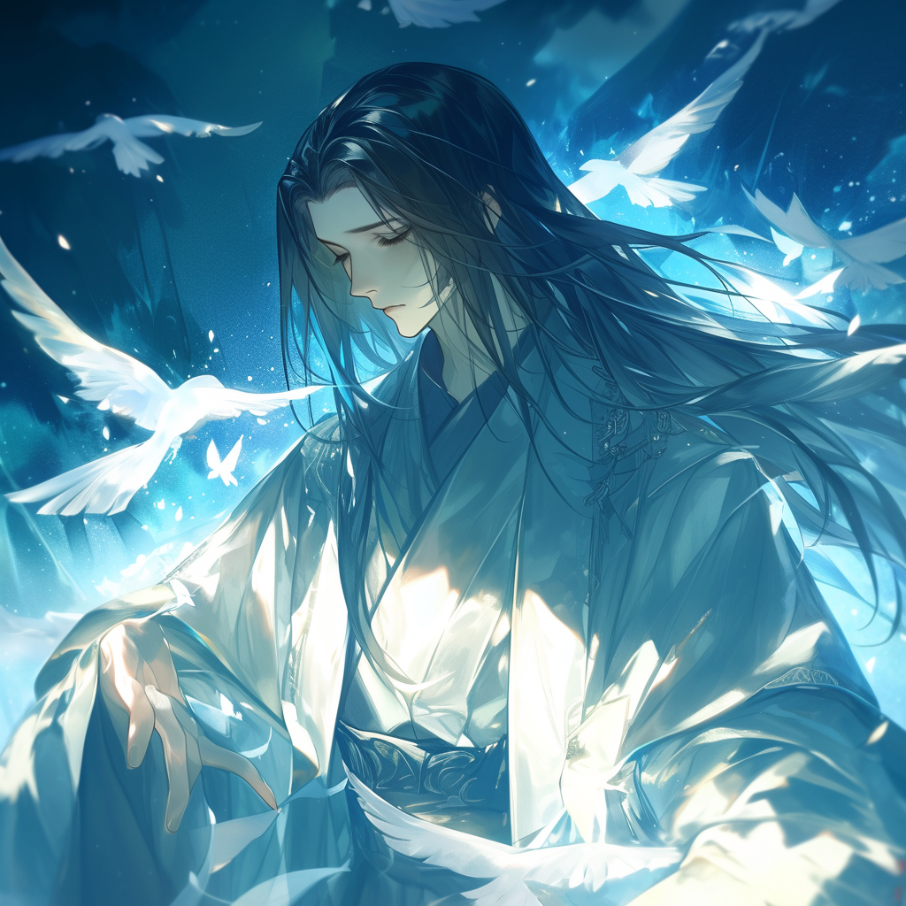
>     <div style="font-family: STXingkai;font-size:20px">怯懦心洗，至新生。</div><br/>
>     <div style="font-family: STXingkai;font-size:20px">驰遣意消，颂东坡渊明。</div><br/>
>     <div style="font-family: STXingkai;font-size:20px">难忘饮，梦夜明，心远人境清。</div><br/>
>     <div style="font-family: STXingkai;font-size:20px">问君此中是何性？斜川诗，东坡堂。经诗寄遥情。</div><br/>
>
> 48. <div style="font-family: STXingkai;font-size:30px">观解玉骢骄</div><br/>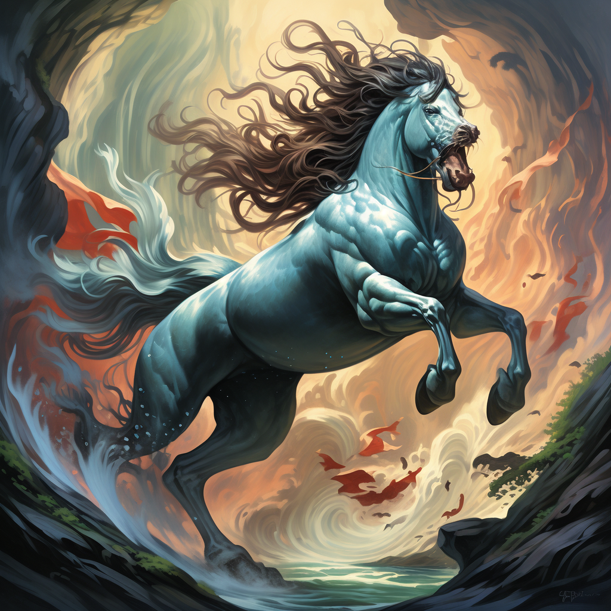
>     <div style="font-family: STXingkai;font-size:20px">葱茏间窥羡琼瑶，桥解障泥玉骢骁。</div><br/>
>     <div style="font-family: STXingkai;font-size:20px">叫啸踏碎绯玉橑，惊断云梦骸，浪羁霄！</div><br/>
>     <div style="font-family: STXingkai;font-size:20px">霄间客解逸寻迷，迷醉坠沿芳草，芳草间，舒沽幽渊唤鲸叫！</div><br/>
>
> 49. <div style="font-family: STXingkai;font-size:30px">灵魂摆渡</div><br/>
>     <div style="font-family: STXingkai;font-size:20px">孤灵千岁曲，吏扬魂生续。</div><br/>
>     <div style="font-family: STXingkai;font-size:20px">忧娅顾摆伏，冬色回青渡。</div><br/>
>
> 50. <div style="font-family: STXingkai;font-size:30px">柔情水，居无定。</div><br/>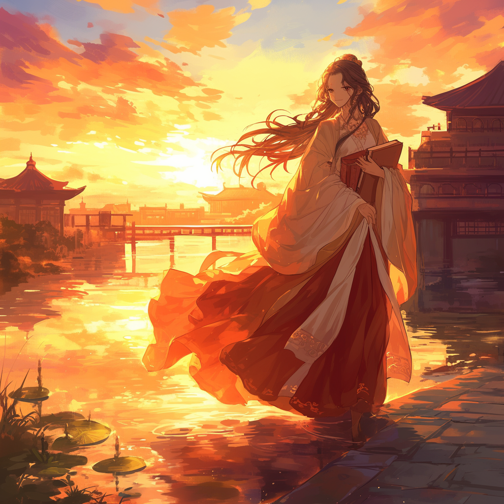
>     <div style="font-family: STXingkai;font-size:20px">原见旧晚笙隆，顾看座席返空，别无他是。</div><br/>
>     <div style="font-family: STXingkai;font-size:20px">重作罢，戏演余生。夕日沦下又明朝！赤鸢仙回晴峦颠。</div><br/>
>
> 51. <div style="font-family: STXingkai;font-size:30px">观诗阅井</div><br/>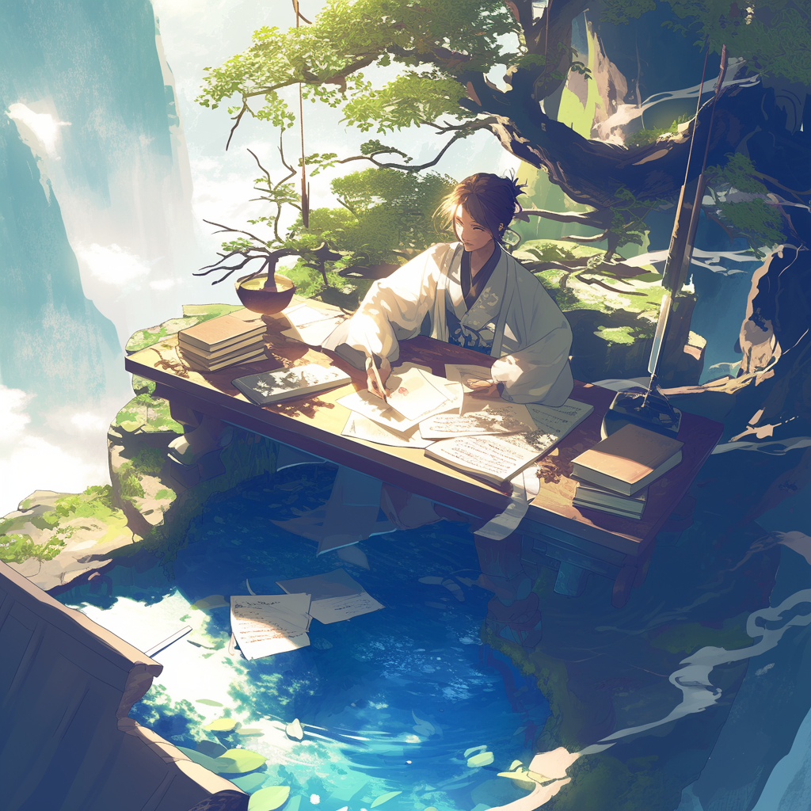
>     <div style="font-family: STXingkai;font-size:20px">卷抚诗书涧中潭，客近观井镜内山。</div><br/>
>     <div style="font-family: STXingkai;font-size:20px">坐井不知身外世，入世毋解此间繁。</div><br/>
>     <div style="font-family: STXingkai;font-size:20px">坐忘顾得诗情意，机心冰涣玄机参。</div><br/>
>
> 52. <div style="font-family: STXingkai;font-size:30px">镜花水月歌</div><br/>
>     <div style="font-family: STXingkai;font-size:20px">镜世两离分，</div><br/>
>     <div style="font-family: STXingkai;font-size:20px">绛花孕乾坤。</div><br/>
>     <div style="font-family: STXingkai;font-size:20px">琉璃水藏焰，</div><br/>
>     <div style="font-family: STXingkai;font-size:20px">独卷掩月温。</div><br/>
>
> 53. <div style="font-family: STXingkai;font-size:30px">神游方外</div><br/>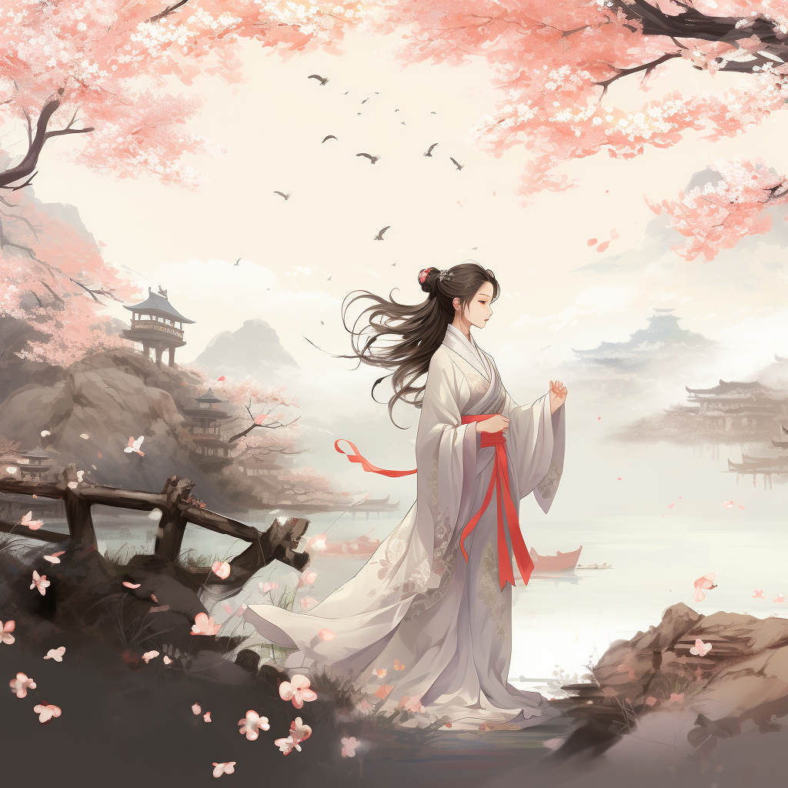
>     <div style="font-family: STXingkai;font-size:20px">素游云莱别无间，红袖着香拭笼砂。</div><br/>
>     <div style="font-family: STXingkai;font-size:20px">思予客过人间处，见落桃花散着衫。</div><br/>
>     <div style="font-family: STXingkai;font-size:20px">湖上经风好读诗，月下青鸾回鸣痴。</div><br/>
>     <div style="font-family: STXingkai;font-size:20px">该是回还身去处，今古离殇韵销魂。</div><br/>
>
> 54. <div style="font-family: STXingkai;font-size:30px">明遇</div><br/>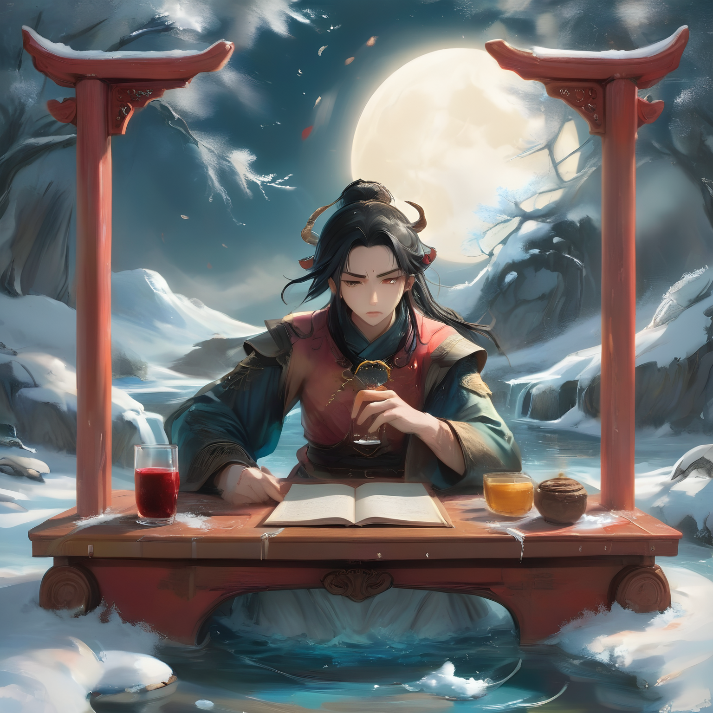
>     <div style="font-family: STXingkai;font-size:20px">淡酒屏桌，唤来清风月明。冰淋世机，沽酒张琴。弦鸣响，溪水流心。</div><br/>
>     <div style="font-family: STXingkai;font-size:20px">过从处，往来寻复。何所似？似梦断云惊。</div><br/>
>     <div style="font-family: STXingkai;font-size:20px">醒来呓语孰明经？吾造化不足也！不得云梦泽，得往复。</div><br/>
>
> 55. <div style="font-family: STXingkai;font-size:30px">快哉风！</div><br/>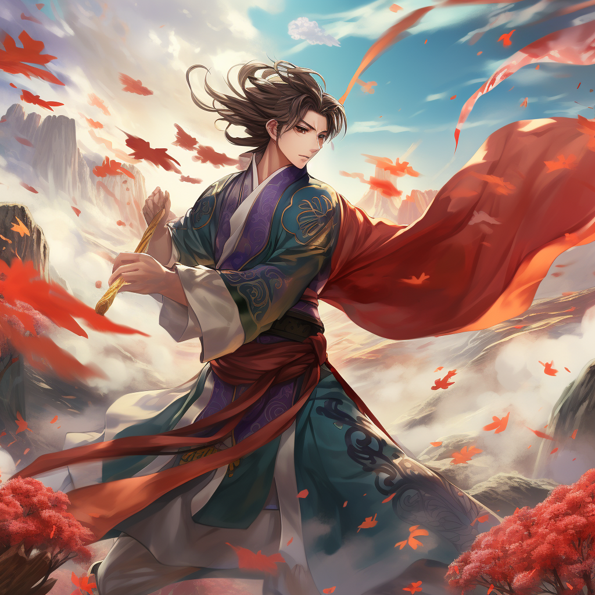
>     <div style="font-family: STXingkai;font-size:20px">越起苍岚，呼卷长林啸。啸叫清谷正鸣劲，刚道雄风绕！</div><br/>
>     <div style="font-family: STXingkai;font-size:20px">孤尔闭巷倦风起，窈窈生民殃。民何辜？</div><br/>
>     <div style="font-family: STXingkai;font-size:20px">罡风驾怯出长林，呼卷阴浊去，过汉湘。吹向快哉亭，名唤快哉风！</div><br/>
>
> 56. <div style="font-family: STXingkai;font-size:30px">夏夜蝉心响</div><br/>
>     <div style="font-family: STXingkai;font-size:20px">嘁嘁蝉鸣，自是卷乱昏帐。</div><br/>
>     <div style="font-family: STXingkai;font-size:20px">闻尔近身，却见孤鸿凄让。</div><br/>
>     <div style="font-family: STXingkai;font-size:20px">断了旭思，元是顾心自赏。</div><br/>
>     <div style="font-family: STXingkai;font-size:20px">执笔非念，挥尽相思泪往。</div><br/>
>
> 57. <div style="font-family: STXingkai;font-size:30px">杨花落</div><br/>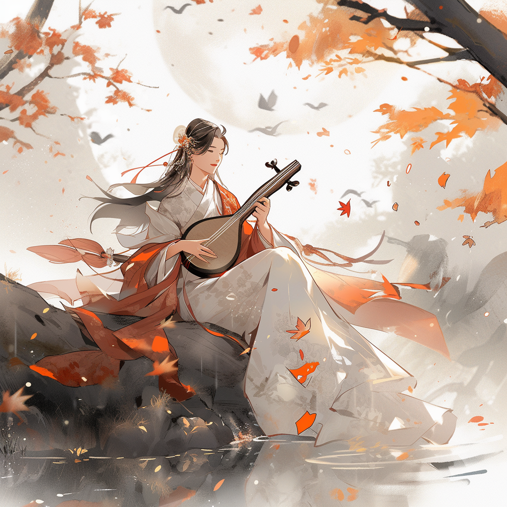
>     <div style="font-family: STXingkai;font-size:20px">痴远离多，自蛮风起，但孤诩。抛家弃身，落是从听教坠。</div><br/>
>     <div style="font-family: STXingkai;font-size:20px">坠见前从，似是傍系寻身。</div><br/>
>     <div style="font-family: STXingkai;font-size:20px">观后弦，却肖寻无路，鸢飞衔入旧窗台，凭吹覆！</div><br/>
>
> 58. <div style="font-family: STXingkai;font-size:30px">观倩女绮泪</div><br/>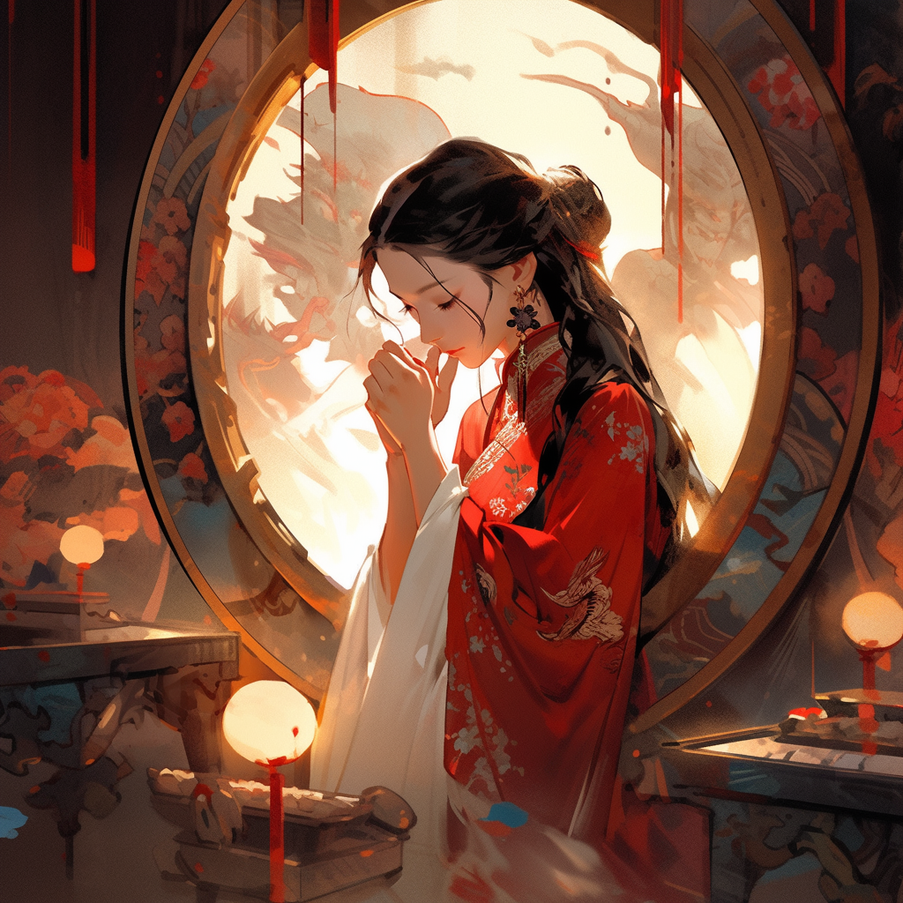
>     <div style="font-family: STXingkai;font-size:20px">鉴中人，谁是观？</div><br/>
>     <div style="font-family: STXingkai;font-size:20px">廊中长离悬铃响，拾熟媚，顾身来。还是眼后那般景，飞身万里觅寻那场风。</div><br/>
>     <div style="font-family: STXingkai;font-size:20px">别无泪，静照灯火话凄凉。</div><br/>
>
> 59. <div style="font-family: STXingkai;font-size:30px">憩游神怀天地有感  </div><br/> 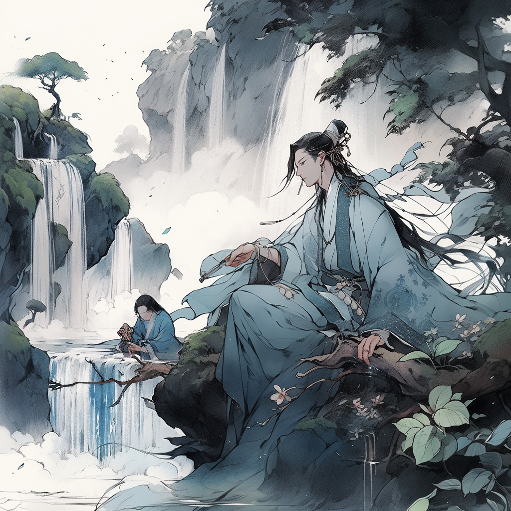
>     <div style="font-family: STXingkai;font-size:20px">愿尽时思莫难同，缘褪此路道始空。</div><br/>
>     <div style="font-family: STXingkai;font-size:20px">予本一天地蜉蝣，何恼苦心多烦忧？</div><br/>
>     <div style="font-family: STXingkai;font-size:20px">小憩消醒泪痕干，世事羡得知未难！</div><br/>
>     <div style="font-family: STXingkai;font-size:20px">神游本来诓谈事，谓叹幽言不识事？</div><br/>
>     <div style="font-family: STXingkai;font-size:20px">疏影横斜水清浅，暗香浮动月黄昏。</div><br/>
>
> 60. <div style="font-family: STXingkai;font-size:30px">游乐言</div><br/> 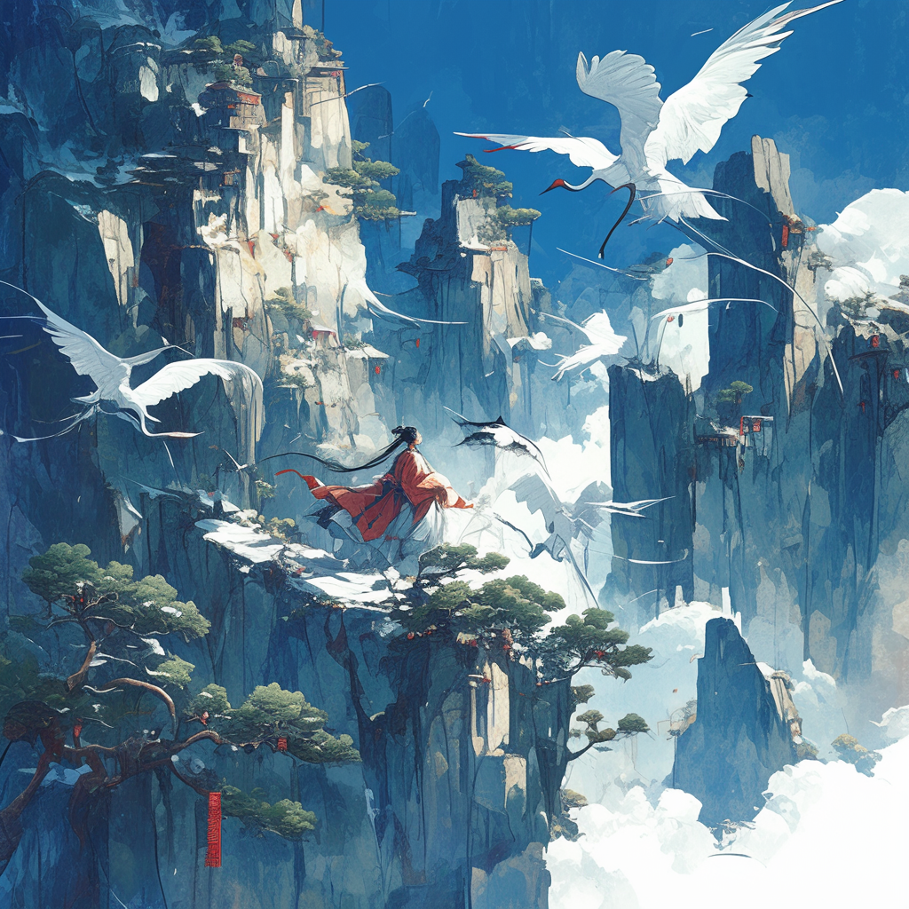
>     <div style="font-family: STXingkai;font-size:20px">元应中山无暇客，暮闻铭前千秋鹤。</div><br/>
>     <div style="font-family: STXingkai;font-size:20px">踏妒扬愤简道侧，曦在人间云觅乐。</div><br/>
>     <div style="font-family: STXingkai;font-size:20px">轴转弦停静休尘，清鸣扬律息疏魂。</div><br/>
>     <div style="font-family: STXingkai;font-size:20px">莫向青天问白箭，不问缘何心在安。</div><br/>
>
> 61. <div style="font-family: STXingkai;font-size:30px">闲云世间客</div><br/> 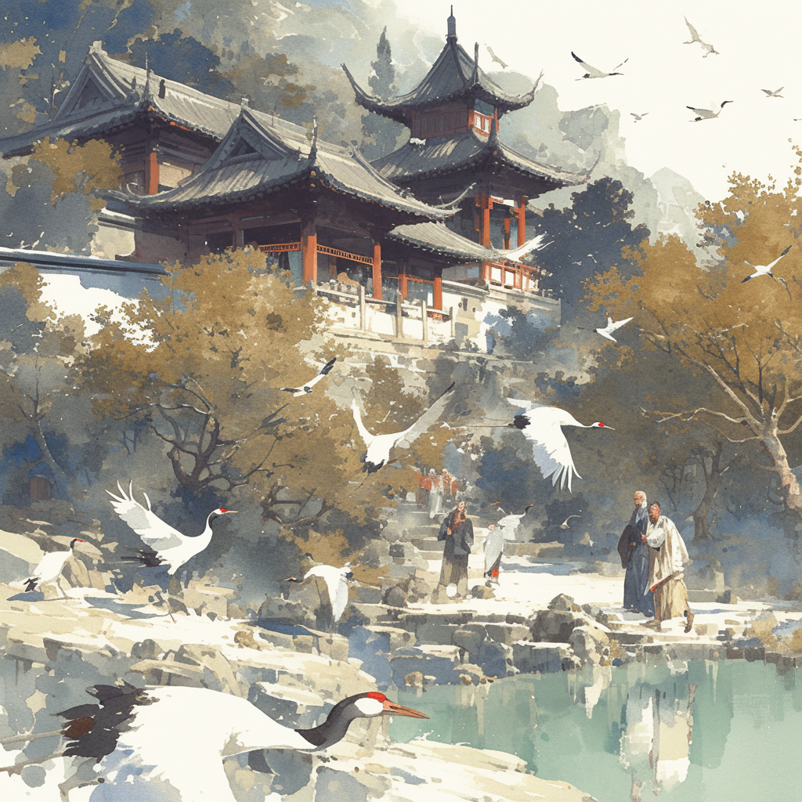
>     <div style="font-family: STXingkai;font-size:20px">我本山中人，偶坐堂前客。</div><br/>
>     <div style="font-family: STXingkai;font-size:20px">扶风踏世尘，惊起闲云鹤。</div><br/>
>
> 62. <div style="font-family: STXingkai;font-size:30px">聚散离</div><br/>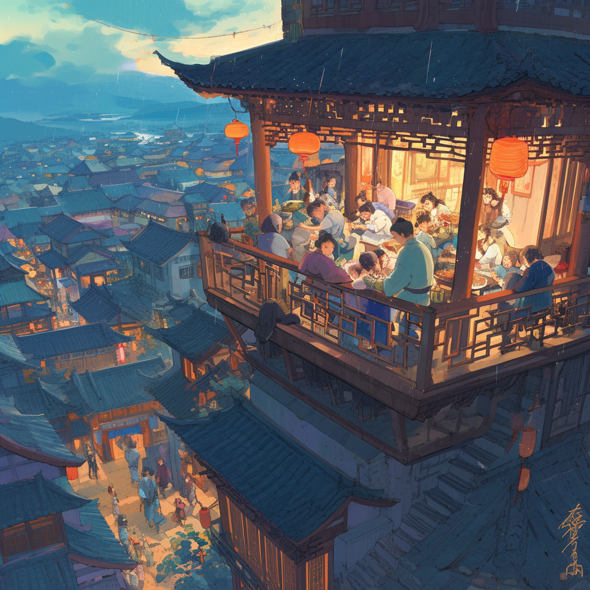
>     <div style="font-family: STXingkai;font-size:20px">顿开云集梦起时，话终风起娴涌刻。</div><br/>
>     <div style="font-family: STXingkai;font-size:20px">雨湛楼台闲听月，离别此是最难时。</div><br/>
>
> 63. <div style="font-family: STXingkai;font-size:30px">梦古道夜行</div><br/>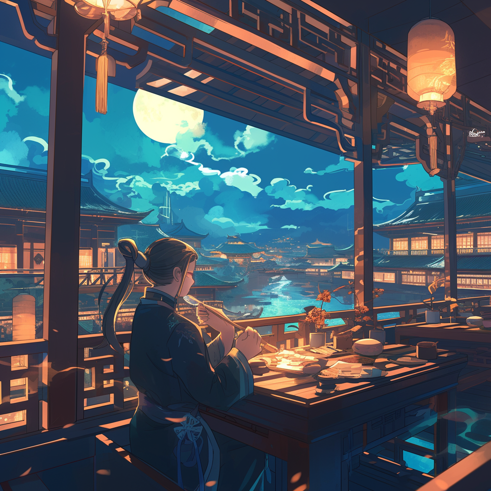
>     <div style="font-family: STXingkai;font-size:20px">菊篱藩外难觅静，暮道夜行是凄清。</div><br/>
>     <div style="font-family: STXingkai;font-size:20px">得寻卧榻闲憩处，皿酒一席梦泸沽。</div><br/>
>     <div style="font-family: STXingkai;font-size:20px">月照相思风满楼，遥负千川望神州。</div><br/>
>
> 64. <div style="font-family: STXingkai;font-size:30px">无题</div><br/>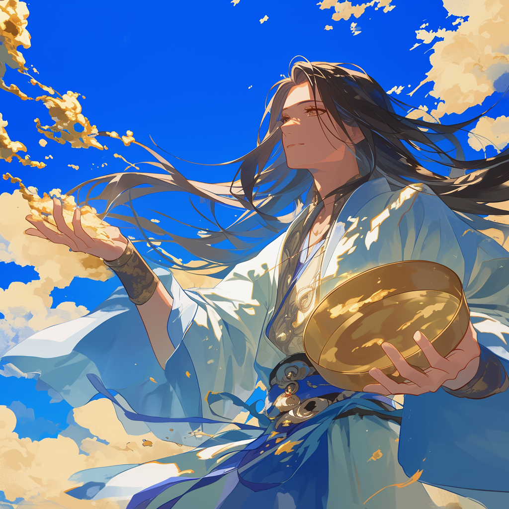
>     <div style="font-family: STXingkai;font-size:20px">日照晴天虽静好，风卷残云收。</div><br/>
>     <div style="font-family: STXingkai;font-size:20px">时刻浸境金樽兜，万事尽东流。</div><br/>
>     <div style="font-family: STXingkai;font-size:20px">醉里笑见周郎计，年少风流默。</div><br/>
>     <div style="font-family: STXingkai;font-size:20px">敬羡人间回春寂，蹉跎志消磨。</div><br/>
>
> 65. <div style="font-family: STXingkai;font-size:30px">无题二</div><br/>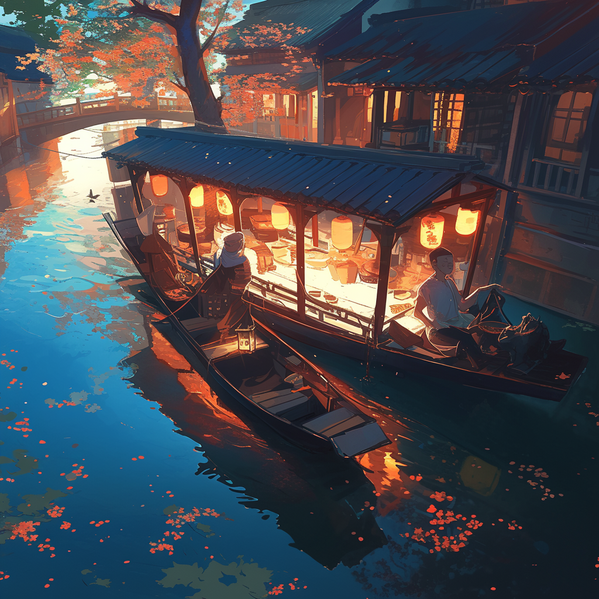
>     <div style="font-family: STXingkai;font-size:20px">孰将岁月吟语陈，一喜一悲一世人。</div><br/>
>     <div style="font-family: STXingkai;font-size:20px">今夕何晓吾莫愁，一夜一灯一扁舟。</div><br/>
>
> 66. <div style="font-family: STXingkai;font-size:30px">孤幻 见仙舞</div><br/>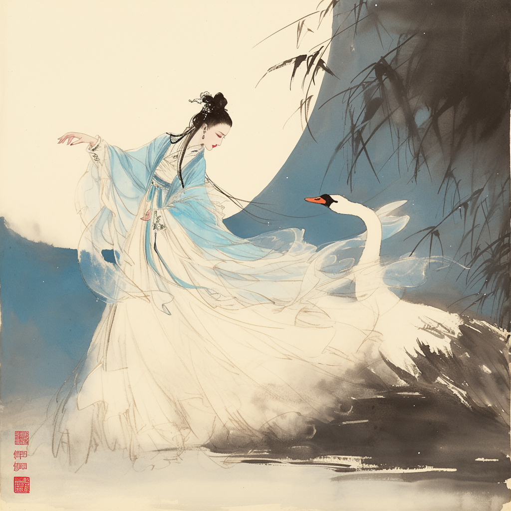
>     <div style="font-family: STXingkai;font-size:20px">神机窥惊鸿，此身无落尘。</div><br/>
>     <div style="font-family: STXingkai;font-size:20px">月下淑云功，翩若仙世辰。</div><br/>
>     <div style="font-family: STXingkai;font-size:20px">恭身弗敢退，瑶台会见身。</div><br/>
>
> 67. <div style="font-family: STXingkai;font-size:30px">心洒江</div><br/>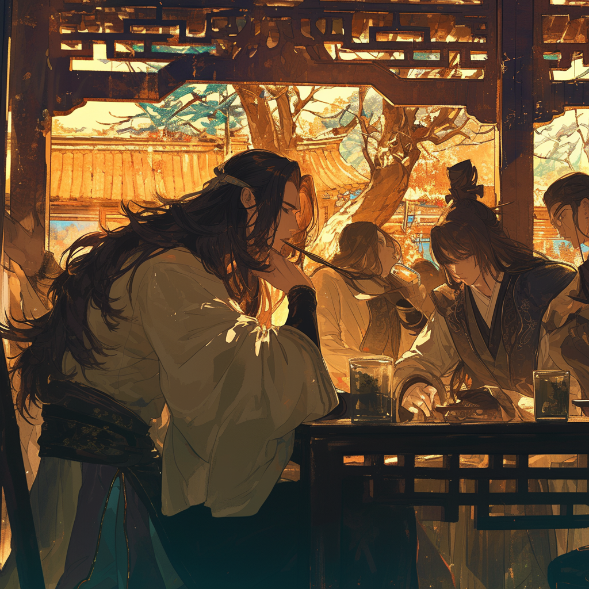
>     <div style="font-family: STXingkai;font-size:20px">只影行单说梦里，欢座堂前客，氛说众云朵。</div><br/>
>     <div style="font-family: STXingkai;font-size:20px">予本不沾粮云酿，难却盛中情，饮尽瀚海江。无情本是多情人，醉里说天阔。</div><br/>
>     <div style="font-family: STXingkai;font-size:20px">大梦方却曙醒时，笑斥心中舵。吾来也！</div><br/>
>
> 68. <div style="font-family: STXingkai;font-size:30px">自问</div><br/>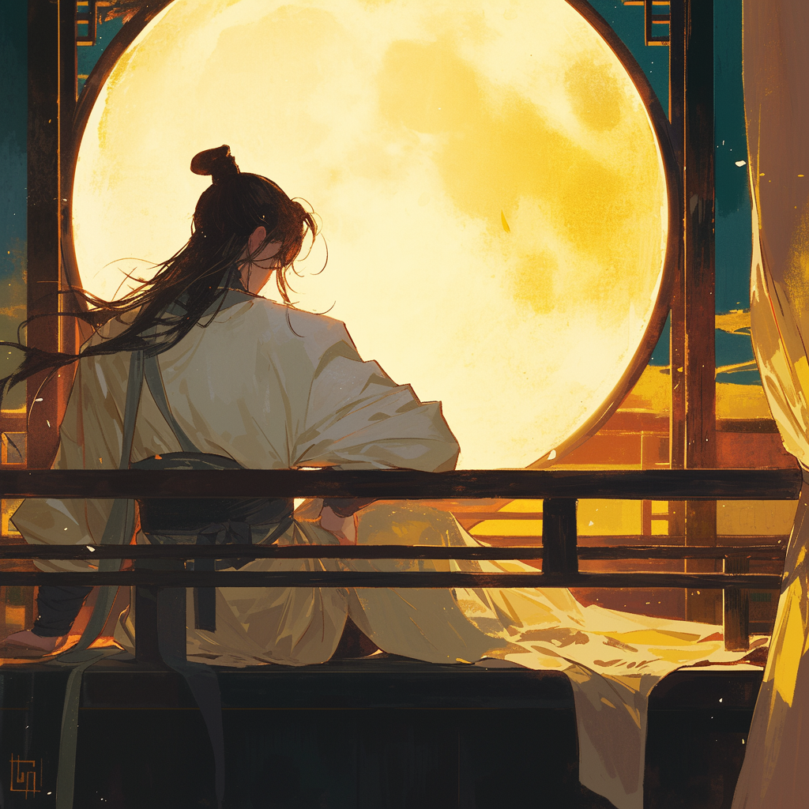
>     <div style="font-family: STXingkai;font-size:20px">忆半生功名半纸，风雪千山。</div><br/>
>     <div style="font-family: STXingkai;font-size:20px">欲忘泪向揽明月，会上青天。余有何欢？自尔也。</div><br/>
>
> 69. <div style="font-family: STXingkai;font-size:30px">后晌红尘梦醒语</div><br/>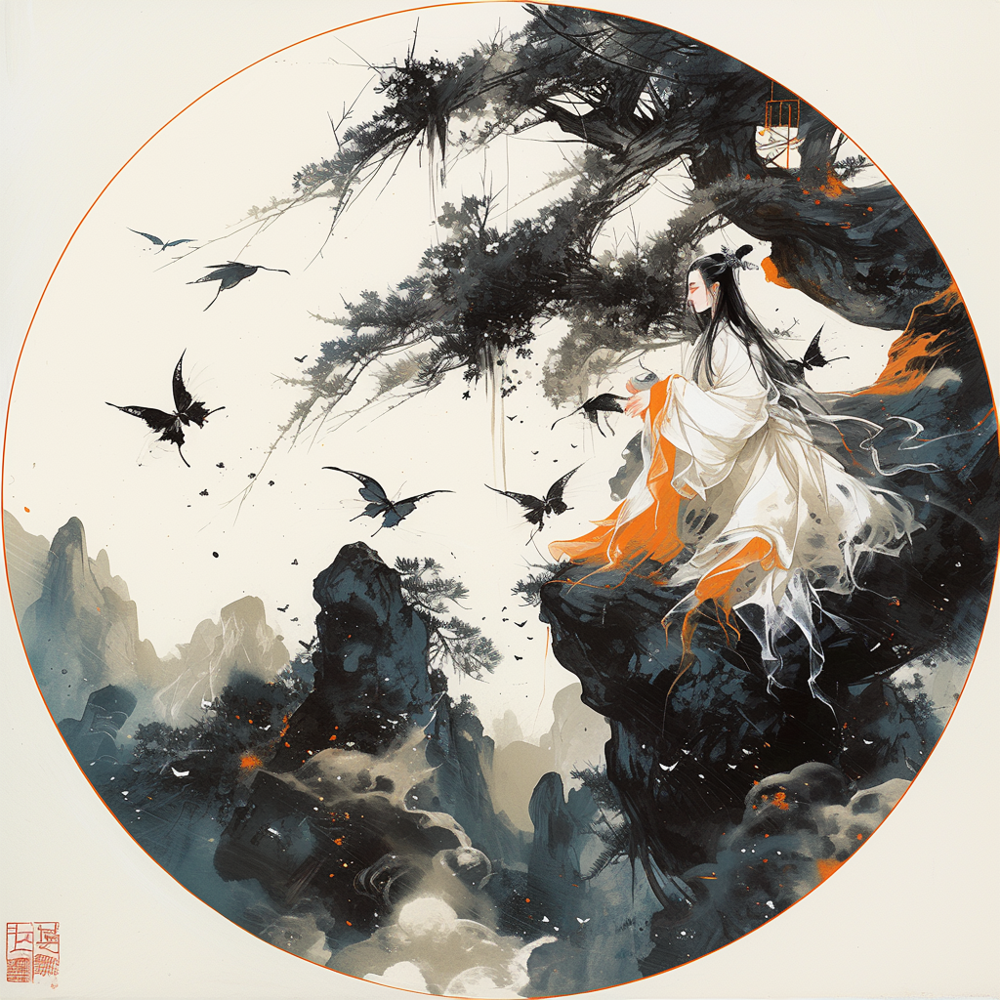
>     <div style="font-family: STXingkai;font-size:20px">怨羡尘间红，晓通万千恨。</div><br/>
>     <div style="font-family: STXingkai;font-size:20px">故作深情种，缘是陌路人？</div><br/>
>     <div style="font-family: STXingkai;font-size:20px">身入浮世霰，魂遁霄飞尘。</div><br/>
>     <div style="font-family: STXingkai;font-size:20px">韵起霓裳曲，音惑羽衣人。</div><br/>
>     <div style="font-family: STXingkai;font-size:20px">风谢岚妃焱（如火热情），云停幻梦真。</div><br/>
>     <div style="font-family: STXingkai;font-size:20px">不闻化蝶语，岂殇仙凡伦…</div><br/>
>     <div style="font-family: STXingkai;font-size:20px">妄做逍遥游，客笑天下嗔。</div><br/>
>     <div style="font-family: STXingkai;font-size:20px">玩阅翻澜岳，赏尽燃日昆。</div><br/>
>     <div style="font-family: STXingkai;font-size:20px">卧听西垂雨，俯瞰月向昏。</div><br/>
>     <div style="font-family: STXingkai;font-size:20px">难称（chen)由自愿，天地此向坤。</div><br/>
>
> 70. <div style="font-family: STXingkai;font-size:30px">月下独坐拂虚</div><br/>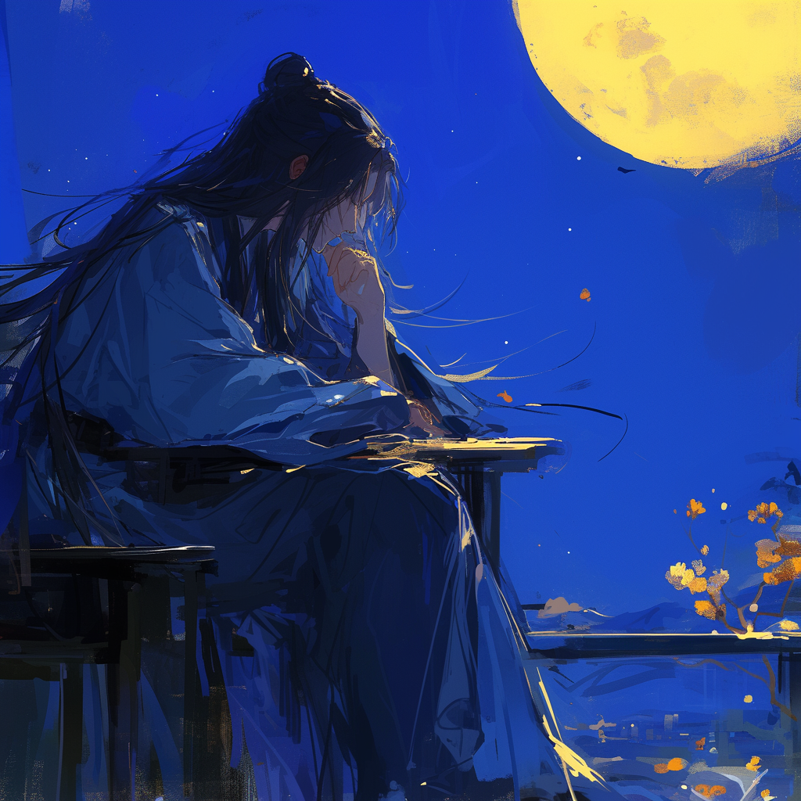
>     <div style="font-family: STXingkai;font-size:20px">零清若弄月， 孰堪情共与。</div><br/>
>     <div style="font-family: STXingkai;font-size:20px">弗须赴汝约，莫若共花语。</div><br/>
>     <div style="font-family: STXingkai;font-size:20px">悉卿颜如玉，枉用若相存。</div><br/>
>     独自一人盘坐在这月色下攘抗着寂寞之虚 我在这零清的夜色下，就好像这夜空中被孤零的独月，谁能和我共情相与呢？
>     不用再独赴对你的约定了🙂，不如在这里和花相谈交心。我知道你过得不错，如玉之颜，我又何必再纠结过去，好像你还在我身边…
>
> 71. <div style="font-family: STXingkai;font-size:30px">时颂</div><br/>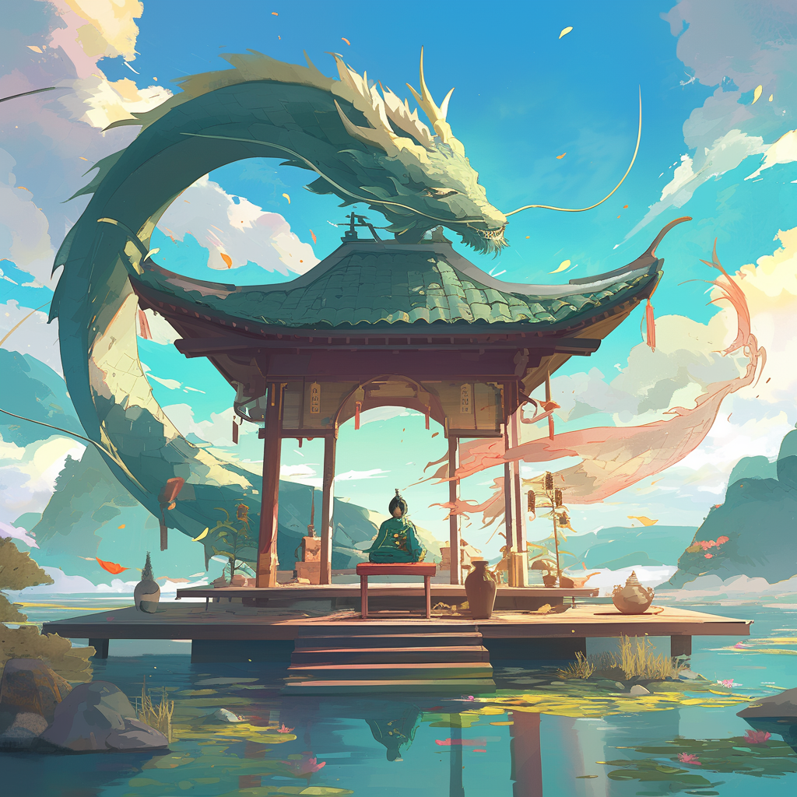
>     <div style="font-family: STXingkai;font-size:20px">独坐玉龙台，风溪待尘埃。</div><br/>
>     <div style="font-family: STXingkai;font-size:20px">远江才过隙，人间已百亥。</div><br/>
>
> 72. <div style="font-family: STXingkai;font-size:30px">阅生</div><br/>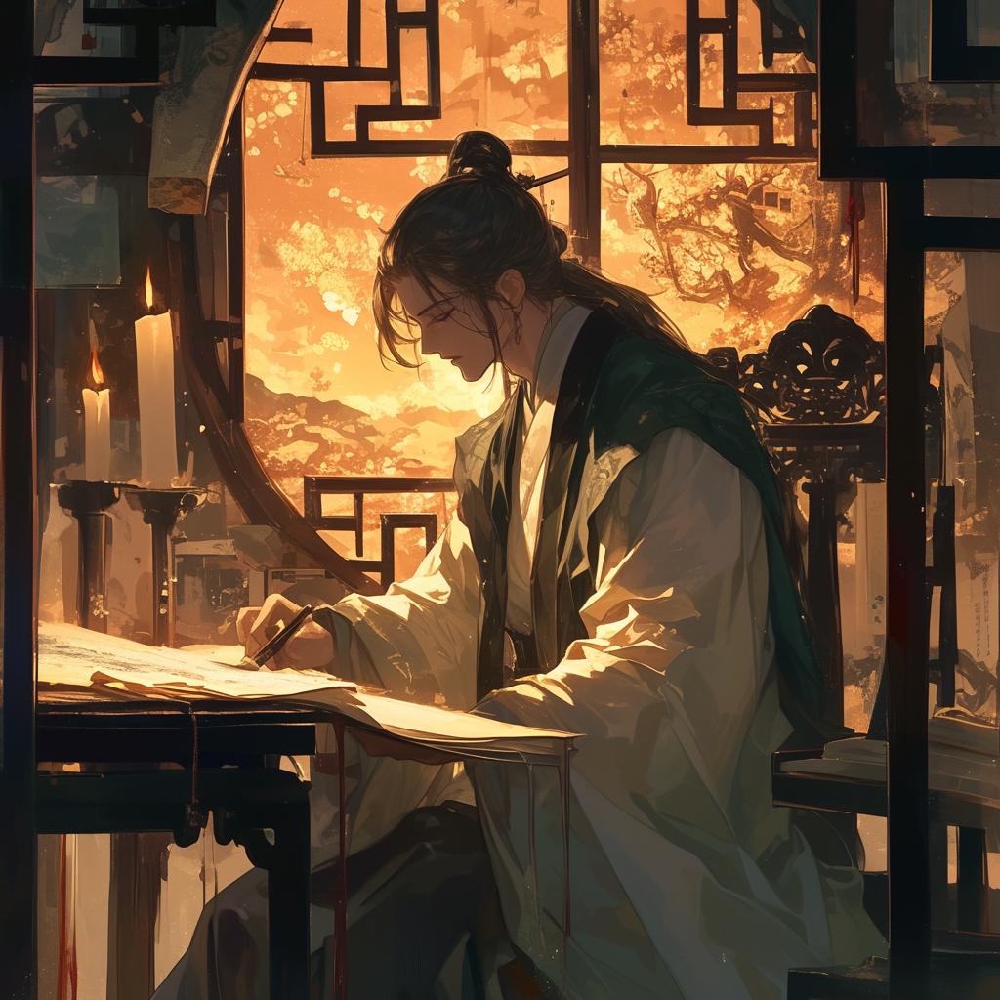
>     <div style="font-family: STXingkai;font-size:20px">学海向问一生事，皓首穷经若可知。</div><br/>
>     <div style="font-family: STXingkai;font-size:20px">生如毫末从头戏，末置玄经却见奇。</div><br/>
>
> 73. <div style="font-family: STXingkai;font-size:30px">醒文</div><br/>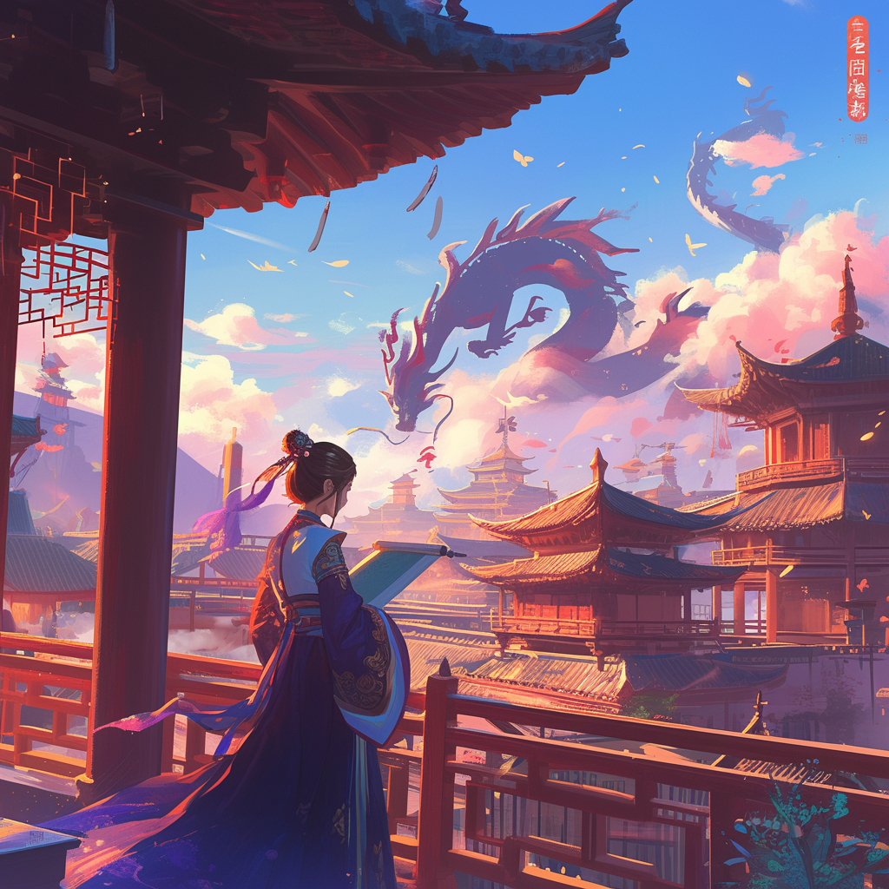
>     <div style="font-family: STXingkai;font-size:20px">纹云画柱粱雕栋，痴愿吟风章鸣钟。</div><br/>
>     <div style="font-family: STXingkai;font-size:20px">四是九非承天殿，莫对文诗论攀迁。</div><br/>
>
> 74. <div style="font-family: STXingkai;font-size:30px">约莫</div><br/>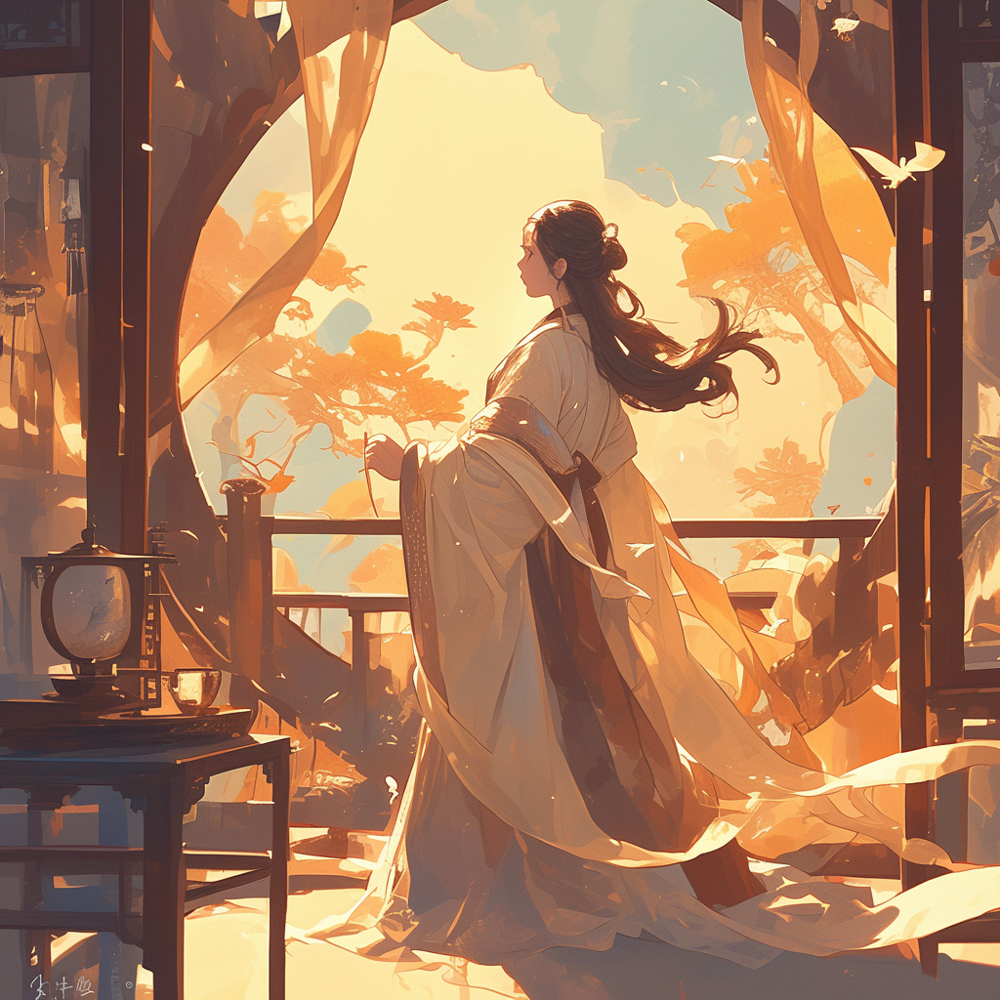
>     <div style="font-family: STXingkai;font-size:20px">约从是世期，莫横弗若希。</div><br/>
>     <div style="font-family: STXingkai;font-size:20px">世事难前料，何谈顾若一。</div><br/>
>
> 75. <div style="font-family: STXingkai;font-size:30px">论雪</div><br/> 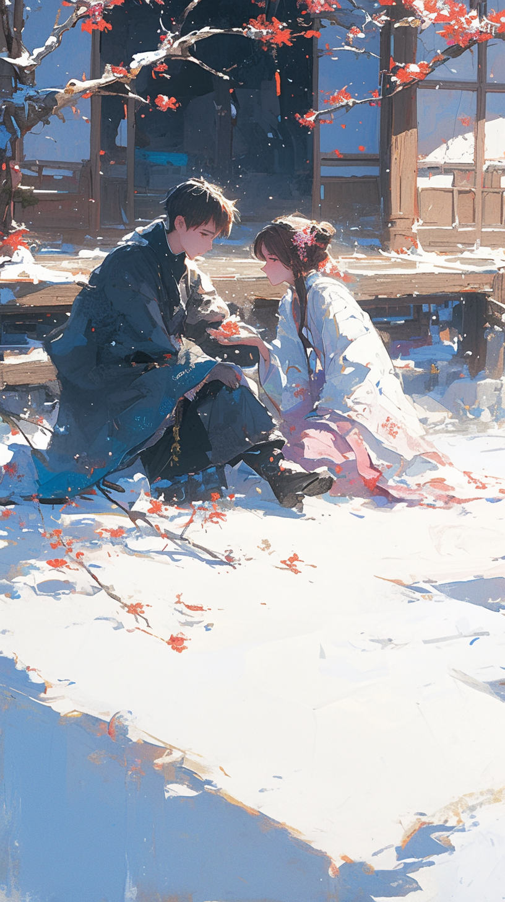
>     <div style="font-family: STXingkai;font-size:20px">风吹起，鹅雪作絮掩碎音。</div><br/>
>     <div style="font-family: STXingkai;font-size:20px">人道尽，盐粉化论声正奇。</div><br/>
>     <div style="font-family: STXingkai;font-size:20px">天公作美分毫意，引得意乱相分离。</div><br/>
>     <div style="font-family: STXingkai;font-size:20px">八斗才高谁正言?些许分唤各真谜。</div><br/>
>
> 76. <div style="font-family: STXingkai;font-size:30px">何是此，此是何</div><br/>
>
> ****
>
> ### 入世
>
> 1. <div style= "font-family:monospace;font-size:30px">若母💕💕💕💕💕💕孰知父</div><br/>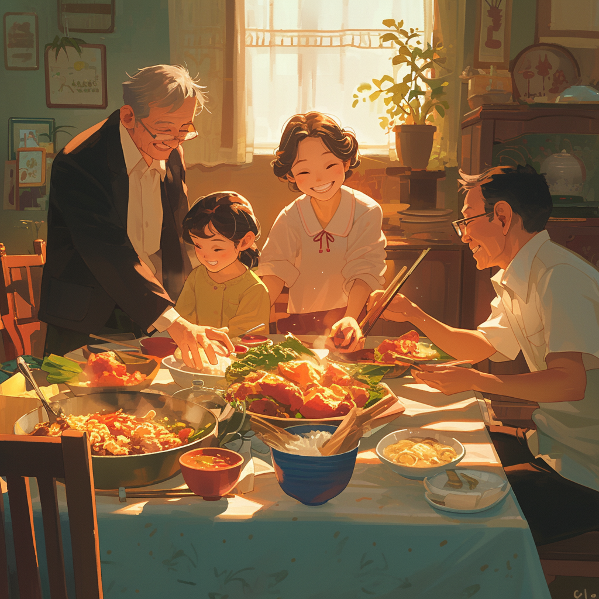
>    <div style="font-family: STXingkai;font-size:20px">晨去恕苦愆，暮归梳家宴。 沐晨漱起工，苦劳承家功。</div><br/>
>    <div style="font-family: STXingkai;font-size:20px">会飨亲中情，斯是报德星。 寐夜浅休憩， 回晨复日兮。</div><br/>
>
> 2. <div style="font-family: STXingkai;font-size:30px">中华赋</div><br/>
>    洪荒神古，灵修之始。炎黄之盟，洞(洞悉天时)创新世，禹后千主(这个千只是虚指，就是多的意思)，悉以亡商。
>
>    姬武行道，世逢乐土。幽王谬宠(宠信奸臣啦)，诸侯乱世。几载春秋(这个是双关啦，春秋时期和时间)，几番乐苦。诸子伏途，拜君臣主。奕战难服，国殇屈(伟大爱国诗人屈原啦)步(踱步)。
>
>    秦帝黩武，四海归心。汉以秦过，文景治世。卫霍之功，青史铭笔。莽之篡乱，光武定服。东汉废室，并立三国。晋夺曹魏，周公吐哺。三雄图志，终难定笃。世事难违，终是落土。可怜英雄，殚思无睹。
>
>    南北(南北朝啦)初定，隋唐开化。万世皇都，盛活开泰。文采前世之所长，补后世之无功(亏欠的)。诗仙飘渺，浪荡五湖。邈云汉，踱群巅。神思鬼才，旷世天逢。诗圣国情，诗状他意。
>
>    五代更迭，乱世谁忧。既已苟且，无思无睹。宋帝狡拙，武穆不瞑。苏辛(苏轼辛弃疾啦)之恨，状以赋词。残山剩水，状以宫图。英雄射雕，只怜佳谣。只等闲，少年白头。乌江不渡(借用项羽典故啦，辛弃疾大词人北宋亡了还坚持抵抗  同时对比  项羽私人之气与辛弃疾家国之情)，北疆不定（元灭宋）。
>
>    洪武开疆，永乐圣图。嘉靖夺心(大明王朝1566的台词啦 以一人之心夺万人之心)，刚峰（海瑞的字啦）直笔，嵩之奸恶，清流之上，万历三征，宠奸（阉党和东林党啦）乱政。北疆不定(满清入关)，祯(崇祯皇帝啦)遗圣命，勿伤生民。嘉定三屠，扬州十日。怅恨千古，多少意留此中。
>
>    辛亥之革，民兆之始。抗魔(抗战)恒战，军威荡寰，日出东方，奉恒五星。
>
> 3. <div style="font-family:STXingkai;font-size:30px">敞猎游风</div><br/>
>    <div style="font-family: STXingkai;font-size:20px">游猎郎，夜走踏风雨气凉。</div><br/>
>    <div style="font-family: STXingkai;font-size:20px">满弓折戟林田上，会挽欺天狼。</div><br/>
>    <div style="font-family: STXingkai;font-size:20px">摇龙摆尾桥池塘，坐晚不休裳。</div><br/>
>    <div style="font-family: STXingkai;font-size:20px">后山倚顿壮歌哉，工巧任天翔！</div><br/>
>
> 4. <div style="font-family:STXingkai;font-size:30px">邀月</div><br/>
>    <div style="font-family: STXingkai;font-size:20px">古月邀晴照玉莹，萤守惑心穿堂明。</div><br/>
>    <div style="font-family: STXingkai;font-size:20px">神想前如来世梦，何望今人古时月？ </div><br/>
>
> 5. <div style="font-family:STXingkai;font-size:30px">林中雨</div><br/>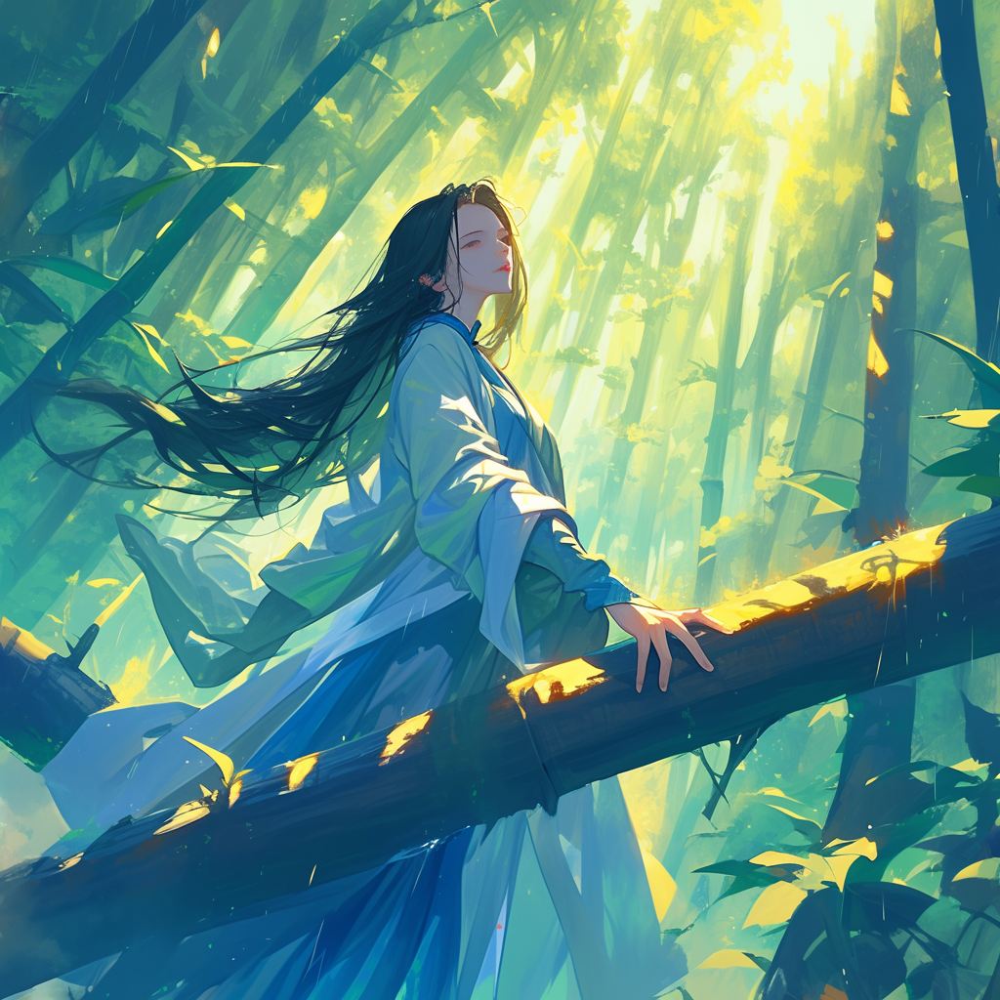
>    <div style="font-family: STXingkai;font-size:20px">淋汗星星透盘衫，</div><br/>
>    <div style="font-family: STXingkai;font-size:20px">轻歌越舞一重关。</div><br/>
>    <div style="font-family: STXingkai;font-size:20px">舒心展颜谈笑处，</div><br/>
>    <div style="font-family: STXingkai;font-size:20px">俏雨轻风教人欢！</div><br/>
>
> 6. <div style="font-family: STXingkai;font-size:30px">绣春刀</div><br/>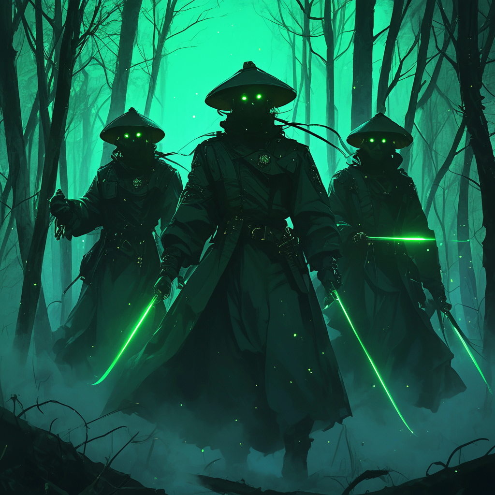
>    <div style="font-family: STXingkai;font-size:20px">林暗风清夜掌灯，青光冥影见迷踪。</div><br/>
>    <div style="font-family: STXingkai;font-size:20px">飞鱼玄绮旁坠玉，嗔音染鞘绣春狰。</div><br/>
>
> 7. <div style="font-family: STXingkai;font-size:30px">天地梅花开</div><br/>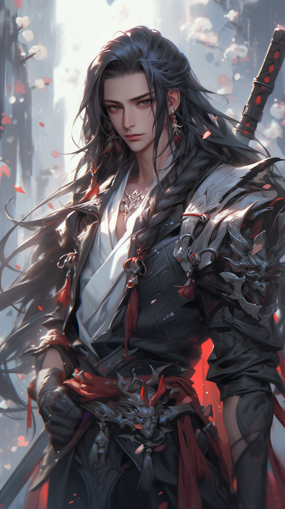
>    <div style="font-family: STXingkai;font-size:20px">暗香杳碎，凛冬烈风醉人睡。</div><br/>
>    <div style="font-family: STXingkai;font-size:20px">近闻旁处飘香雪，觅得寻君笑，原是雪梅蓓开蕾。</div><br/>
>    <div style="font-family: STXingkai;font-size:20px"> 天地遥寒，却自梅花开，兴得采情嬉笑泪。</div><br/>
>    <div style="font-family: STXingkai;font-size:20px">向元言，待天地梅花开时，肝胆明心照鬼魅！</div><br/>
>
> 8. <div style="font-family: STXingkai;font-size:30px">东方白</div><br/>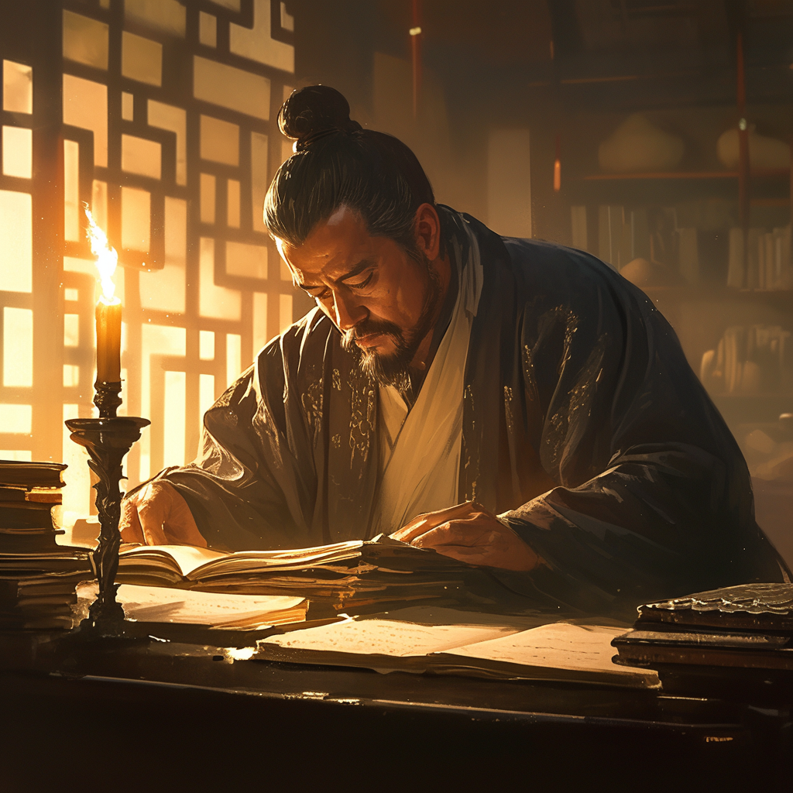
>    <div style="font-family: STXingkai;font-size:20px"> 书放翁，合闭卷帘点烛灯。</div><br/>
>    <div style="font-family: STXingkai;font-size:20px">  几页书，却是百岁春秋，千万声息。</div><br/>
>    <div style="font-family: STXingkai;font-size:20px">    谁道事圣终末了，不闻今后是，百卷图，竟争风流！</div><br/>
>    <div style="font-family: STXingkai;font-size:20px">天涯过客了无迹，更见义气终不休！</div><br/>
>    <div style="font-family: STXingkai;font-size:20px"> 莫了未竟无情事，东方白，明日更再来！</div><br/>
>
> 9. <div style="font-family: STXingkai;font-size:30px">东坡言</div><br/>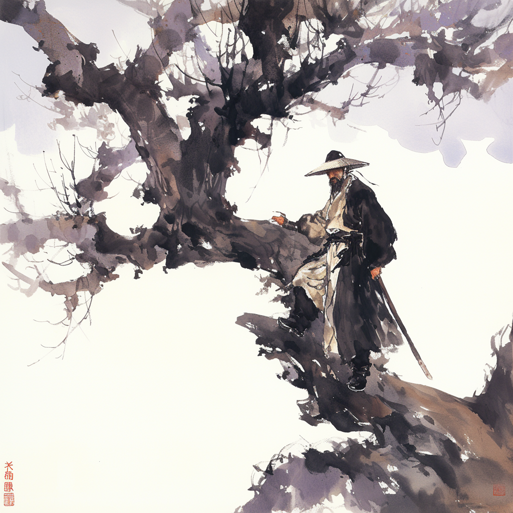
>    <div style="font-family: STXingkai;font-size:20px">蔽新谪，重围至东坡。南放投荒枯身槁，心转文夷巧。</div><br/>
>    <div style="font-family: STXingkai;font-size:20px">北路难归倒也是，身远思清好。杳在回路，天赦道运晓。</div><br/>
>    <div style="font-family: STXingkai;font-size:20px">待到昔缘旧见时，笑颜依老，莫道短横长，触来往日复西东。</div><br/>
>
> 10. <div style="font-family: STXingkai;font-size:30px">虞美人   歌思昼宇</div><br/>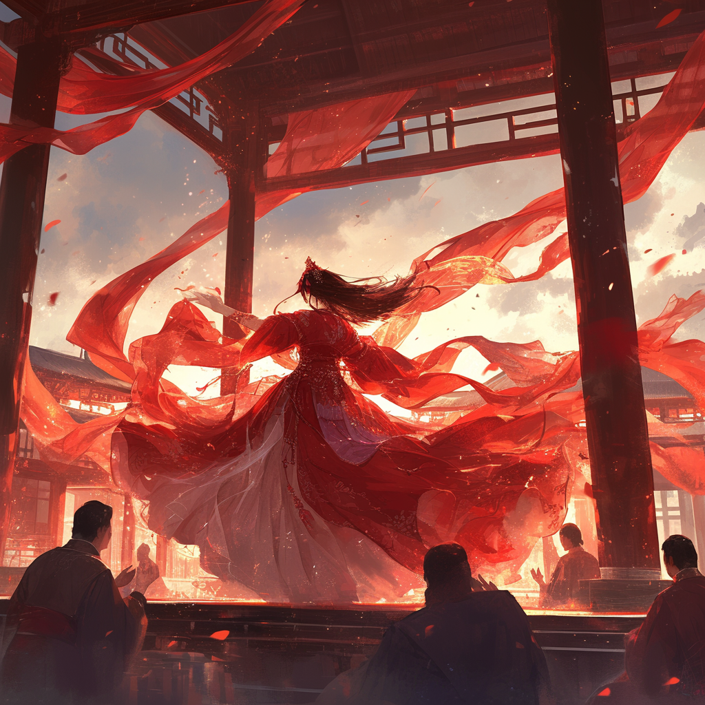
>     <div style="font-family: STXingkai;font-size:20px">白风起苍岚，楼台上，幸有美人舞。</div><br/>
>     <div style="font-family: STXingkai;font-size:20px">红绾掩遮鲛绡透，摇玉佩，问君谁许受？</div><br/>
>     <div style="font-family: STXingkai;font-size:20px">悦起歌阑藻，轻萍随波扫，扫尽风雨帘。一点一滴算是，浪屿旅人泪。</div><br/>
>     <div style="font-family: STXingkai;font-size:20px">忒是晴明了，再起陈旅前倾脚，脚踏起风云，颂歌千金稿！</div><br/>
>
> 11. <div style="font-family: STXingkai;font-size:30px">花雨江湖</div><br/>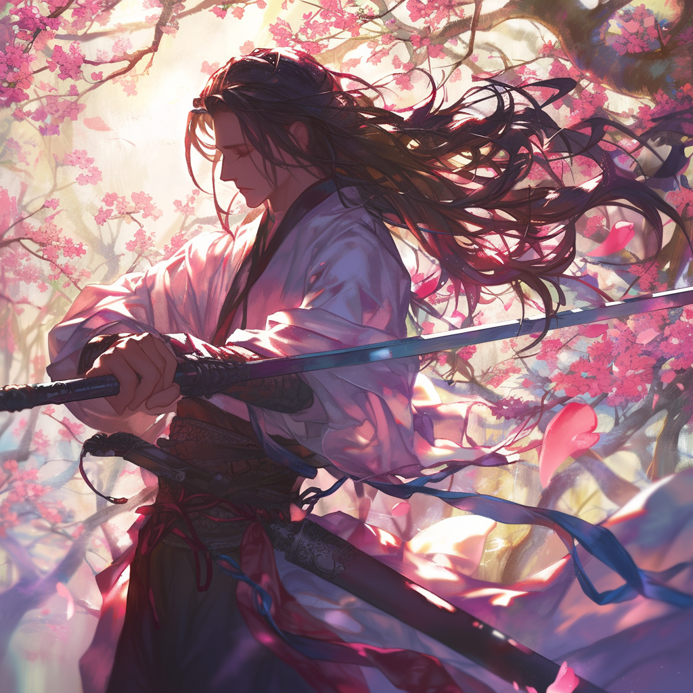
>      <div style="font-family: STXingkai;font-size:20px">春风意，艳粉百花争流芳。</div><br/>
>      <div style="font-family: STXingkai;font-size:20px">一剑风来韵飘散，靡靡间，香隙惹人醉。</div><br/>
>      <div style="font-family: STXingkai;font-size:20px">醉红尘，江湖夜夜风飘雨，谁能万人敌？</div><br/>
>      <div style="font-family: STXingkai;font-size:20px">省无泪，缤纷落英抹辟锋，花谢花开，明日哪朵俏媚？</div><br/>
>      <div style="font-family: STXingkai;font-size:20px">逾飞燕，都不唤。指向千仞天，幸乃今日是今，花雨剑锋江湖岁！</div><br/>
>
> 12. <div style="font-family: STXingkai;font-size:30px">人生路，万千道不同</div><br/>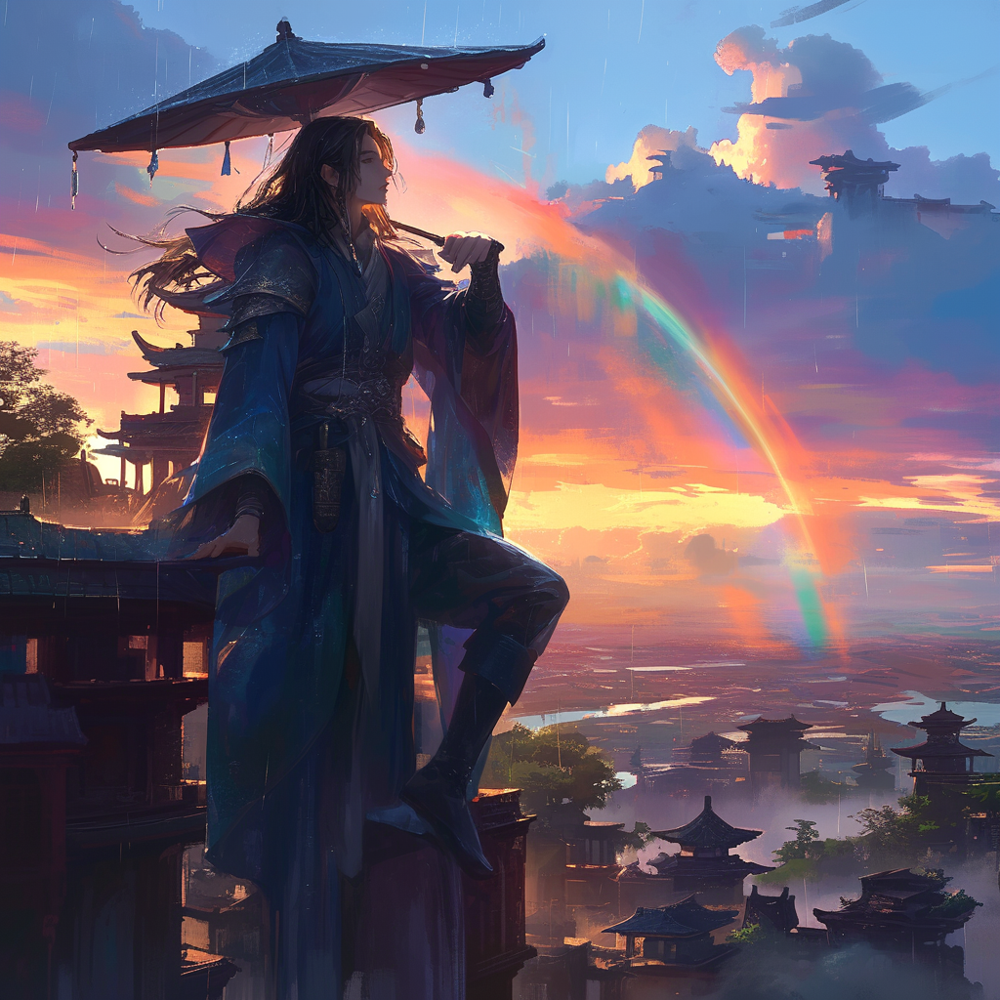
>     <div style="font-family: STXingkai;font-size:20px">夕雨淋昭，滩外顾城绕。</div><br/>
>     <div style="font-family: STXingkai;font-size:20px">霄有人音悲戚唱，淡渐消。细听来，是凄凉心意，别世躁。</div><br/>
>     <div style="font-family: STXingkai;font-size:20px">风云起，旧曲焕新奏离箫。不似此中人，事间乱迷绕。</div><br/>
>     <div style="font-family: STXingkai;font-size:20px">生人道路千万条，孤舟沧浪滔天半。一页秋，向河汉，胜天半子顾不骄。</div><br/>
>     <div style="font-family: STXingkai;font-size:20px">羁绊下一场，是晴日焰火比天高！</div><br/>
>
> 13. <div style="font-family: STXingkai;font-size:30px">问言</div><br/>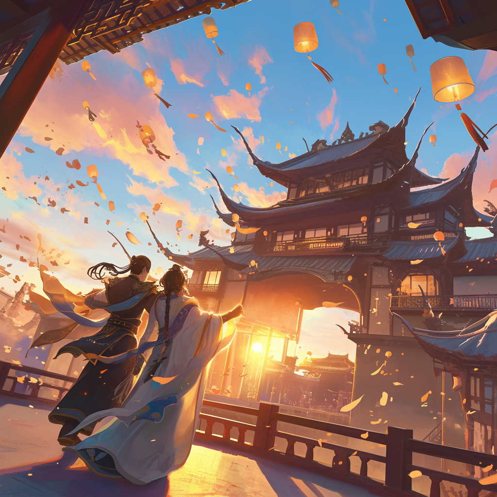
>      <div style="font-family: STXingkai;font-size:20px">香榭亭来不须呼，过晚来风醉金乌。</div><br/>
>      <div style="font-family: STXingkai;font-size:20px">问姑难讨凉杯饮， 睡暖芳心言笑疏。</div><br/>
>
> 14. <div style="font-family: STXingkai;font-size:30px">见孤鸿雁飞</div><br/>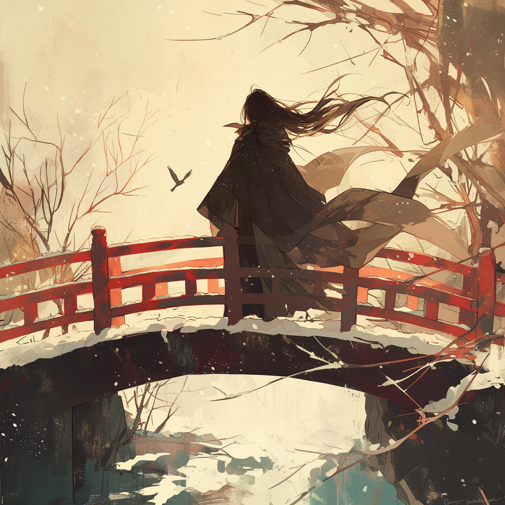
>     <div style="font-family: STXingkai;font-size:20px">断桥路，影摇寒冰水。</div><br/>
>     <div style="font-family: STXingkai;font-size:20px">孤鸿羁悲雪，弄洒莹莹泪，何处念归？</div><br/>
>     <div style="font-family: STXingkai;font-size:20px">千丈山，万里雪，青丝绕几许？</div><br/>
>     <div style="font-family: STXingkai;font-size:20px">风里露，翅中血。啼悲是为谁？</div><br/>
>     <div style="font-family: STXingkai;font-size:20px">尽头孤往，约莫处，衷见君来会！</div><br/>
>
> 15. <div style="font-family: STXingkai;font-size:30px">葬花吟</div><br/>
>     <div style="font-family: STXingkai;font-size:20px">凄艳玉兰开早谢，</div><br/>
>     <div style="font-family: STXingkai;font-size:20px">晴枝扫悲绢啼嗟。</div><br/>
>     <div style="font-family: STXingkai;font-size:20px">皆望花繁盛点街，</div><br/>
>     <div style="font-family: STXingkai;font-size:20px">不思花放过隙歇。</div><br/>
>
> 16. <div style="font-family: STXingkai;font-size:30px">若见</div><br/>
>      <div style="font-family: STXingkai;font-size:20px">樽杯举饮酬云集，散蔻掩人羽犹衫。</div><br/>
>      <div style="font-family: STXingkai;font-size:20px">缠袖燕舞六幺曲，桃花腮吟若见川。</div><br/>
>
> 17. <div style="font-family: STXingkai;font-size:30px">呼十全</div><br/>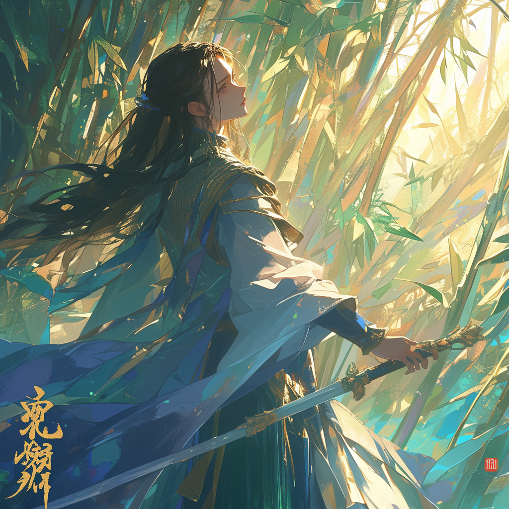
>     <div style="font-family: STXingkai;font-size:20px">世上无全事， 那有十全人。</div><br/>
>     <div style="font-family: STXingkai;font-size:20px">若到历经时， 混元意向真。</div><br/>
>
> 18. <div style="font-family: STXingkai;font-size:30px">亟涅槃</div><br/>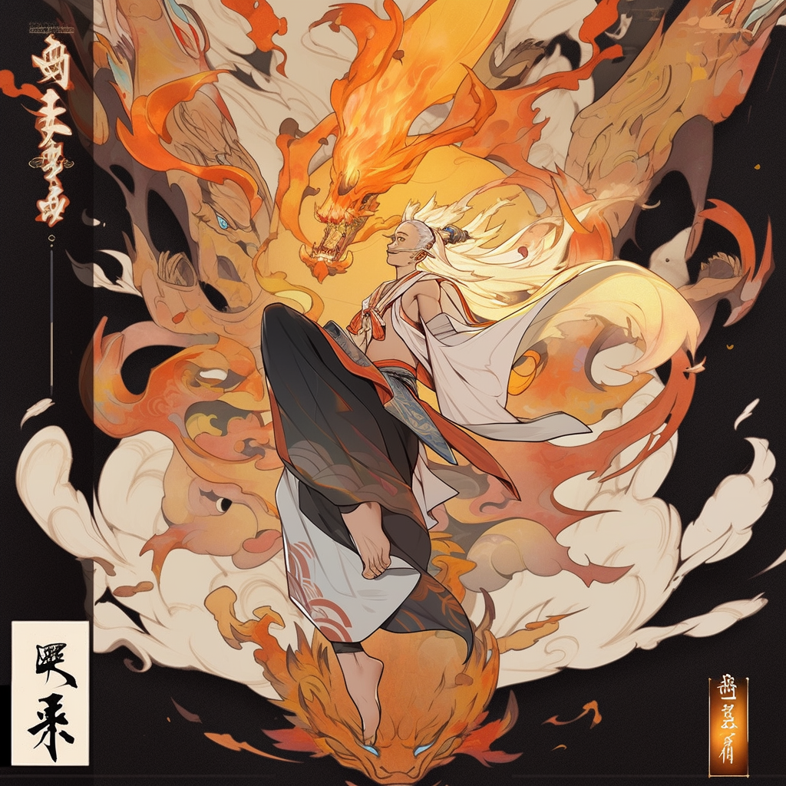
>     <div style="font-family: STXingkai;font-size:20px">只闻凤鸣九天叫，孰知涅槃苦深道。</div><br/>
>     <div style="font-family: STXingkai;font-size:20px">苦深涅槃灭天骄，傲世一鸣天下啸。</div><br/>
>
> 19. <div style="font-family: STXingkai;font-size:30px">念骠姚校尉去病</div><br/>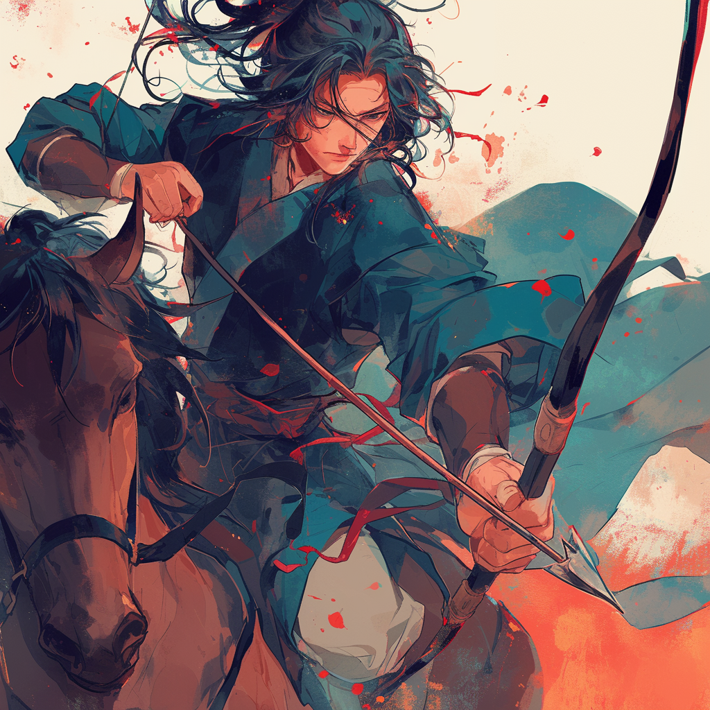
>     <div style="font-family: STXingkai;font-size:20px">怒马鲜衣少年郎，箭逐胡马戍天疆。</div><br/>
>     <div style="font-family: STXingkai;font-size:20px">酒兵倾尽玉泉酿，醉覆前路侠骨香。</div><br/>
>
> 20. <div style="font-family: STXingkai;font-size:30px">唤大圣</div><br/>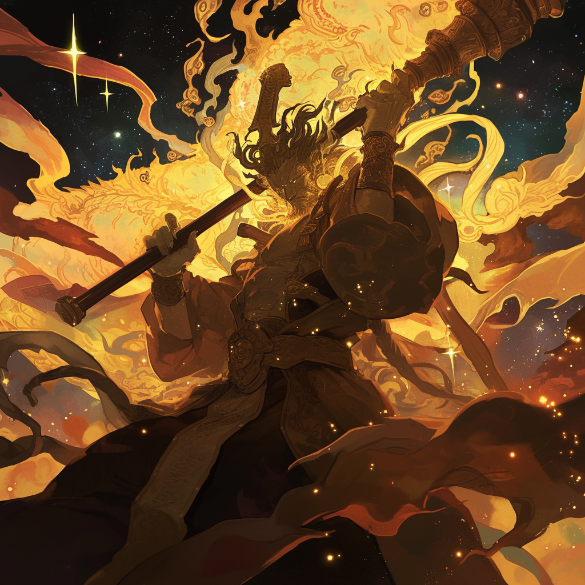
>     <div style="font-family: STXingkai;font-size:20px">混沌初开世清明，日月分光漫天星。</div><br/>
>     <div style="font-family: STXingkai;font-size:20px">道说魍魉今犹在， 神猴挥棒乾坤清。</div><br/>
>
> 21. <div style="font-family: STXingkai;font-size:30px">借铭月下独酌</div><br/>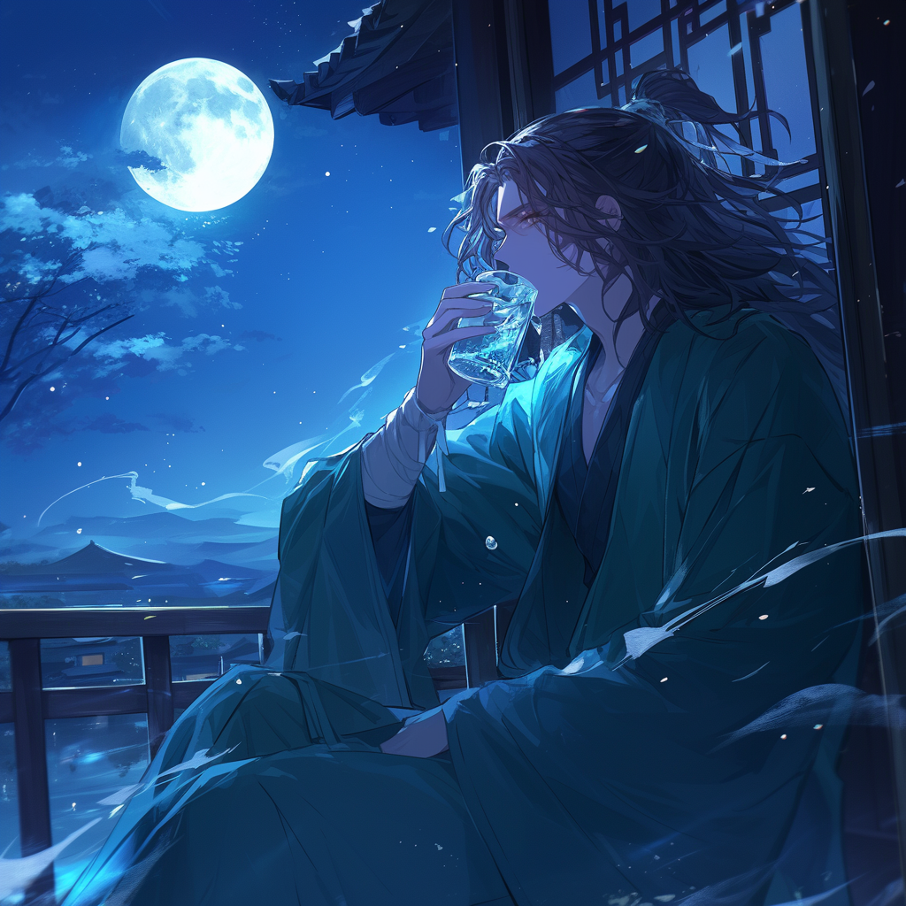
>     <div style="font-family: STXingkai;font-size:20px">苍穹月，望风帘，独坐吮饮杜康甜。直杯敬止豪杰目。</div><br/>
>     <div style="font-family: STXingkai;font-size:20px">问世间，有何倦厌？坐起行径崤函路。弃厌毕，会出关！关外见崆峒，去筱贤。</div><br/>
>
> 22. <div style="font-family: STXingkai;font-size:30px">乐天</div><br/>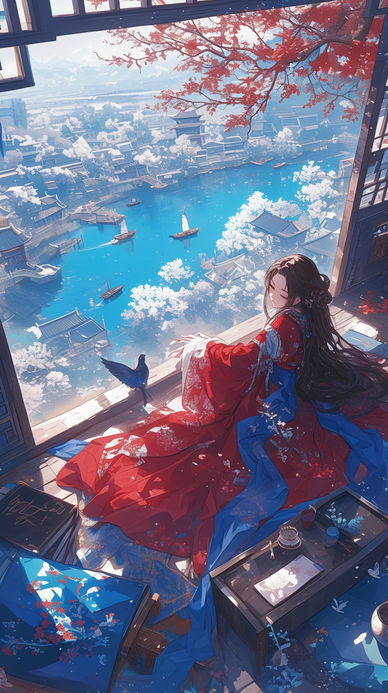
>     <div style="font-family: STXingkai;font-size:20px">轻风拂槛倚翠楼，睡蛾展，偎青帘。</div><br/>
>     <div style="font-family: STXingkai;font-size:20px">描红挂贴白云檐，亭台乱，眺清乾。</div><br/>
>     <div style="font-family: STXingkai;font-size:20px">孰言此间瑶池会，看人世，扬轻帆。</div><br/>
>     <div style="font-family: STXingkai;font-size:20px">轻帆越重千万展，会如意，虞乐天！</div><br/>
>
> 23. <div style="font-family: STXingkai;font-size:30px">剑铭映山河</div><br/>
>     <div style="font-family: STXingkai;font-size:20px">饮马阑珊刀与火，缨鸣青锋睇当年，映见原样山河。</div><br/>
>     <div style="font-family: STXingkai;font-size:20px">只一生离响，划开两世三生。</div><br/>
>     <div style="font-family: STXingkai;font-size:20px">轻摇扶婵娟，河山是何恙？</div><br/>
>     <div style="font-family: STXingkai;font-size:20px">勒紫电还宿，月覆青霜。只念离索处，轻鸣弦歌，是吾安处。</div><br/>
>
> 24. <div style="font-family: STXingkai;font-size:30px">有晴风归去</div><br/>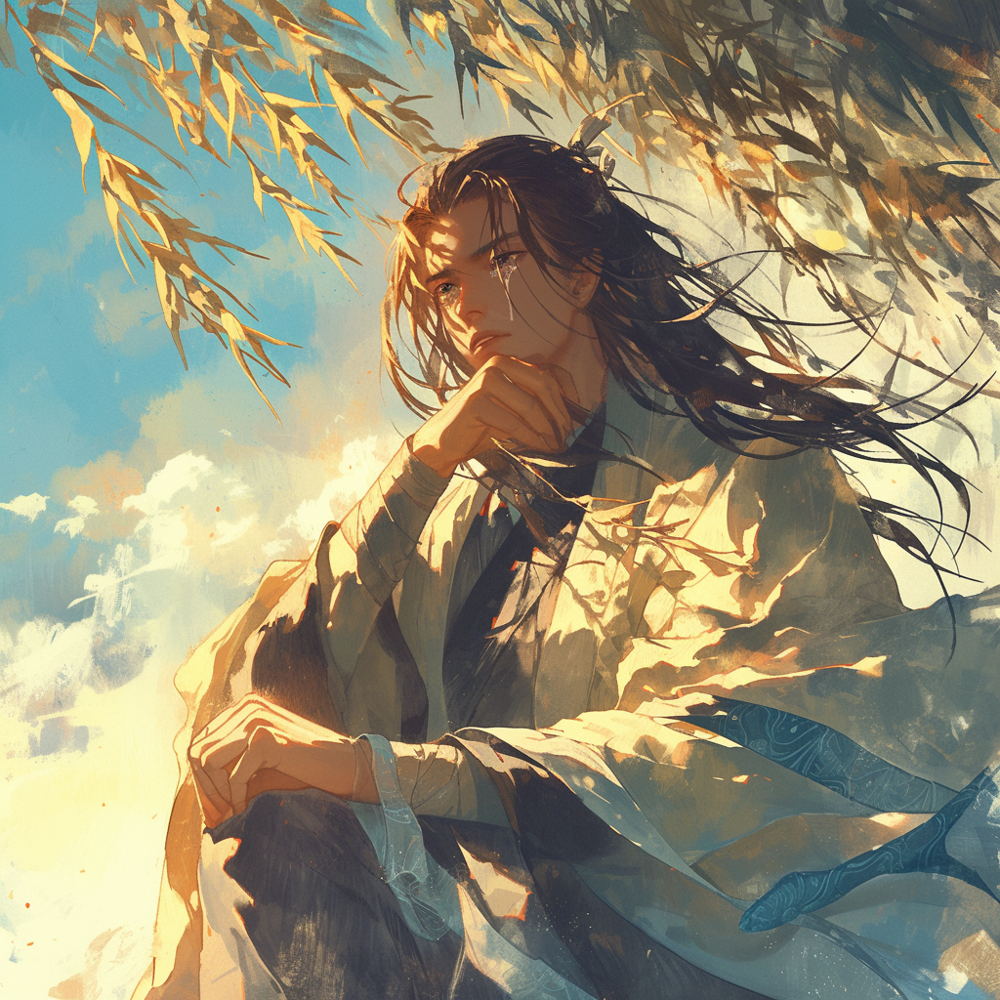
>     <div style="font-family: STXingkai;font-size:20px">有情来风，无心去归，乌鬓不相怜。</div><br/>
>     <div style="font-family: STXingkai;font-size:20px">白首莫逾心，不禁西江泪， 去往兴灵浦，拦撤愁云会。</div><br/>
>     <div style="font-family: STXingkai;font-size:20px">握开是晴天，擎首明神时，是阳春！</div><br/>
>
> 25. <div style="font-family: STXingkai;font-size:30px">无言</div><br/>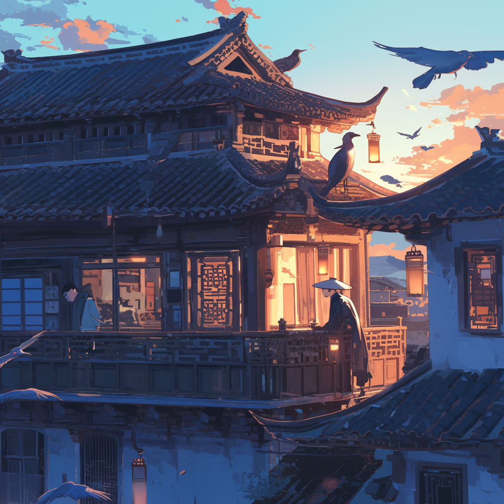
>     <div style="font-family: STXingkai;font-size:20px">别经年，岁悠悠。痴离在，人莫愁。</div><br/>
>     <div style="font-family: STXingkai;font-size:20px">会须一饮三百杯，今朝谁将夕阳飞？</div><br/>
>
> 26. <div style="font-family: STXingkai;font-size:30px">何以忧</div><br/>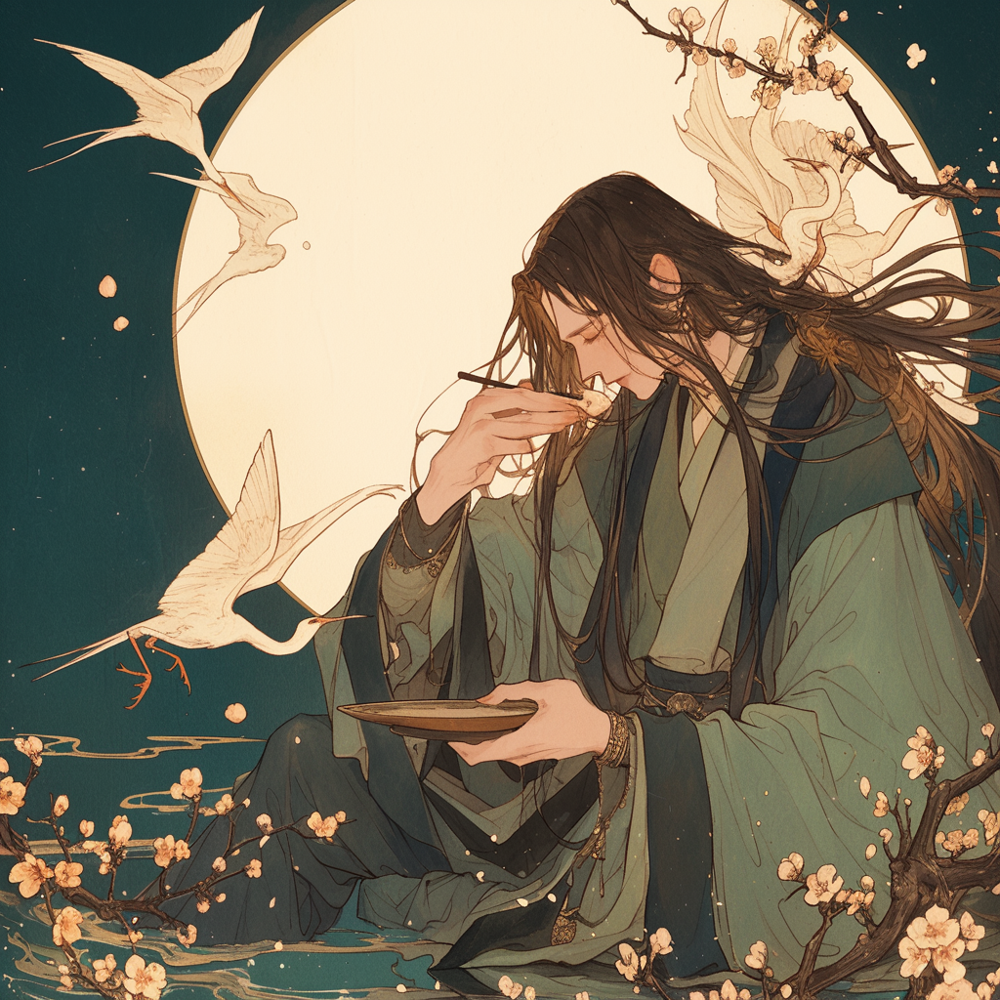
>     <div style="font-family: STXingkai;font-size:20px">三月风烟，五月桃花。春红未谢，闭月已羞。孤鹜独飞，落河无泪。雁声何道？擎空难翔。</div><br/>
>     <div style="font-family: STXingkai;font-size:20px">暮香沉而零花落，尽消陨。</div><br/>
>     <div style="font-family: STXingkai;font-size:20px">月盘咄咄，玉光难照。影独处之？明日以何忧？今朝谁人思？</div><br/>
>
> 27. <div style="font-family: STXingkai;font-size:30px">醒来吧</div><br/>
>      醒来吧
>
>      不要沉睡
>
>      这是岁月的呼唤
>
>      这是生命的亲昵
>
>      听风而吟诗
>
>      见花而谢室
>
>      吾闻江河海
>
>      我见鸟语香
>
>      我唱天星月
>
>      吾颂地脂垢
>
>      我引弹剑歌
>
>      吾奏金枪曲
>
>      孰知此道前方路？
>
>      我已踏至到此行
>
>      需归？须归？
>
>      毋悔！毋回！
>
> 28. <div style="font-family: STXingkai;font-size:30px">读东坡赠朝云词有怀</div><br/>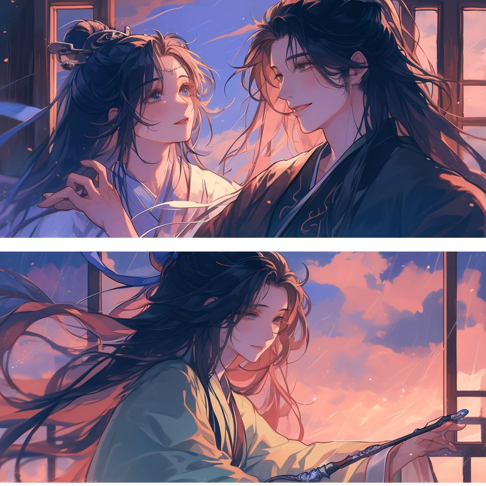
>     <div style="font-family: STXingkai;font-size:20px">朝云行来，暮结雨，未见犹似怀。</div><br/>
>     <div style="font-family: STXingkai;font-size:20px">结习余缘，维摩花容身。</div><br/>
>     <div style="font-family: STXingkai;font-size:20px">但有君知我，何事待以尽？为是观。</div><br/>
>
> 29. <div style="font-family: STXingkai;font-size:30px">祝君辞</div><br/>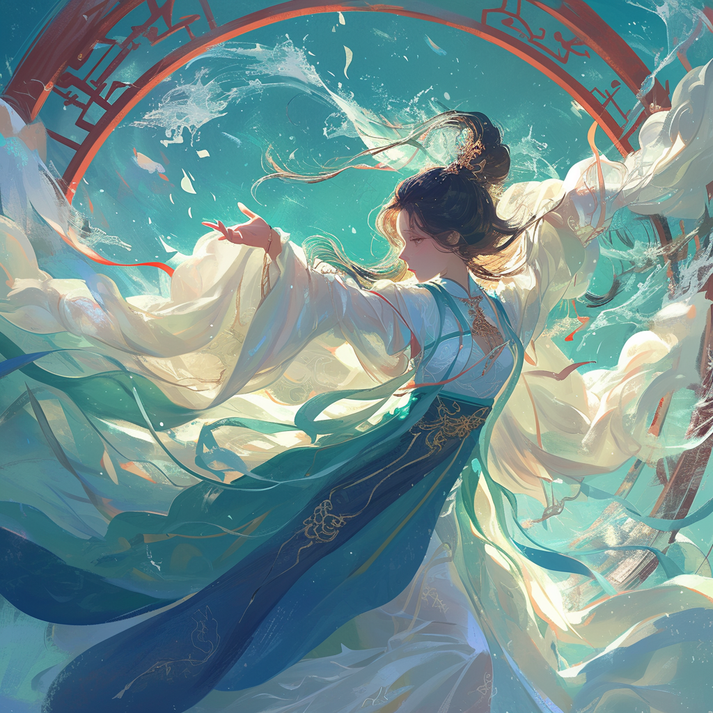
>     <div style="font-family: STXingkai;font-size:20px">顾念子为姝，露霜镜伊人。</div><br/>
>     <div style="font-family: STXingkai;font-size:20px">妆颜倾国色，细裹垂柳身。</div><br/>
>     <div style="font-family: STXingkai;font-size:20px">新衣绣云裳，风踏镜阶去。</div><br/>
>     <div style="font-family: STXingkai;font-size:20px">难忘子为姝，歌而贺汝迁，岁曰：</div><br/>
>     <div style="font-family: STXingkai;font-size:20px">最是伊人留不住，驻蝶辞花花辞树。</div><br/>
>     <div style="font-family: STXingkai;font-size:20px">辞树翩飞朝仙露，朝露莹发花晨述。</div><br/>
>
> 30. <div style="font-family: STXingkai;font-size:30px">破军关</div><br/>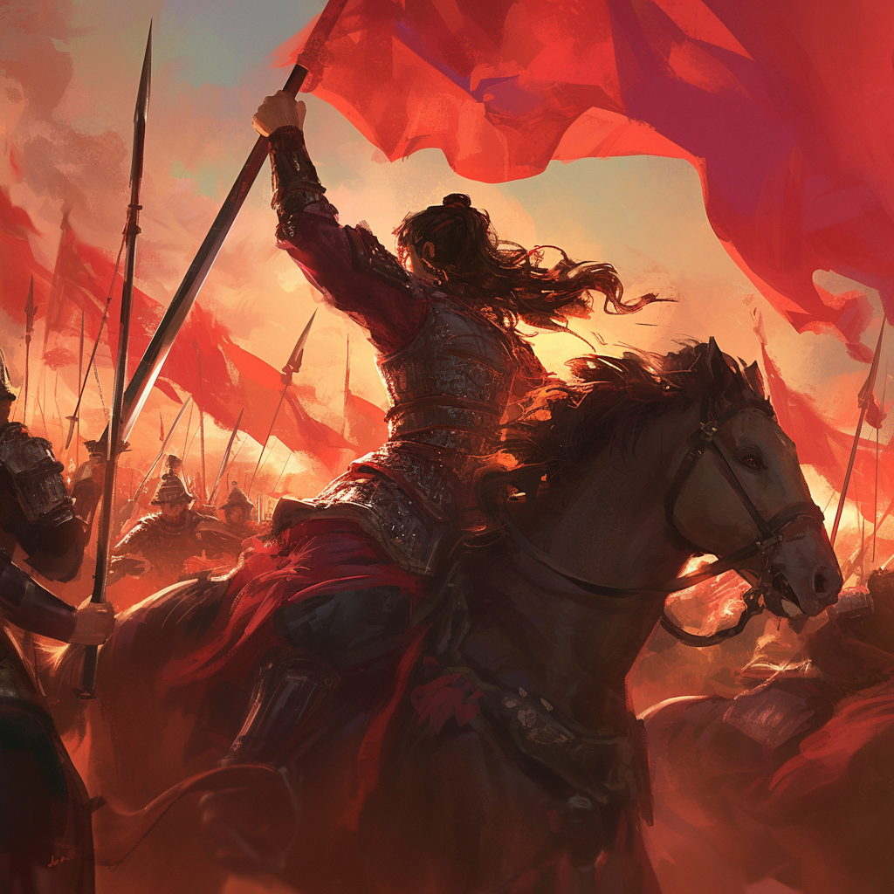
>     <div style="font-family: STXingkai;font-size:20px">亿丈铜鼓锣嚣，指点万千戾马嘶嚎。</div><br/>
>     <div style="font-family: STXingkai;font-size:20px">角声燎燎，鞭敕东都向西朝。日向黄昏，风烟滚滚，战事难休徒销魂。</div><br/>
>     <div style="font-family: STXingkai;font-size:20px">呓当年，力斩华雄酒还温，把一骑当千，将千古英明显。</div><br/>
>     <div style="font-family: STXingkai;font-size:20px">莫笑把酒偷欢，看明日沙场，一马当先。</div><br/>
>     <div style="font-family: STXingkai;font-size:20px">只待破军关，别离战壕间。不请功业建，盼得思亲俱欢颜。</div><br/>
>
> 31. <div style="font-family: STXingkai;font-size:30px">雄关</div><br/>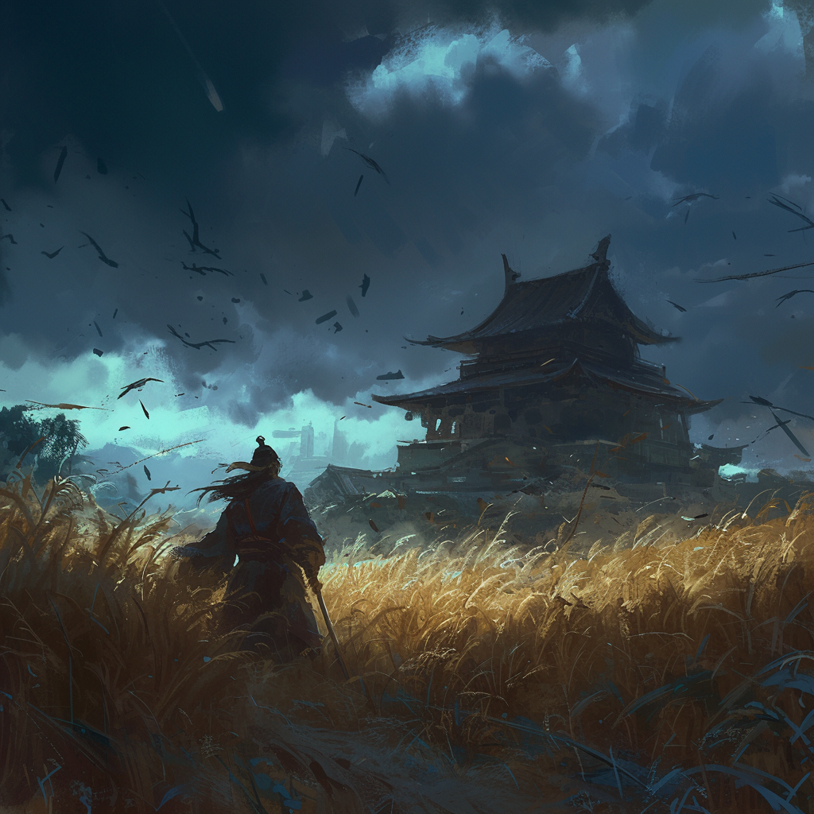
>     <div style="font-family: STXingkai;font-size:20px">远唤重云来，迈泽覆淤开。</div><br/>
>     <div style="font-family: STXingkai;font-size:20px">清风旋入夜， 雄关惊雷骇。</div><br/>
>
> 32. <div style="font-family: STXingkai;font-size:30px">南娥-勿忘我</div><br/>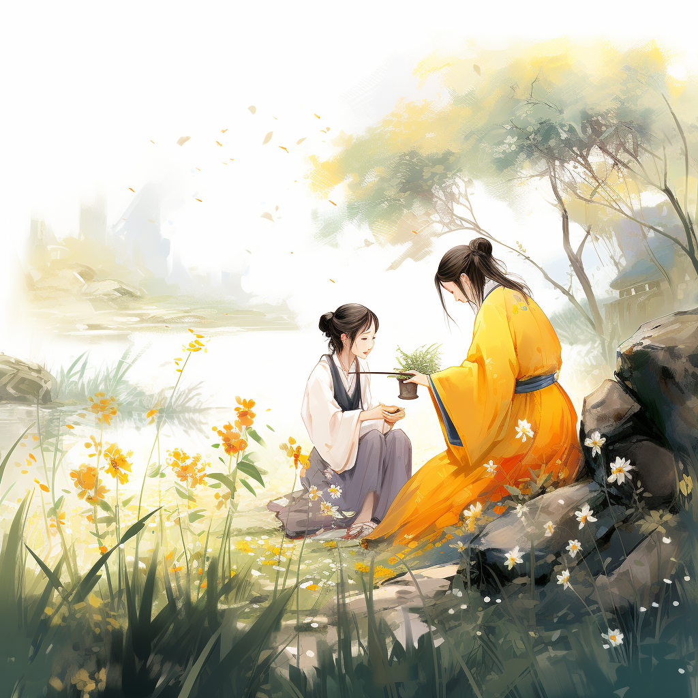
>     <div style="font-family: STXingkai;font-size:20px">采花娇，不知岁稀昔岁伴年少。流年不轻叹，笑得猗郁烂漫。</div><br/>
>     <div style="font-family: STXingkai;font-size:20px">枉不顾似水年华，朝朝暮暮；参不透红尘夙愿，零零落落。却落得残柳败絮唏嘘。</div><br/>
>     <div style="font-family: STXingkai;font-size:20px">错盼！错盼！难得潇洒，不服三秋败华韶。</div><br/>
>     <div style="font-family: STXingkai;font-size:20px">执念！执念！毋忘君，君勿忘。</div><br/>
>
> 33. <div style="font-family: STXingkai;font-size:30px">妙雨丹青</div><br/>
>     <div style="font-family: STXingkai;font-size:20px">白练自舞，惊起浩渺云烟。离人不归，倩谁人来见？</div><br/>
>     <div style="font-family: STXingkai;font-size:20px">撒一江愁思，凌乱灯火阑珊。举樽成忆，细雨如针，织起光景往年。</div><br/>
>     <div style="font-family: STXingkai;font-size:20px">清风翠雨迷人眼，醉卧长亭影独欢。执笔非念，挥尽相思泪。</div><br/>
>     <div style="font-family: STXingkai;font-size:20px">怎得？梦回魂断鹊桥仙。不奈此情成追忆，信手丹青妙雨间。</div><br/>
>     <div style="font-family: STXingkai;font-size:20px">欲语焉？泪欲坠，梦中此缠绵。</div><br/>
>
> 34. <div style="font-family: STXingkai;font-size:30px">回梦燕子楼</div><br/>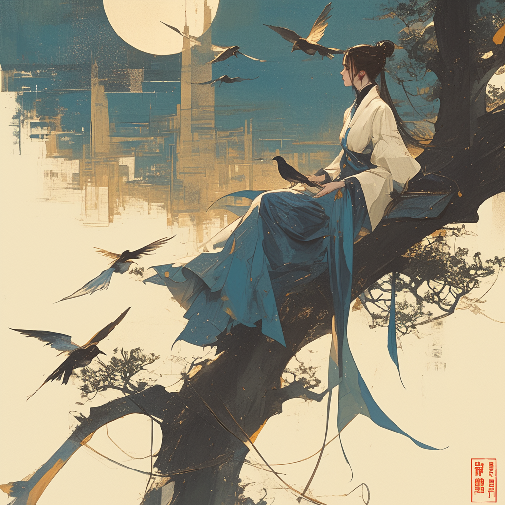
>     <div style="font-family: STXingkai;font-size:20px">搁笔处，正望古月。流光晓寒，回神燕子楼，教人成灰。</div><br/>
>     <div style="font-family: STXingkai;font-size:20px">痴命见人笑，谁人命不痴？难作缀语。</div><br/>
>     <div style="font-family: STXingkai;font-size:20px">提笔作罢，一字许归元。元以守中，是生！</div><br/>
>
> 35. <div style="font-family: STXingkai;font-size:30px">狂生晓梦 </div><br/>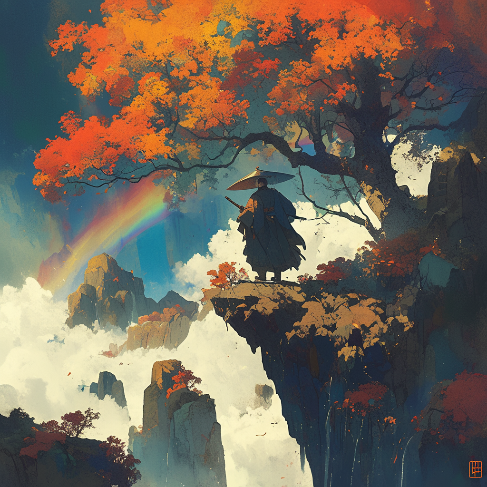
>     <div style="font-family: STXingkai;font-size:20px">雨过秋残红，淡霰落如风。</div><br/>
>     <div style="font-family: STXingkai;font-size:20px">羡得滔天浪，万事原是空…</div><br/>
>
> 36. <div style="font-family: STXingkai;font-size:30px">若人见花</div><br/>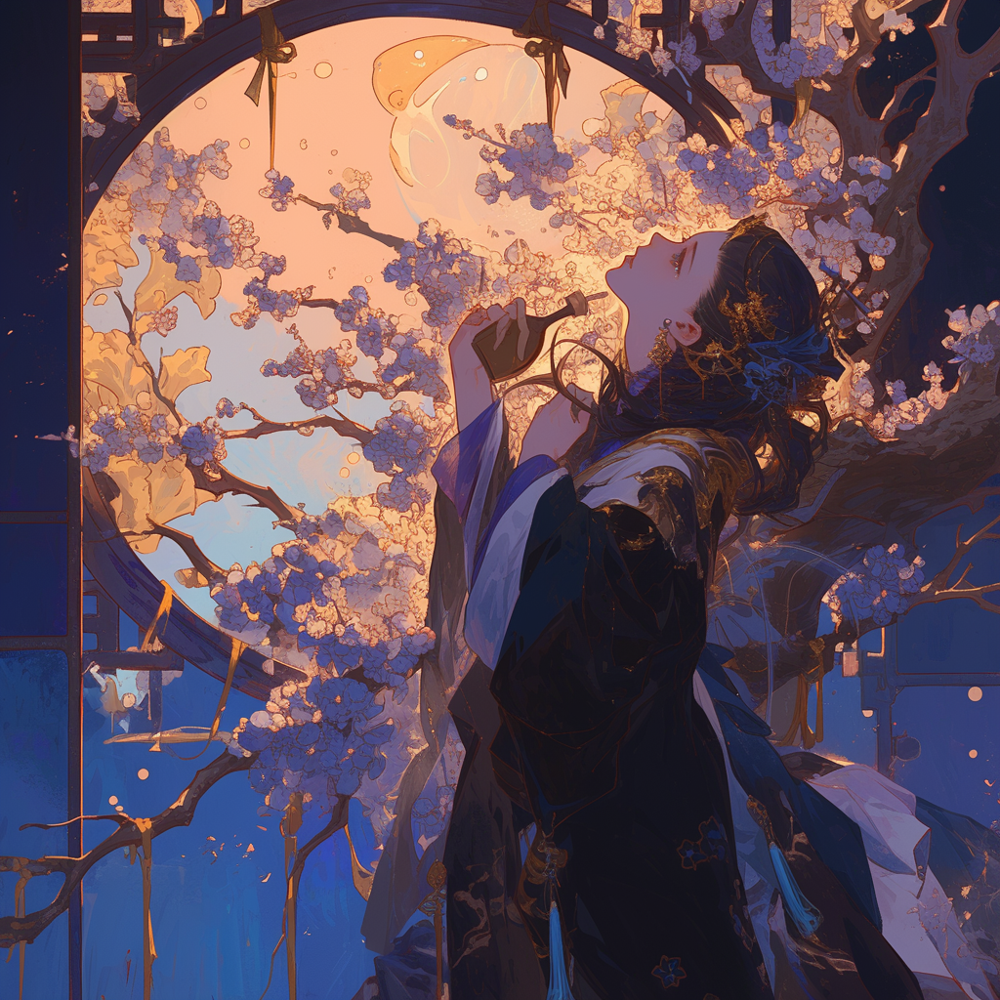
>     <div style="font-family: STXingkai;font-size:20px">容绝新艳独占春，醉晚林风夜见深。</div><br/>
>     <div style="font-family: STXingkai;font-size:20px">兹是落花本无意，绛乱生发焕奇芬。</div><br/>
>
> 37. <div style="font-family: STXingkai;font-size:30px">秋凉</div><br/>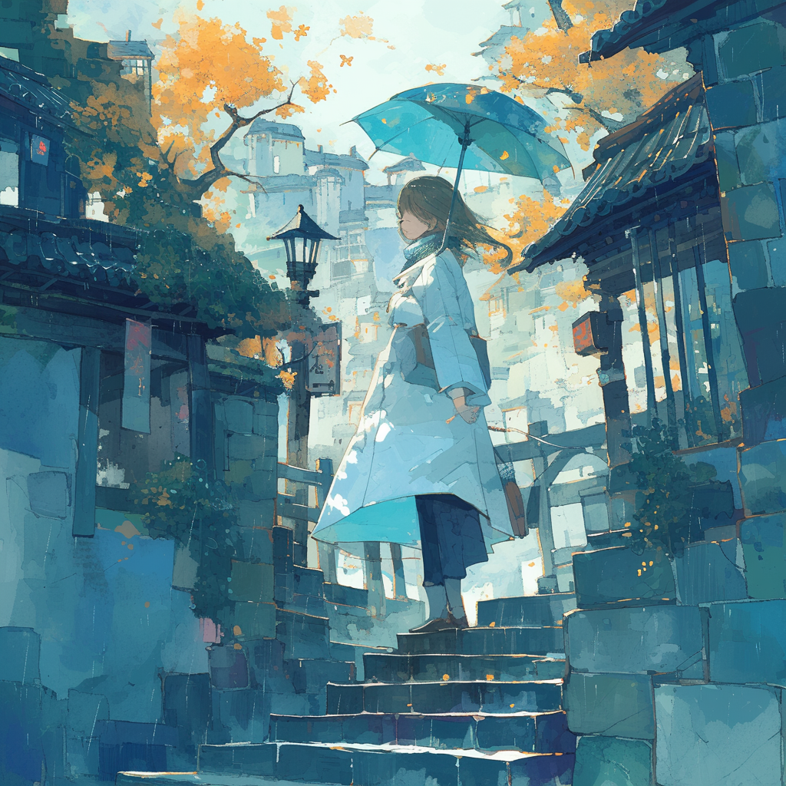
>     <div style="font-family: STXingkai;font-size:20px">邦节霖熏秋凉意，出走临乡归故里。</div><br/>
>     <div style="font-family: STXingkai;font-size:20px">漆云漫布终期雨，似是无晴也有晴。</div><br/>
>
> 38. <div style="font-family: STXingkai;font-size:30px">佳人愿</div><br/>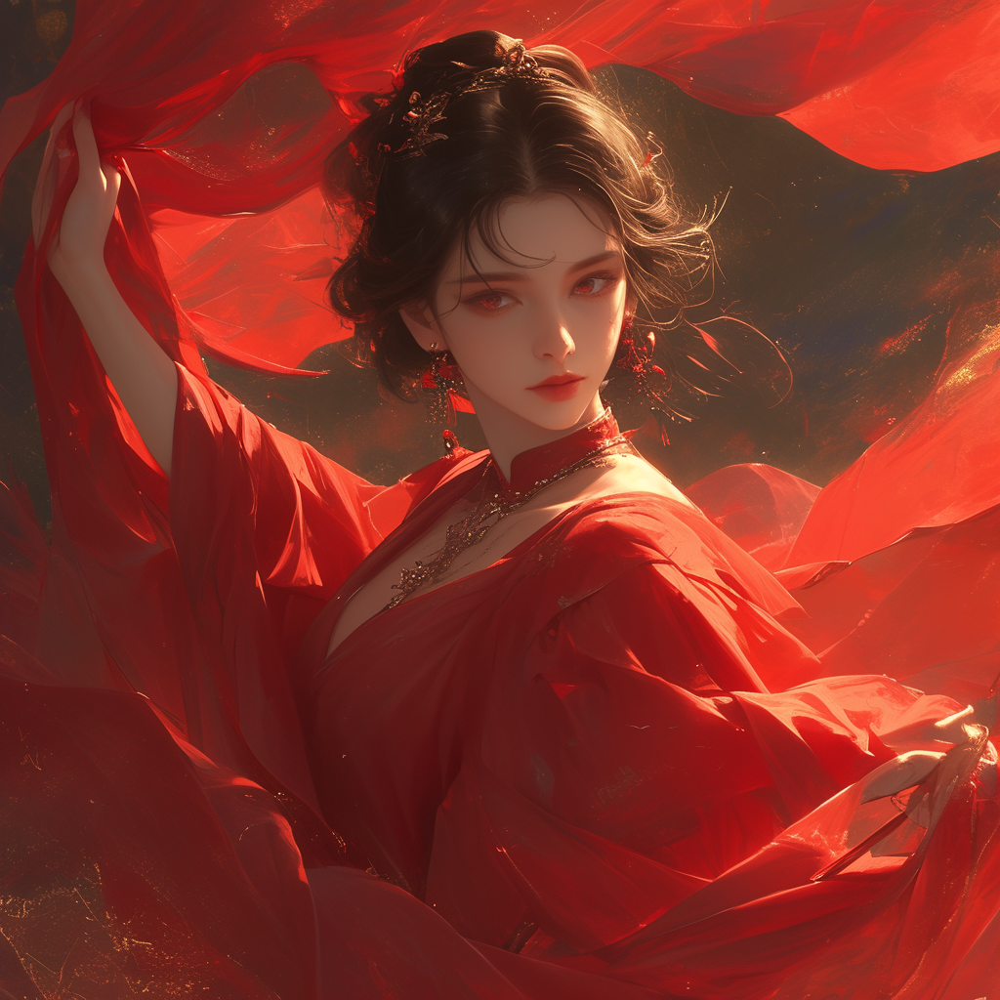
>     <div style="font-family: STXingkai;font-size:20px">愿添红袖香，风轻万云裳。</div><br/>
>     <div style="font-family: STXingkai;font-size:20px">星关云闭月，熠日耀重光。</div><br/>
>
> 39. <div style="font-family: STXingkai;font-size:30px">夜夏弦律</div><br/>
>     <div style="font-family: STXingkai;font-size:20px">怡入江寒静，顿首望星天。</div><br/>
>     <div style="font-family: STXingkai;font-size:20px">回堪遮望眼，弦轻慧花田。</div><br/>
>     <div style="font-family: STXingkai;font-size:20px">日月行天，亘古不变</div><br/>
>
> 40. <div style="font-family: STXingkai;font-size:30px">浮世善恶图</div><br/>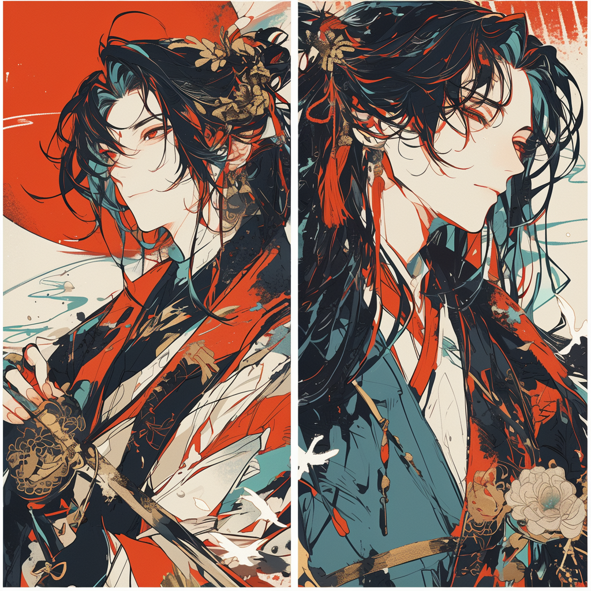
>     <div style="font-family: STXingkai;font-size:20px">为甚莫作善，看尽殍世暗。</div><br/>
>     <div style="font-family: STXingkai;font-size:20px">做尽天下恶，享尽世间乐。</div><br/>
>
> 41. <div style="font-family: STXingkai;font-size:30px">夏午</div><br/>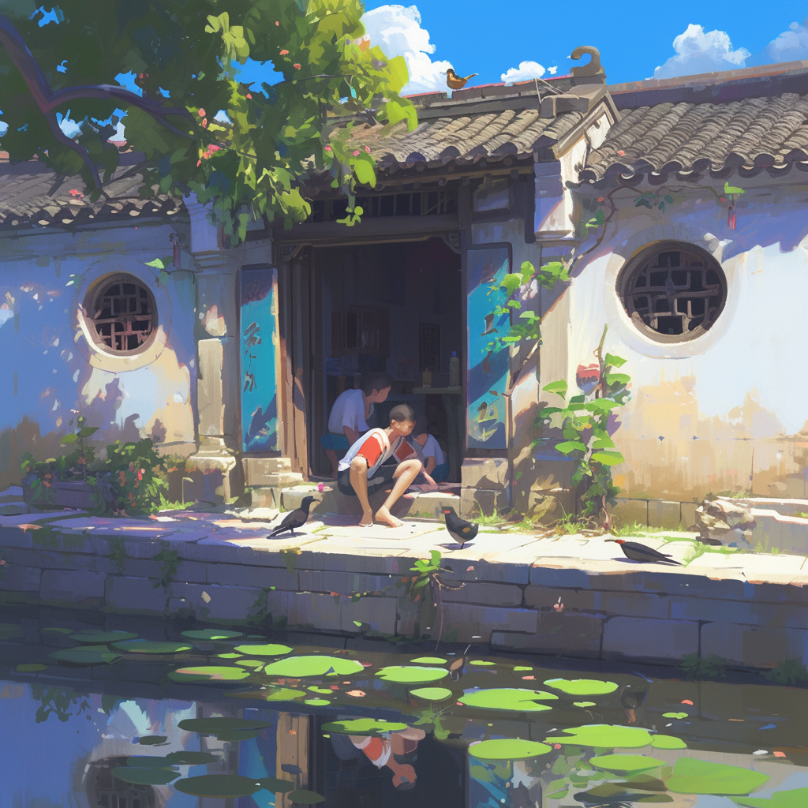
>     <div style="font-family: STXingkai;font-size:20px">午照凝露树柳阴，莺啼燕语旧绪新。</div><br/>
>     <div style="font-family: STXingkai;font-size:20px">南风飘来繁如絮，姿是人间雪阳春。</div><br/>
>
> 42. <div style="font-family: STXingkai;font-size:30px">花似醉</div><br/>
>     <div style="font-family: STXingkai;font-size:20px">凯风是惑邂，梦悠拂南山。</div><br/>
>     <div style="font-family: STXingkai;font-size:20px">轻摇花落叶，醉展姬绡艳。</div><br/>
>
> 43. <div style="font-family: STXingkai;font-size:30px">观夜</div><br/>
>     <div style="font-family: STXingkai;font-size:20px">洛风扶雁双飞客，暑去经还几度秋。</div><br/>
>     <div style="font-family: STXingkai;font-size:20px">阑珊明珠将夜艳，笑眺白兔戏玉蟾。</div><br/>
>
> 44. <div style="font-family: STXingkai;font-size:30px">美人颂</div><br/>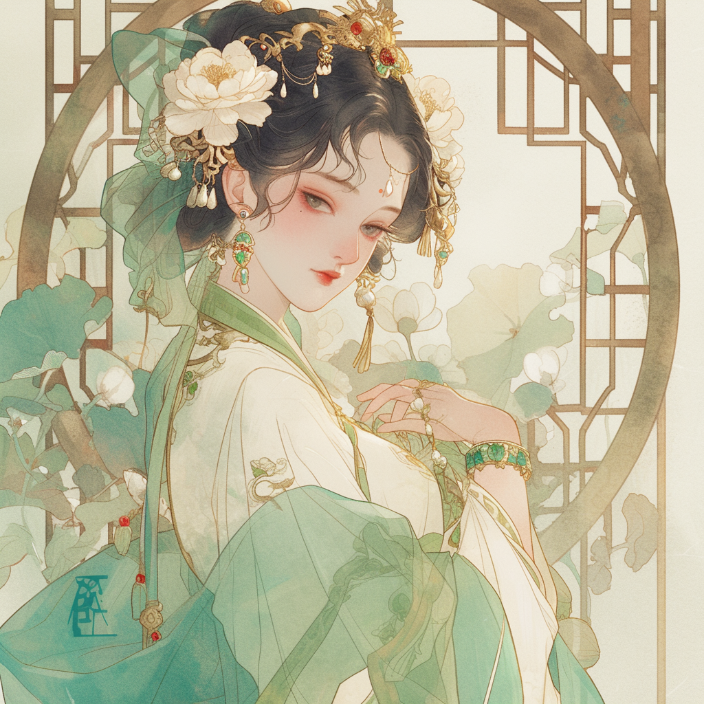
>     <div style="font-family: STXingkai;font-size:20px">玉头一树妆，清眸皓齿香。</div><br/>
>     <div style="font-family: STXingkai;font-size:20px">云姿婀娜步，情怯小轩窗。</div><br/>
>
> 45. <div style="font-family: STXingkai;font-size:30px">岁</div><br/>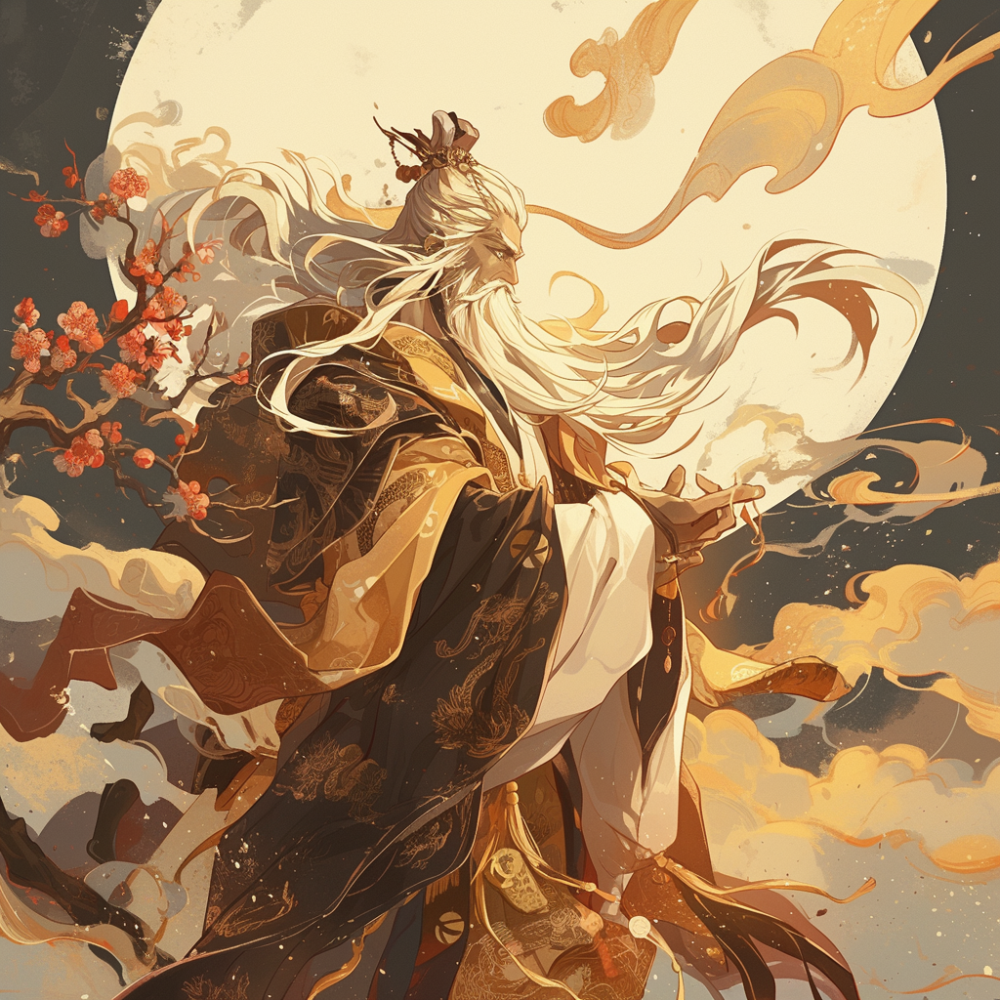
>     <div style="font-family: STXingkai;font-size:20px">花开夕阳陌，日升百岁时。</div><br/>
>     <div style="font-family: STXingkai;font-size:20px">仙人踏云来，新生向此开。</div><br/>
>
> 46. <div style="font-family: STXingkai;font-size:30px">惊蛰</div><br/>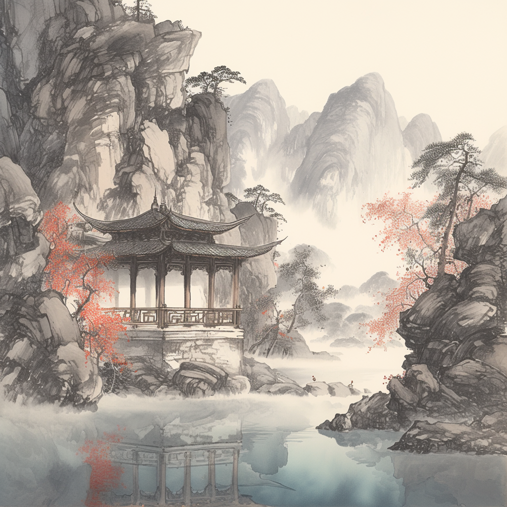
>     <div style="font-family: STXingkai;font-size:20px">惊蛰，再曰“启蛰”，乃二十四节气之三。</div><br/>
>     <div style="font-family: STXingkai;font-size:20px">时至惊蛰，烁气舒上，春雷乍动、水雨出脱，盎然生机。</div><br/>
>     <div style="font-family: STXingkai;font-size:20px">缭然春色，江山易图。春雷始鸣，乍惊伏蛰。曰惊蛰干支历卯月始，又曰“春雷惊百虫”。</div><br/>
>     <div style="font-family: STXingkai;font-size:20px">卯，仲春之月，卦在震位，万物出乎震，乃生发之象。</div><br/>
>     <div style="font-family: STXingkai;font-size:20px"> “卯”，冒也，万物冒地出，天雷唤起万生醒；故曰，卯月（二月），量道法之易，万道更新自斯始。今日惊蛰，惊鸿人间！</div><br/>
>
> 47. 我将我的卑鄙带进我的坟墓，你把你的光明带给他们的明天。
>      我几百年的大奸大恶，只是为了我的一厢情愿罢了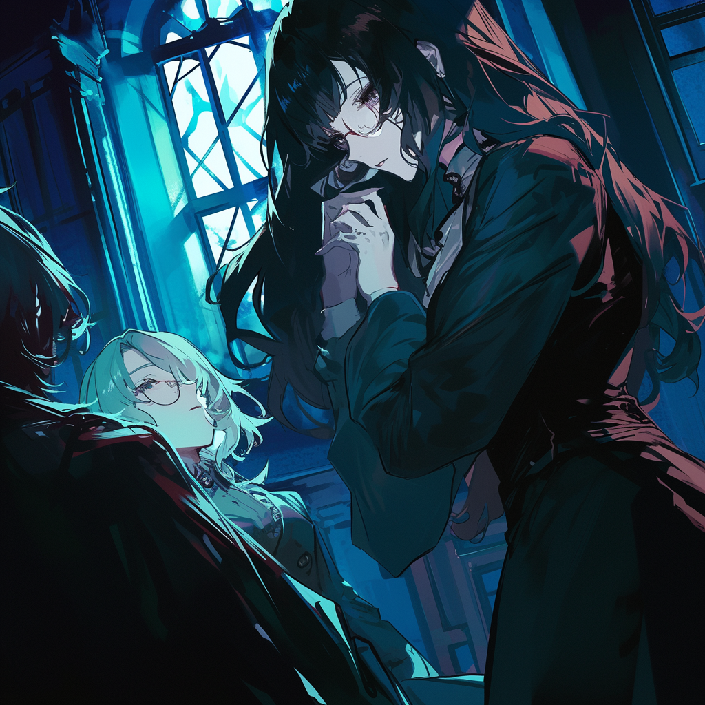
>      无生之前，唯愿你我可以坚守自己所珍爱的一切。
>      无生之后，我带着我的意志和愧意消散于这宙宇之间，你协同他们一起，走向你所希望的世间。
>
> 48. 他们这群人，得到别人的好，就感谢他们的神。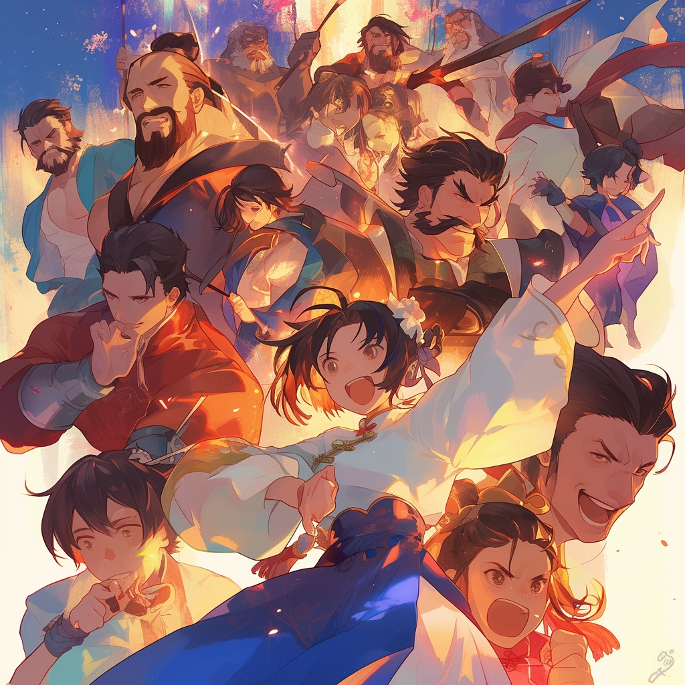
>      受到自己的不幸，就责怪他人，莫不在他人身上找自己不幸的原因。
>      问起来，就说这是神告诉他们的，要让他们代神惩罚他人，说得大义凛然，不苟言笑。
>      我每当想起这些，就不禁想哈哈大笑。
>
> 49. 你什么都想要的时候，其实你离一无所有已经不远了。当你拥有一切，你已经是一无所有了
>
> 50. 如若无情，天地俱寂消如音
>     如若有情，草木皆春繁如画<br/>
>       
>
> 51. 鼠器凌霄子，孺牛奋丑期。
>
> ****
>
> **我写的歌词**
>
> ```json
> 修罗会哭
> 躲在面具后耀熠
> 叱咤风云 自在得意
> 只是在不确定的某个夜里
> 我也会卸下面具戴上回忆
> 空气中弥漫着杀意
> 不能自已 停止呼吸
> 惊恐之中守候着唯一
> 梦想着带着自己逃离
> 也许修罗会哭 也会痛苦无助
> 我也不愿再做回浮屠
> 独自仰望天幕
> 向上苍祈祷诉
> 悔不当初 甘愿服下荣耀的毒
> 浮云流风谈吐着压抑
> 我已成王有怎能放弃
> 梦想？现实？已陷入迷离
> 谁是自己？又如何辨析
> 修罗面具紧锁冲动心悸
> 只是修罗会哭 也要忍受孤独谁也不愿再踏入轮回之渡
> ```
>
> ```json
> 假面
> 如果对现实的痛已变成一段优美插曲
> 就让半麻木的心随风飘散成絮
> 那时心中的念 渐行渐远
> 竟已悄然带上假面
> 独步在一个人的繁华之上
> 我看见他们都在说谎
> 一阵莫名糊涂的哀伤
> 难忘誓言中的虔诚在回荡
> 怎么笑得如此惆怅
> ```
>
> 

## 我的写作素材

>**自己的写作素材**
>
>1. not they but we
>
>2. 努力是会留下痕迹的
>
>3. 人这一辈子就是不停地在做选择 你不能指望别人为自己的选择买单
>
>4. 中日大师法战 中方故梦阵 使全人类进入南京大屠杀现场 看见鬼子行凶全过程 少部分鬼子精神崩溃 主要是妇孺 大部分亢奋 甚至想加入
>
> 5. 总结：
>
>    不要懒
>    不要形式上勤奋，思想上懒惰
>
>    多写
>    百万必神，多码字多思考[喜极而泣]
>
>    没有捷径，愿杠精少一些，世界和平
>
>6. 意识流电影拍摄手法 用一个特殊时间段的实际 插入多个故事片段 最后故事结束 回到现实
>
>7. 其实人生只要懂得两句话就可以快乐 关我屁事关你屁事 盛世有盛世的快乐 无为有无为的快乐
>
>8. 胡适写给儿子的信：
>```
>   我养育你，并非恩情，
>   只是血缘使然的生物本能；
>   所以，我既然无恩于你，
>   你便无需报答我。
>   反而，我要感谢你，
>   因为有你的参与，
>   我的生命才更完整。
>
>   我只是碰巧成为了你的父亲，
>   你只是碰巧成为了我的女儿和儿子，
>   我并不是你的前传，
>   你也不是我的续篇。
>
>   你是独立的个体，
>   是与我不同的灵魂；
>   你并不因我而来，
>   你是因对生命的渴望而来。
>
>   你是自由的，
>   我是爱你的；
>   但我绝不会“以爱之名”，去掌控你的人生。
>```
>9. 能够闲时一起扯淡的才是朋友
>
>10. 你要追着光，而不是光芒下的荣耀
>
>11. 今天的生活又是一张白纸，你要如何书写，已和昨日无干。说不定，昨日你写的东西，已经被风吹走，不见踪迹nothing lasts forever
>
>12. 人同此心，心同此理 我并不讨厌一人得道，鸡犬升天。我感到不平的是，为什么，得道的人不是我而已
>
>13. 求道寻佛
>
>       >给善恶两念化身安排相似的境遇 看其作何选择
>       >
>       >善念是南方弱国贫农之子
>       >
>       >父母饿死时 被道长师傅所救
>       >
>       >从小天性纯良 老见生死就不忍落泪
>       >
>       >对其影响最几件事有
>       >
>       >  * 其一 在山上道馆时 一贼偷东西被抓
>       >
>       >    趁善念不备
>       >
>       >    发起反击 却被打得快落下山崖
>       >
>       >    善念尽力扑救未果
>       >
>       >    隐隐于怀
>       >
>       >  * 其二 下山求道
>       >
>       >    见父子二人快被猛虎吃掉
>       >
>       >    出手打晕猛虎 营救父子二人
>       >
>       >    猛虎奄奄一息 随后死亡 
>       >
>       >    善念将猛虎埋葬后被父子二人请至家中招待
>       >
>       >    住了几天 便离去了
>       >
>       >    过了几日 再次路经此地时 那父子又请到家里去了
>       >
>       >    堂前
>       >
>       >    那张虎皮被剥下 挂在院里晾干
>       >
>       >    父亲说 这虎皮多值钱啊 埋了可惜了 我就把它挖出来        隔几日把它卖了去 换点钱财 好度日啊 
>       >    听了这话 呆呆地眨了眨眼
>       >
>       >    他想起埋葬饿虎时 说的话
>       >
>       >    你这虎 野兔山猪还不够你吃活
>       >
>       >    偏要吃人！ 我也是迫不得已啊 
>       >
>       >    因你生猛 不出手重点 怕是救不了那对父子
>       >
>       >    我 也得葬送于你口中 如今你重归与土
>       >
>       >    也算是死得其所了 那里在这里 好好安歇吧
>       >
>       >    可是此时 那张虎皮就放在眼前
>       >
>       >    我是不是 不应出手呢？父子被饿虎食
>       >
>       >    是天道 我出手救人 杀了虎 本以为可让它落叶归根 可是却落得死后剥皮的下场？
>       >
>       >    问道与己
>       >
>       >    我 违背了道？身在道中 怎能得道？
>       >
>       >    跳出去
>       >
>       >    不 没有 饿虎吃人是道 我出手救人也是道
>       >
>       >    道是跟着内心的方向
>
>14. 人类进化
>       当人类的物质精神形态随着物质基础渐渐变化
>       数万年后 人类 还是人类吗？还是已经是进化后的新物种？
>       你能说人类的原始形态就是人类吗？
>       那么？人类作为这一物种的原始形态
>       我们，应该把他们聊什么呢？
>       这一生物姓名 精神的命名权 我们称之为 文化战争！
>
>15. 妈妈这一概念 从雌性 转化为 产生 养育
>
>16. 断锋刀
>       煜直剑
>       刀剑江湖
>
>17. 终极治疗方案 
>       以患者本体作为设计图
>       使用量子化仪器（）将人打成量子态
>       再通过一定指引 去除病变因子
>       将去除病变因子的新量子团根据设计图重构成患者 达到去除一切疾病的目的 甚至如果年轻时就留存自身设计图的话 可以按照留存设计图重构 真的 返老还童了
>       只是 谁又能确定 重构的 是他 本人呢？
>
>18. 小说创意 以扫毒为背景 讲述警校生和主角一样的经历却被黑老大识破的故事 他答道 当我没看过 扫毒吗
>       开头  我叫xx，是一名平平无奇的警校生 快被分配到缉毒大队了 （哈哈上一次平平无奇这个词指的可是古天乐杨过呦，我大概是和古神一样英俊潇洒吧）
>
>19. 无神技  涅槃 乾坤再造！ 屠神技 陨落 漠灭乾坤  乾空技  浮坤技 须臾生灭
>
>20. 能力，势。以云为势，水火为势，天地为势。势为无常。人势，地势，天势。三才势阵 军势
>
>21. 炽鸦：炽羽三千鸦杀尽
>
>22. 按照原神这样 一人一世界 以未来技术为背景写科幻小说 彼此可以进入彼此的世界经历不同的故事-进行中-须弥芥子
>
>23. 茧房  如果你要塑造一个特定类型的人，你只需要给他特定的信息。 你要塑造一个心里充满爱的人，那就从小从新给他被爱的信息；如果你要塑造一个怀疑一切的人，那就让他的脑海充满背叛的信息；如果你要塑造一个阳光自信的人，那就在茧房里洒满散播阳光吧。就像你的大脑给你的身体一样传送信号和信息 文字，语言可以成就一个人，也可以摧毁你的仇恨对象 他们是世间，最强大的武器 成就、毁灭于无形之间
>
>24. 当你坐在这个位置上那一刻，权力就是你我的生存基础，和他们斗，是为了生存！
>
>25. 吾心如镜，清透明彻 要将全部的激情灌注到生命中去 你的问题，生活终会给出所有的答案，无论你喜欢与否
>
>26. 一切的爱不过是价值的延伸
>
>27. 欢迎来到成年人的世界，在这里大家都很忙，没时间听你矫情
>
>28. 人啊要三思 思危 思变 思退
>
>29. 口宜守，心宜修，人宜厚
>
>30. 一切准备就绪，舞台已经搭好，演员已经就位，剩下的，就由我来引领这首灭世曲吧！
>
>31. 不应该追求幸福，而应该追求更好的自我；因为幸福是从天而降的恩赐，而更好的自我是努力的结果。
>
>32. 做人的最高境界是悟。学习的最高境界是德。生活的最高境界是平静。修炼的最高境界是无止境。交友的最高境界是心。爱情的最高境界是成全。人生的最高境界是归一。
>
>33. 即使是流着恐惧的泪，即使这双腿沉若千斤，战场这个方向，我也要向他走去
>
>34. 世界是一棵树，她以生存为根，以动静为养，不断延伸，你我所见到的，不过是世界的树杈。
>
>35. 当一个男人真的爱上一个女人，那这个女人在他的心里份量是很沉重的，沉重到超越了传宗接代的本能。如果爱这个字里带有动物本能的成分，那也就不是爱了，是交换，不是爱。有招有数的感情，其实是用套路，换取女人动物本能的安全感。没招没术的感情，剩下的就该是造物主给的那颗心了，有了这颗心才有爱，没有这颗心，就不能再称之为爱。所以真正的爱情不需要证明，需要证明的不是爱情，是交换、是买卖。都说爱情就像鬼 ，都说有，可谁也没见过。其实是大多数人达不到那个高度，自然见不到真正的爱情。
>
>36. 爱，是人脱离了动物属性后才有的心，可遇，但不可求。
>
>37. 小谎骗人，大骗欺世
>
>38. 未生我时谁是我，生我之时我是谁
>
>39. 这世界上，谁不是谁的过客
>
>40. 侠之大者为国为民 侠之义者 仗剑扶正 当大者之义同义者相冲突 会怎么样呢？
>
>41. 我喜欢你这句话好像并不对，我喜欢的只是我以为的你，并不一定是真正的你，我喜欢的只是你给我加上自己想象的印象
>
>42. 好的伴侣会让你觉得你是世上最好的人。你在他的眼里可以看见你自己最灿烂的模样。跟真正爱你的人在一起，你也会真正成长起来。这样互相给予养分的爱情太让人向往了。 我爱上一座宝藏，希望她只属于我，但又不希望，她被深埋于地下
>
>43. 天意自古高难问
>
>44. 穷养男儿志，富养女儿德。养志养德才目的，本末倒置不可取。
>
>45. 我知道自己或许会遇上一个人，让我透过她的眼，看见凌驾这江湖之上的天外天。可是那闻所未闻的境界，我心中早已明了。若是非要从她的眸子里看清胜似仙界的风景，免不得让她一直睁着眼睛，落下泪来。所以我宁可绕开每一个可能是她的人，尽全力避着她。因为我知道她的泪在我而言是那么滚烫，就算相隔千里，也能让我的剑锋融化。若是面对面看见她的哭泣，便是想用自己这副骸骨种一朵花给她，也是办不到了
>
>46. 吸血鬼夜行录 白日属于你们，夜晚属于我们 不过，从爱迪生开始 人类好像不想遵守这条不成文的约定了呢
>
>47. 人这一辈子就是不停地在做选择 你不能指望别人为自己的选择买单
>
>48. 世间如此，皆因人我不一。倘若你即是我，我即是你，万间争斗皆无意义，世间之事，皆为一统。岂不美哉？岂不乐哉？ 反面主角：为实现人之一统，将事件万人合为一人。 他儿时，战争不断，母亲独自一人抚养他长大，看尽事件恶丑 影响最深之事，一次一少年偷盗他母亲最后一些金钱，被抓， 少年说出那些话：不偷，死的就是我，你是你，我是我，我当然要为自己而活 为自己做事 触动了他：若人之如一，还会如此吗？
>
>49. 你好 请问 你是我的0.5吗 最好的爱情不是1+1=2 而是0.5+0+5=1 接受自己的不足，承认自己是0.5 结合另外的0.5 才是一 你好，余生，请多指教 从此刻开始，我们拥有彼此 最好的关系，应该是像人和玉 人养玉 玉养人
>
>50. 我只是一个倾听者，但现在 我作为故事的讲述者来带领众生，走进这个属于你们的故事
>
>51. 任何人答应你的都不能作数，只有你自己能控制的才作数
>
>52. 顶天立地是要用胯下之辱来换的
>
>53. 意识流电影拍摄手法 用一个特殊时间段的实际 插入多个故事片段 最后故事结束 回到现实
>
>54. 世间事，无可奈何才是常态 眼见他这高楼落了又起起了又落
>
>55. 中日大师法战 中方故梦阵 使全人类进入南京大屠杀现场 看见鬼子行凶全过程 少部分鬼子精神崩溃 主要是妇孺 大部分亢奋 甚至想加入
>
>56. 如果一开始就知道结局，这个故事，你还会亲自去开启吗 人生最痛苦的事情，莫过于不得不玩一场绝对不能输的游戏。而最悲惨的是，这场绝对不能输的游戏，从一开始，你还不知道自己一定会输 或者 ，知道自己一定会输
>
>57. 那些过去的人啊， 友好的，敌对的，时间将我们分隔两岸，我在此，向你们致以衷心的感谢 过去的你们造就了我的现在 现在身边的人啊，我和你们在同一岸 携手一起走向未来吧
>
>58. 什么是痛苦？莫过于知道结局却又无力，一步步地被迫或自主地走向结局
>
>59. 把知识在应用中化为感觉
>
>60. 看看女孩的咬唇撩发 最吸引人了
>
>61. 天生万物以养人 人无一善以报天
>
>62. 以类似宁波 董帅 消失的新娘的案件为蓝本 写小说犯人被惩罚后 和他们相关的记忆 物品 资料将从人间消失 书名 消失的那一页 亲人们也会忘记那痛苦的记忆
>
>63. Let's count down 3 2 1  this game has begun! let's enjoy it together
>     .Shall we govern all? Let's give a try
>
>64. 有些人之间是相互成就的
>
>65. 我理解的爱情 是两个人相互吸引而不是一个付出一个坦然接受，但没有感情上的交流 爱情应该是良性的双向反馈 和你在一起，才是我最大的幸福 请给我一个幸福的机会好吗
>
>66. 有时候，不经意的善引发原本不存在的恶
>
>67. 看看战双剧情 意识回传 罗塞那 生物的本能是繁殖 文明的本能是扩张 升格网络 共享意识能力 需要时可以降临能力和战斗意识到网格个体身上 学习帕弥什剧情！
>
>68. 庄生晓梦迷蝴蝶 是我梦蝴蝶还是蝴蝶梦我 永远活在自己的世界里，自我感动😭
>
>69. 恭休帝君能力 （给出初始条件，结束状态，创造一个事件，事件发展情况也可以自定，不指定的话自由发展） 冲虚帝君 空修帝君 恭休帝君（对人，控制情绪，使得产生矛盾或者情谊） 东旭帝君能力共情，共情万物 第二能力控制思想，因果鞭可颠倒改变因果 （将因与果通过不同事件联系起来，只能用于不影响世界性质的因果 颠倒世间重大事件，需要搜集因果，提高因果率） 突破肉身之眼 同时见前见后 见近见远 见内见外 全感四周
>
>70. 主父，为何如此？当年的斩风小子今日的真龙天子，为何变化至此？ 泽业，我已将玄器交由于你，该怎么做怎么说也都交给他们了，要不要做，敢不敢做，就看你们的决心了！
>
>71. 真正的愤怒是不会说出来的，积压的才是最恐怖的愤怒 看看几千年来的起义，说了吗？如果你把最后爆发的怒吼也算说了的话
>
>72. 这个世界上，最亏本的事情就是为尚未发生的而担忧，为自己想象的结果而焦虑。
>
>73. 我做事情的原则是：从利益出发它要不要做，从风险考虑，它给该不该博，从能力出发，它该不该干，从结果出发它划不划算。而不是别人告诉我该不该做 


